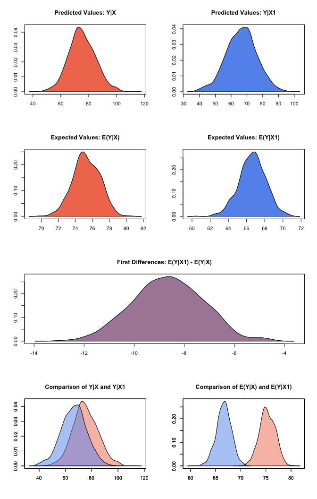
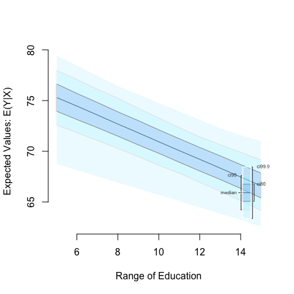

<!-- README.md is generated from README.Rmd. Please edit that file -->

<!--- Badges ----->
**Release:** 
 

**Development:** 

[Dev-Blog](https://medium.com/zelig-dev)

Zelig workflow overview
-----------------------

All models in Zelig can be estimated and results explored presented
using four simple functions:

1.  `zelig` to estimate the parameters,

2.  `setx` to set fitted values for which we want to find quantities of
    interest,

3.  `sim` to simulate the quantities of interest,

4.  `plot` to plot the simulation results.

#### Zelig 5 reference classes

Zelig 5 introduced [reference classes](http://adv-r.had.co.nz/R5.html).
These enable a different way of working with Zelig that is detailed in
[a separate vignette](docs/articles/zelig5_vs_zelig5.html). Examples
throughout the package documentation use both the ways of interacting
with Zelig.

Zelig Quickstart Guide
----------------------

Let’s walk through an example. This example uses the swiss dataset. It
contains data on fertility and socioeconomic factors in Switzerland’s 47
French-speaking provinces in 1888 (Mosteller and Tukey, 1977, 549-551).
We will model the effect of education on fertility, where education is
measured as the percent of draftees with education beyond primary school
and fertility is measured using the common standardized fertility
measure (see Muehlenbein (2010, 80-81) for details).

Installing and Loading Zelig
----------------------------

If you haven't already done so, open your R console and install Zelig.
We recommend installing Zelig with the zeligverse package. This installs
core Zelig and ancillary packages at once.

    install.packages('zeligverse')

Alternatively you can install the development version of Zelig with:

    devtools::install_github('IQSS/Zelig')

Once Zelig is installed, load it:

    library(zeligverse)

Building Models
---------------

Let’s assume we want to estimate the effect of education on fertility.
Since fertility is a continuous variable, least squares (`ls`) is an
appropriate model choice. To estimate our model, we call the `zelig()`
function with three two arguments: equation, model type, and data:

    # load data
    data(swiss)

    # estimate ls model
    z5_1 <- zelig(Fertility ~ Education, model = "ls", data = swiss, cite = FALSE)

    # model summary
    summary(z5_1)

    ## Model: 
    ## 
    ## Call:
    ## z5$zelig(formula = Fertility ~ Education, data = swiss)
    ## 
    ## Residuals:
    ##     Min      1Q  Median      3Q     Max 
    ## -17.036  -6.711  -1.011   9.526  19.689 
    ## 
    ## Coefficients:
    ##             Estimate Std. Error t value Pr(>|t|)
    ## (Intercept)  79.6101     2.1041  37.836  < 2e-16
    ## Education    -0.8624     0.1448  -5.954 3.66e-07
    ## 
    ## Residual standard error: 9.446 on 45 degrees of freedom
    ## Multiple R-squared:  0.4406, Adjusted R-squared:  0.4282 
    ## F-statistic: 35.45 on 1 and 45 DF,  p-value: 3.659e-07
    ## 
    ## Next step: Use 'setx' method

The NA coefficient on education suggests a negative relationship between
the education of a province and its fertility rate. More precisely, for
every one percent increase in draftees educated beyond primary school,
the fertility rate of the province decreases NA units. To help us better
interpret this finding, we may want other quantities of interest, such
as expected values or first differences. Zelig makes this simple by
automating the translation of model estimates into interpretable
quantities of interest using Monte Carlo simulation methods (see King,
Tomz, and Wittenberg (2000) for more information). For example, let’s
say we want to examine the effect of increasing the percent of draftees
educated from 5 to 15. To do so, we set our predictor value using the
`setx()` and `setx1()` functions:

    # set education to 5 and 15
    z5_1 <- setx(z5_1, Education = 5)
    z5_1 <- setx1(z5_1, Education = 15)

    # model summary
    summary(z5_1)

    ## setx:
    ##   (Intercept) Education
    ## 1           1         5
    ## setx1:
    ##   (Intercept) Education
    ## 1           1        15
    ## 
    ## Next step: Use 'sim' method

After setting our predictor value, we simulate using the `sim()` method:

    # run simulations and estimate quantities of interest
    z5_1 <- sim(z5_1)

    # model summary
    summary(z5_1)

    ## 
    ##  sim x :
    ##  -----
    ## ev
    ##      mean       sd      50%     2.5%    97.5%
    ## 1 75.2361 1.647454 75.21341 71.98292 78.56192
    ## pv
    ##          mean      sd      50%     2.5%    97.5%
    ## [1,] 75.32647 9.93109 75.28549 55.52913 93.75793
    ## 
    ##  sim x1 :
    ##  -----
    ## ev
    ##       mean       sd      50%     2.5%    97.5%
    ## 1 66.65153 1.510361 66.65971 63.58143 69.63157
    ## pv
    ##          mean       sd      50%     2.5%    97.5%
    ## [1,] 66.37808 9.948372 66.13238 47.06571 85.34356
    ## fd
    ##        mean       sd       50%      2.5%     97.5%
    ## 1 -8.584562 1.492263 -8.518099 -11.62224 -5.684232

At this point, we’ve estimated a model, set the predictor value, and
estimated easily interpretable quantities of interest. The `summary()`
method shows us our quantities of interest, namely, our expected and
predicted values at each level of education, as well as our first
differences–the difference in expected values at the set levels of
education.

Visualizations
==============

Zelig’s `plot()` function plots the estimated quantities of interest:

    plot(z5_1)

We can also simulate and plot simulations from ranges of simulated
values:

    z5_2 <- zelig(Fertility ~ Education, model = "ls", data = swiss, cite = FALSE)

    # set Education to range from 5 to 15 at single integer increments
    z5_2 <- setx(z5_2, Education = 5:15)

    # run simulations and estimate quantities of interest
    z5_2 <- sim(z5_2)

Then use the `plot()` function as before:

    z5_2 <- plot(z5_2)

Getting help
============

The primary documentation for Zelig is available at:
<http://docs.zeligproject.org/articles/>.

Within R, you can access function help using the normal `?` function,
e.g.:

    ?setx

If you are looking for details on particlar estimation model methods,
you can also use the `?` function. Simply place a `z` before the model
name. For example, to access details about the `logit` model use:

    ?zlogit

Building Zelig (for developers)
===============================

Zelig can be fully checked and build using the code in
[check\_build\_zelig.R](check_build_zelig.R). Note that this can be time
consuming due to the extensive test coverage.
