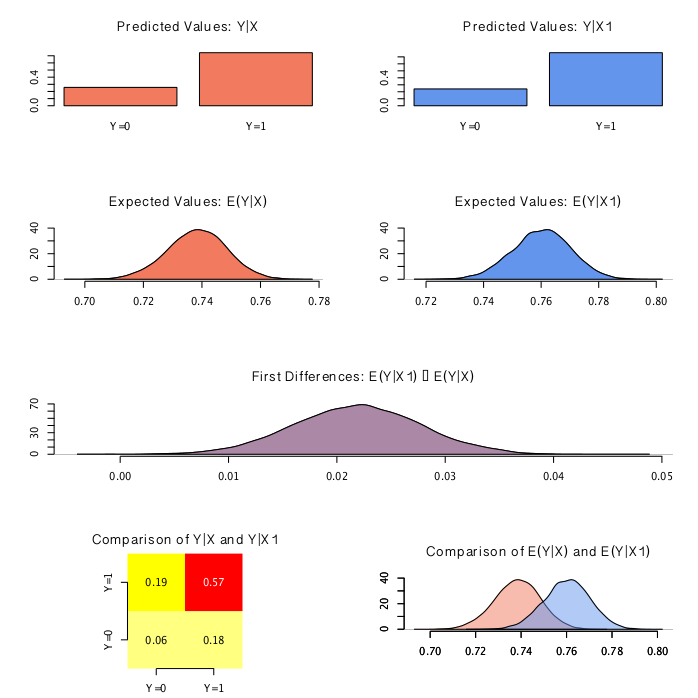

**Zelig** is an interface, that allows a large body of different statistical models in the R statistical language to be implemented and interpreted in a common framework and interface.  The release of Zelig 5.0 expands the set of models available, while simplifying the model wrapping process, and solving architectural problems by completely rewriting into R’s Reference Classes for a fully object-oriented architecture.

Project page and publications available at: 
http://zeligproject.org

 

