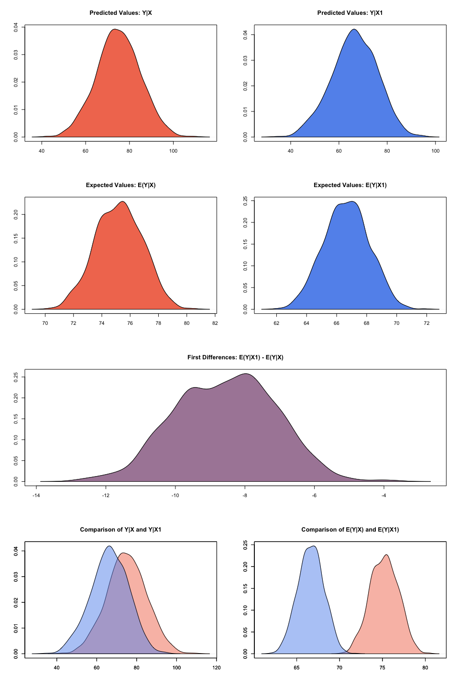

<!-- README.md is generated from README.Rmd. Please edit that file -->

<!--- Badges ----->
**Release:** 
 

**Development:** 

Zelig is an easy-to-use, free, open source, general purpose statistics
program for estimating, interpreting, and presenting results from any
statistical method. Zelig turns the power of R, with thousands of open
source packages — but with free ranging syntax, diverse examples, and
documentation written for different audiences — into the same three
commands and consistent documentation for every method. Zelig uses R
code from many researchers, making it "everyone’s statistical software."
We hope it becomes everyone’s statistical software for applications too,
as we designed it so anyone can use it or add their methods to it. We
aim for Zelig to be the best way to do analysis, prepare replication
files, learn new methods, or teach.

Project page and publications available at: <http://zeligproject.org>.

Zelig 5
=======

The release of Zelig 5.0 expands the set of models available, while
simplifying the model wrapping process, and solving architectural
problems by completely rewriting into R’s Reference Classes for a fully
object-oriented architecture. Comparability wrappers are available so
that you can still use pre-Zelig 5 syntax.

Quick Start Zelig 5
-------------------

All models in Zelig 5 can be estimated and results explored presented
using a five simple steps:

-   Initialise the Zelig object, e.g with `z.out <- zls$new()` for a
    least squares model. Then populate the object with:

-   `zelig` to estimate the parameters,

-   `setx` to set fitted values for which we want to find quantities of
    interest,

-   `sim` to simulate the quantities of interest,

-   `graph` to plot the simulation results.

Let’s load the package and walk through an example. The swiss dataset
contains data on fertility and socioeconomic factors in Switzerland’s 47
French-speaking provinces in 1888 (Mosteller and Tukey, 1977, 549-551).
We will model the effect of education on fertility, where education is
measured as the percent of draftees with education beyond primary school
and fertility is measured using the common standardized fertility
measure (see Muehlenbein (2010, 80-81) for details).

Loading Zelig
-------------

First, open your R console and load Zelig:

    library(Zelig)

Building Models
---------------

Let’s assume we want to estimate the effect of education on fertility.
Since fertility is a continuous variable, least squares is an
appropriate model choice. We first create a Zelig least squares object:

    # initialize Zelig5 least squares object
    z5 <- zls$new()

To estimate our model, we call the zelig() method, which is a function
that is internal to the Zelig object. We pass the zelig() method two
arguments: equation and data:

    # estimate ls model
    z5$zelig(Fertility ~ Education, data = swiss)

    # model summary
    summary(z5)

    ## Model: 
    ## 
    ## Call:
    ## z5$zelig(formula = Fertility ~ Education, data = swiss)
    ## 
    ## Residuals:
    ##     Min      1Q  Median      3Q     Max 
    ## -17.036  -6.711  -1.011   9.526  19.689 
    ## 
    ## Coefficients:
    ##             Estimate Std. Error t value Pr(>|t|)
    ## (Intercept)  79.6101     2.1041  37.836  < 2e-16
    ## Education    -0.8624     0.1448  -5.954 3.66e-07
    ## 
    ## Residual standard error: 9.446 on 45 degrees of freedom
    ## Multiple R-squared:  0.4406, Adjusted R-squared:  0.4282 
    ## F-statistic: 35.45 on 1 and 45 DF,  p-value: 3.659e-07
    ## 
    ## Next step: Use 'setx' method

The -0.8624 coefficient on education suggests a negative relationship
between the education of a province and its fertility rate. More
precisely, for every one percent increase in draftees educated beyond
primary school, the fertility rate of the province decreases 0.8624
units. To help us better interpret this finding, we may want other
quantities of interest, such as expected values or first differences.
Zelig makes this simple by automating the translation of model estimates
into interpretable quantities of interest using Monte Carlo simulation
methods (see King, Tomz, and Wittenberg (2000) for more information).
For example, let’s say we want to examine the effect of increasing the
percent of draftees educated from 5 to 15. To do so, we set our
predictor value using the `setx()` method:

    # set education to 5
    z5$setx(Education = 5)

    # set education to 15
    z5$setx1(Education = 15)

    # model summary
    summary(z5)

    ## setx:
    ##   (Intercept) Education
    ## 1           1         5
    ## setx1:
    ##   (Intercept) Education
    ## 1           1        15
    ## 
    ## Next step: Use 'sim' method

After setting our predictor value, we simulate using the `sim()` method:

    # run simulations and estimate quantities of interest
    z5$sim()

    # model summary
    summary(z5)

    ## 
    ##  sim x :
    ##  -----
    ## ev
    ##       mean       sd      50%     2.5%   97.5%
    ## 1 75.21191 1.644432 75.24545 71.95282 78.2947
    ## pv
    ##          mean       sd      50%     2.5%    97.5%
    ## [1,] 74.99261 9.939054 75.05308 56.04266 94.37075
    ## 
    ##  sim x1 :
    ##  -----
    ## ev
    ##       mean       sd      50%     2.5%    97.5%
    ## 1 66.65529 1.504845 66.67759 63.75745 69.45737
    ## pv
    ##          mean       sd      50%     2.5%    97.5%
    ## [1,] 66.46168 9.416217 66.56552 47.13064 84.14331
    ## fd
    ##        mean       sd       50%      2.5%     97.5%
    ## 1 -8.556617 1.443082 -8.540944 -11.33572 -5.895454

At this point, we’ve estimated a model, set the predictor value, and
estimated easily interpretable quantities of interest. The `summary()`
method shows us our quantities of interest, namely, our expected and
predicted values at each level of education, as well as our first
differences–the difference in expected values at the set levels of
education.

Visualizations
==============

Zelig’s `graph()` method plots the estimated quantities of interest:

    z5$graph()

