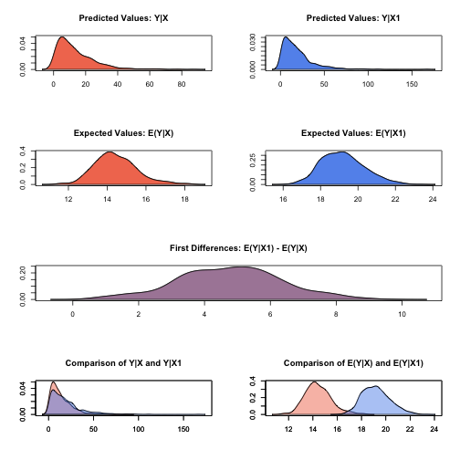

zelig-gamma
~~~~~~

Gamma Regression for Continuous, Positive Dependent Variables

Use the gamma regression model if you have a positive-valued dependent
variable such as the number of years a parliamentary cabinet endures, or
the seconds you can stay airborne while jumping. The gamma distribution
assumes that all waiting times are complete by the end of the study
(censoring is not allowed).

Syntax
+++++

With reference classes:

.. sourcecode:: r
    

    z5 <- zgamma$new()
    z5$zelig(Y ~ X1 + X ~ X, data = mydata)
    z5$setx()
    z5$sim()

With the Zelig 4 compatibility wrappers:

.. sourcecode:: r
    

    z.out <- zelig(Y ~ X1 + X2, model = "gamma", data = mydata)
    x.out <- setx(z.out)
    s.out <- sim(z.out, x = x.out, x1 = NULL)

Example
+++++

Attach the sample data:

.. sourcecode:: r
    

    data(coalition)

Estimate the model:

.. sourcecode:: r
    

    z.out <- zelig(duration ~ fract + numst2, model = "gamma", data = coalition)

::

    ## How to cite this model in Zelig:
    ##   Kosuke Imai, Gary King, Olivia Lau. 2007.
    ##   gamma: Gamma Regression for Continuous, Positive Dependent Variables
    ##   in Kosuke Imai, Gary King, and Olivia Lau, "Zelig: Everyone's Statistical Software,"
    ##   http://datascience.iq.harvard.edu/zelig

View the regression output:

.. sourcecode:: r
    

    summary(z.out)

::

    ## Model: 1
    ## Call:  stats::glm(formula = duration ~ fract + numst2, family = Gamma("inverse"), 
    ##     data = .)
    ## 
    ## Coefficients:
    ## (Intercept)        fract       numst2  
    ##   -0.012960     0.000115    -0.017387  
    ## 
    ## Degrees of Freedom: 313 Total (i.e. Null);  311 Residual
    ## Null Deviance:	    301 
    ## Residual Deviance: 272 	AIC: 2430
    ## Next step: Use 'setx' method

Set the baseline values (with the ruling coalition in the minority) and
the alternative values (with the ruling coalition in the majority) for
X:

.. sourcecode:: r
    

    x.low <- setx(z.out, numst2 = 0)
    x.high <- setx(z.out, numst2 = 1)

Simulate expected values (qi$ev) and first differences (qi$fd):

.. sourcecode:: r
    

    s.out <- sim(z.out, x = x.low, x1 = x.high)

.. sourcecode:: r
    

    summary(s.out)

::

    ## 
    ##  sim x :
    ##  -----
    ## ev
    ##       mean    sd   50%  2.5% 97.5%
    ## [1,] 14.47 1.102 14.39 12.56 16.79
    ## pv
    ##       mean    sd   50%   2.5% 97.5%
    ## [1,] 13.95 12.89 10.81 0.7147 47.46
    ## 
    ##  sim x1 :
    ##  -----
    ## ev
    ##       mean    sd   50%  2.5% 97.5%
    ## [1,] 19.21 1.151 19.16 17.23 21.61
    ## pv
    ##      mean    sd   50%  2.5% 97.5%
    ## [1,]   19 17.09 14.45 1.187 61.95
    ## fd
    ##      mean    sd   50%  2.5% 97.5%
    ## [1,] 4.74 1.588 4.737 1.671 7.974

.. sourcecode:: r
    

    plot(s.out)

    Zelig-gamma

Model
+++++

-  The Gamma distribution with scale parameter :math:`\alpha` has a
   *stochastic component*:

   .. math::

      \begin{aligned}
      Y &\sim& \textrm{Gamma}(y_i \mid \lambda_i, \alpha) \\
      f(y)  &=& \frac{1}{\alpha^{\lambda_i} \, \Gamma \lambda_i} \, y_i^{\lambda_i
        - 1} \exp -\left\{ \frac{y_i}{\alpha} \right\}\end{aligned}

   | for :math:`\alpha, \lambda_i, y_i > 0`.

-  The *systematic component* is given by

   .. math:: \lambda_i = \frac{1}{x_i \beta}

Quantities of Interest
+++++

-  The expected values (qi$ev) are simulations of the mean of the
   stochastic component given draws of :math:`\alpha` and :math:`\beta`
   from their posteriors:

   .. math:: E(Y) = \alpha \lambda_i.

-  The predicted values (qi$pr) are draws from the gamma distribution
   for each given set of parameters :math:`(\alpha, \lambda_i)`.

-  If x1 is specified, sim() also returns the differences in the
   expected values (qi$fd),

   .. math::

      E(Y \mid x_1) -
        E(Y \mid x)

   .

-  In conditional prediction models, the average expected treatment
   effect (att.ev) for the treatment group is

   .. math::

      \frac{1}{\sum_{i=1}^n t_i}\sum_{i:t_i=1}^n \left\{ Y_i(t_i=1) -
            E[Y_i(t_i=0)] \right\},

   where :math:`t_i` is a binary explanatory variable defining the
   treatment (:math:`t_i=1`) and control (:math:`t_i=0`) groups.
   Variation in the simulations are due to uncertainty in simulating
   :math:`E[Y_i(t_i=0)]`, the counterfactual expected value of
   :math:`Y_i` for observations in the treatment group, under the
   assumption that everything stays the same except that the treatment
   indicator is switched to :math:`t_i=0`.

-  In conditional prediction models, the average predicted treatment
   effect (att.pr) for the treatment group is

   .. math::

      \frac{1}{\sum_{i=1}^n t_i}\sum_{i:t_i=1}^n \left\{ Y_i(t_i=1) -
            \widehat{Y_i(t_i=0)} \right\},

   where :math:`t_i` is a binary explanatory variable defining the
   treatment (:math:`t_i=1`) and control (:math:`t_i=0`) groups.
   Variation in the simulations are due to uncertainty in simulating
   :math:`\widehat{Y_i(t_i=0)}`, the counterfactual predicted value of
   :math:`Y_i` for observations in the treatment group, under the
   assumption that everything stays the same except that the treatment
   indicator is switched to :math:`t_i=0`.

Output Values
+++++

The output of each Zelig command contains useful information which you
may view. For example, if you run
``z.out <- zelig(y ~ x, model = gamma, data)``, then you may examine the
available information in ``z.out`` by using ``names(z.out)``, see the
coefficients by using z.out$coefficients, and a default summary of
information through ``summary(z.out)``.

See also
+++++

The gamma model is part of the stats package. Advanced users may
wish to refer to ``help(glm)`` and ``help(family)``.
