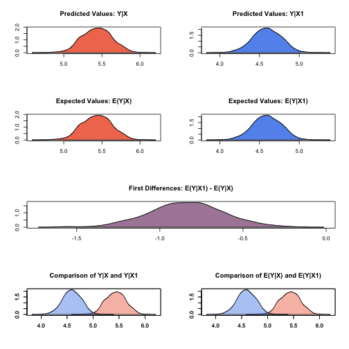

.. _zgammagee:

zelig-gammagee
~~~~~~

The GEE gamma is similar to standard gamma regression (appropriate when
you have an uncensored, positive-valued, continuous dependent variable
such as the time until a parliamentary cabinet falls). Unlike in gamma
regression, GEE gamma allows for dependence within clusters, such as in
longitudinal data, although its use is not limited to just panel data.
GEE models make no distributional assumptions but require three
specifications: a mean function, a variance function, and a “working”
correlation matrix for the clusters, which models the dependence of each
observation with other observations in the same cluster. The “working”
correlation matrix is a :math:`T \times T` matrix of correlations, where
:math:`T` is the size of the largest cluster and the elements of the
matrix are correlations between within-cluster observations. The appeal
of GEE models is that it gives consistent estimates of the parameters
and consistent estimates of the standard errors can be obtained using a
robust “sandwich” estimator even if the “working” correlation matrix is
incorrectly specified. If the “working” correlation matrix is correctly
specified, GEE models will give more efficient estimates of the
parameters. GEE models measure population-averaged effects as opposed to
cluster-specific effects.

Syntax
+++++

With reference classes:

.. sourcecode:: r
    

    z5 <- zgammagee$new()
    z5$zelig(Y ~ X1 + X2, model = "gamma.gee",
             id = "X3", data = mydata)
    z5$setx()
    z5$sim()

With the Zelig 4 compatibility wrappers:

.. sourcecode:: r
    

    z.out <- zelig(Y ~ X1 + X2, model = "gamma.gee",
                   id = "X3", data = mydata)
    x.out <- setx(z.out)
    s.out <- sim(z.out, x = x.out)

where ``id`` is a variable which identifies the clusters. The data
should be sorted by ``id`` and should be ordered within each cluster
when appropriate.

Additional Inputs
+++++

Use the following arguments to specify the structure of the “working”
correlations within clusters:

-  ``corstr``: defaults to “independence”. It can take on the following
   arguments:

   -  Independence (``corstr = independence``): :math:`{\rm
          cor}(y_{it}, y_{it'})=0`, :math:`\forall t, t'` with
      :math:`t\ne t'`. It assumes that there is no correlation within
      the clusters and the model becomes equivalent to standard gamma
      regression. The “working” correlation matrix is the identity
      matrix.

   -  Fixed (``corstr = fixed``): If selected, the user must define the
      “working” correlation matrix with the ``R`` argument rather than
      estimating it from the model.

   -  Stationary :math:`m` dependent (``corstr = stat_M_dep``):

      .. math::

         {\rm cor}(y_{it}, y_{it'})=\left\{\begin{array}{ccc}
               \alpha_{|t-t'|} & {\rm if} & |t-t'|\le m \\ 0 & {\rm if}
               & |t-t'| > m
             \end{array}\right.

      If (``corstr = stat_M_dep``), you must also specify ``Mv`` =
      :math:`m`, where :math:`m` is the number of periods :math:`t` of
      dependence. Choose this option when the correlations are assumed
      to be the same for observations of the same :math:`|t-t'|` periods
      apart for :math:`|t-t'| \leq m`.

      | Sample “working” correlation for Stationary 2 dependence (Mv=2)
      | :math:`\left( \begin{array}{ccccc}
      1 & \alpha_1 & \alpha_2 & 0 & 0 \\
      \alpha_1 & 1 & \alpha_1 & \alpha_2 & 0 \\
      \alpha_2 & \alpha_1 & 1 & \alpha_1 & \alpha_2 \\
      0 & \alpha_2 & \alpha_1 & 1 & \alpha_1 \\
      0 & 0 & \alpha_2 & \alpha_1 & 1
      \end{array} \right) `

   -  Non-stationary :math:`m` dependent (``corstr = non_stat_M_dep``):

      .. math::

         {\rm cor}(y_{it}, y_{it'})=\left\{\begin{array}{ccc}
               \alpha_{tt'} & {\rm if} & |t-t'|\le m \\ 0 & {\rm if}
               & |t-t'| > m
             \end{array}\right.

      If (``corstr = non_stat_M_dep``), you must also specify ``Mv`` =
      :math:`m`, where :math:`m` is the number of periods :math:`t` of
      dependence. This option relaxes the assumption that the
      correlations are the same for all observations of the same
      :math:`|t-t'|` periods apart.

      | Sample “working” correlation for Non-stationary 2 dependence
      (Mv=2)
      | :math:`\left( \begin{array}{ccccc}
      1 & \alpha_{12} & \alpha_{13} & 0 & 0 \\
      \alpha_{12} & 1 & \alpha_{23} & \alpha_{24} & 0 \\
      \alpha_{13} & \alpha_{23} & 1 & \alpha_{34} & \alpha_{35} \\
      0 & \alpha_{24} & \alpha_{34} & 1 & \alpha_{45} \\
      0 & 0 & \alpha_{35} & \alpha_{45} & 1
      \end{array} \right) `

   -  Exchangeable (``corstr = exchangeable``): :math:`{\rm
          cor}(y_{it}, y_{it'})=\alpha`, :math:`\forall t, t'` with
      :math:`t\ne t'`. Choose this option if the correlations are
      assumed to be the same for all observations within the cluster.

      | Sample “working” correlation for Exchangeable
      | :math:`\left( \begin{array}{ccccc}
      1 & \alpha & \alpha & \alpha & \alpha \\
      \alpha & 1 & \alpha & \alpha & \alpha \\
      \alpha & \alpha & 1 & \alpha & \alpha \\
      \alpha & \alpha & \alpha & 1 & \alpha \\
      \alpha & \alpha & \alpha & \alpha & 1
      \end{array} \right) `

   -  Stationary :math:`m`\ th order autoregressive (``corstr = AR-M``):
      If (``corstr = AR-M``), you must also specify ``Mv`` = :math:`m`,
      where :math:`m` is the number of periods :math:`t` of dependence.
      For example, the first order autoregressive model (AR-1) implies
      :math:`{\rm cor}(y_{it},
        y_{it'})=\alpha^{|t-t'|}, \forall t, t'` with :math:`t\ne t'`.
      In AR-1, observation 1 and observation 2 have a correlation of
      :math:`\alpha`. Observation 2 and observation 3 also have a
      correlation of :math:`\alpha`. Observation 1 and observation 3
      have a correlation of :math:`\alpha^2`, which is a function of how
      1 and 2 are correlated (:math:`\alpha`) multiplied by how 2 and 3
      are correlated (:math:`\alpha`). Observation 1 and 4 have a
      correlation that is a function of the correlation between 1 and 2,
      2 and 3, and 3 and 4, and so forth.

      | Sample “working” correlation for Stationary AR-1 (Mv=1)
      | :math:`\left( \begin{array}{ccccc}
      1 & \alpha & \alpha^2 & \alpha^3 & \alpha^4 \\
      \alpha & 1 & \alpha & \alpha^2 & \alpha^3 \\
      \alpha^2 & \alpha & 1 & \alpha & \alpha^2 \\
      \alpha^3 & \alpha^2 & \alpha & 1 & \alpha \\
      \alpha^4 & \alpha^3 & \alpha^2 & \alpha & 1
      \end{array} \right) `

   -  Unstructured (``corstr = unstructured``): :math:`{\rm
          cor}(y_{it}, y_{it'})=\alpha_{tt'}`, :math:`\forall t, t'`
      with :math:`t\ne t'`. No constraints are placed on the
      correlations, which are then estimated from the data.

-  ``Mv``: defaults to 1. It specifies the number of periods of
   correlation and only needs to be specified when ``corstr`` is
   “stat\_M\_dep”, “non\_stat\_M\_dep”, or “AR-M”.

-  ``R``: defaults to ``NULL``. It specifies a user-defined correlation
   matrix rather than estimating it from the data. The argument is used
   only when ``corstr`` is “fixed”. The input is a :math:`T \times T`
   matrix of correlations, where :math:`T` is the size of the largest
   cluster.

Examples
+++++

Example with Exchangeable Dependence
!!!!!

Attaching the sample turnout dataset:

.. sourcecode:: r
    

    data(coalition)

Sorted variable identifying clusters

.. sourcecode:: r
    

    coalition$cluster <- c(rep(c(1:62), 5),rep(c(63), 4))
    sorted.coalition <- coalition[order(coalition$cluster), ]

Estimating model and presenting summary:

.. sourcecode:: r
    

    z.out <- zelig(duration ~ fract + numst2, model = "gamma.gee",
                   id = "cluster", data = sorted.coalition,
                   corstr = "exchangeable")

::

    ## How to cite this model in Zelig:
    ##   Patrick Lam. 2011.
    ##   zgammagee: General Estimating Equation for Gamma Regression
    ##   in Kosuke Imai, Gary King, and Olivia Lau, "Zelig: Everyone's Statistical Software,"
    ##   http://zeligproject.org/

.. sourcecode:: r
    

    summary(z.out)

::

    ## Model: 
    ## $by
    ## [1] 1
    ## 
    ## 
    ## Call:
    ## geepack::geeglm(formula = duration ~ fract + numst2, family = Gamma("inverse"), 
    ##     data = ., id = c(1, 1, 1, 1, 1, 2, 2, 2, 2, 2, 3, 3, 3, 3, 
    ##     3, 4, 4, 4, 4, 4, 5, 5, 5, 5, 5, 6, 6, 6, 6, 6, 7, 7, 7, 
    ##     7, 7, 8, 8, 8, 8, 8, 9, 9, 9, 9, 9, 10, 10, 10, 10, 10, 11, 
    ##     11, 11, 11, 11, 12, 12, 12, 12, 12, 13, 13, 13, 13, 13, 14, 
    ##     14, 14, 14, 14, 15, 15, 15, 15, 15, 16, 16, 16, 16, 16, 17, 
    ##     17, 17, 17, 17, 18, 18, 18, 18, 18, 19, 19, 19, 19, 19, 20, 
    ##     20, 20, 20, 20, 21, 21, 21, 21, 21, 22, 22, 22, 22, 22, 23, 
    ##     23, 23, 23, 23, 24, 24, 24, 24, 24, 25, 25, 25, 25, 25, 26, 
    ##     26, 26, 26, 26, 27, 27, 27, 27, 27, 28, 28, 28, 28, 28, 29, 
    ##     29, 29, 29, 29, 30, 30, 30, 30, 30, 31, 31, 31, 31, 31, 32, 
    ##     32, 32, 32, 32, 33, 33, 33, 33, 33, 34, 34, 34, 34, 34, 35, 
    ##     35, 35, 35, 35, 36, 36, 36, 36, 36, 37, 37, 37, 37, 37, 38, 
    ##     38, 38, 38, 38, 39, 39, 39, 39, 39, 40, 40, 40, 40, 40, 41, 
    ##     41, 41, 41, 41, 42, 42, 42, 42, 42, 43, 43, 43, 43, 43, 44, 
    ##     44, 44, 44, 44, 45, 45, 45, 45, 45, 46, 46, 46, 46, 46, 47, 
    ##     47, 47, 47, 47, 48, 48, 48, 48, 48, 49, 49, 49, 49, 49, 50, 
    ##     50, 50, 50, 50, 51, 51, 51, 51, 51, 52, 52, 52, 52, 52, 53, 
    ##     53, 53, 53, 53, 54, 54, 54, 54, 54, 55, 55, 55, 55, 55, 56, 
    ##     56, 56, 56, 56, 57, 57, 57, 57, 57, 58, 58, 58, 58, 58, 59, 
    ##     59, 59, 59, 59, 60, 60, 60, 60, 60, 61, 61, 61, 61, 61, 62, 
    ##     62, 62, 62, 62, 63, 63, 63, 63), corstr = "exchangeable")
    ## 
    ## Coefficients:
    ##   (Intercept)         fract        numst2 
    ## -0.0129634262  0.0001149139 -0.0174009664 
    ## 
    ## Degrees of Freedom: 314 Total (i.e. Null);  311 Residual
    ## 
    ## Scale Link:                   identity
    ## Estimated Scale Parameters:  [1] 0.6231419
    ## 
    ## Correlation:  Structure = exchangeable    Link = identity 
    ## Estimated Correlation Parameters:
    ##        alpha 
    ## -0.008086333 
    ## 
    ## Number of clusters:   63   Maximum cluster size: 5 
    ## 
    ## Next step: Use 'setx' method

 
Setting the explanatory variables at their default values (mode for factor variables and mean for non-factor variables), with numst2 set to the vector 0 = no crisis, 1 = crisis.

.. sourcecode:: r
    

    x.low <- setx(z.out, numst2 = 0)
    x.high <- setx(z.out, numst2 = 1)

Simulate quantities of interest

.. sourcecode:: r
    

    s.out <- sim(z.out, x = x.low, x1 = x.high)
    summary(s.out)

::

    ## 
    ##  sim x :
    ##  -----
    ## ev
    ##          mean      sd     50%     2.5%    97.5%
    ## [1,] 14.42152 1.12433 14.3364 12.47104 16.89451
    ## pv
    ##          mean       sd      50%       2.5%   97.5%
    ## [1,] 13.73471 16.19528 7.390911 0.06528046 59.0092
    ## 
    ##  sim x1 :
    ##  -----
    ## ev
    ##          mean       sd      50%     2.5%    97.5%
    ## [1,] 19.19156 1.059807 19.17569 17.32821 21.64616
    ## pv
    ##          mean       sd      50%       2.5%    97.5%
    ## [1,] 19.29397 25.26029 9.820899 0.05006266 91.30573
    ## fd
    ##          mean       sd      50%     2.5%    97.5%
    ## [1,] 4.770042 1.601858 4.778185 1.571234 7.981507

Generate a plot of quantities of interest:

.. sourcecode:: r
    

    plot(s.out)

    plot of chunk unnamed-chunk-10

The Model
+++++

Suppose we have a panel dataset, with :math:`Y_{it}` denoting the
positive-valued, continuous dependent variable for unit :math:`i` at
time :math:`t`. :math:`Y_{i}` is a vector or cluster of correlated data
where :math:`y_{it}` is correlated with :math:`y_{it^\prime}` for some
or all :math:`t, t^\prime`. Note that the model assumes correlations
within :math:`i` but independence across :math:`i`.

-  The *stochastic component* is given by the joint and marginal
   distributions

   .. math::

      \begin{aligned}
      Y_{i} &\sim& f(y_{i} \mid \lambda_{i})\\
      Y_{it} &\sim& g(y_{it} \mid \lambda_{it})\end{aligned}

   where :math:`f` and :math:`g` are unspecified distributions with
   means :math:`\lambda_{i}` and :math:`\lambda_{it}`. GEE models make
   no distributional assumptions and only require three specifications:
   a mean function, a variance function, and a correlation structure.

-  The *systematic component* is the *mean function*, given by:

   .. math:: \lambda_{it} = \frac{1}{x_{it} \beta}

   where :math:`x_{it}` is the vector of :math:`k` explanatory variables
   for unit :math:`i` at time :math:`t` and :math:`\beta` is the vector
   of coefficients.

-  The *variance function* is given by:

   .. math:: V_{it} = \lambda_{it}^2 = \frac{1}{(x_{it} \beta)^2}

-  The *correlation structure* is defined by a :math:`T \times T`
   “working” correlation matrix, where :math:`T` is the size of the
   largest cluster. Users must specify the structure of the “working”
   correlation matrix *a priori*. The “working” correlation matrix then
   enters the variance term for each :math:`i`, given by:

   .. math:: V_{i} = \phi \, A_{i}^{\frac{1}{2}} R_{i}(\alpha) A_{i}^{\frac{1}{2}}

   where :math:`A_{i}` is a :math:`T \times T` diagonal matrix with the
   variance function :math:`V_{it} = \lambda_{it}^2` as the
   :math:`t`\ th diagonal element, :math:`R_{i}(\alpha)` is the
   “working” correlation matrix, and :math:`\phi` is a scale parameter.
   The parameters are then estimated via a quasi-likelihood approach.

-  In GEE models, if the mean is correctly specified, but the variance
   and correlation structure are incorrectly specified, then GEE models
   provide consistent estimates of the parameters and thus the mean
   function as well, while consistent estimates of the standard errors
   can be obtained via a robust “sandwich” estimator. Similarly, if the
   mean and variance are correctly specified but the correlation
   structure is incorrectly specified, the parameters can be estimated
   consistently and the standard errors can be estimated consistently
   with the sandwich estimator. If all three are specified correctly,
   then the estimates of the parameters are more efficient.

Quantities of Interest
+++++

-  All quantities of interest are for marginal means rather than joint
   means.

-  The method of bootstrapping generally should not be used in GEE
   models. If you must bootstrap, bootstrapping should be done within
   clusters, which is not currently supported in Zelig. For conditional
   prediction models, data should be matched within clusters.

-  The expected values (qi$ev) for the GEE gamma model is the mean:

   .. math::

      E(Y) =
        \lambda_{c} = \frac{1}{x_c \beta},

   given draws of :math:`\beta` from its sampling distribution, where
   :math:`x_{c}` is a vector of values, one for each independent
   variable, chosen by the user.

-  The first difference (qi$fd) for the GEE gamma model is defined as

   .. math:: \textrm{FD} = \Pr(Y = 1 \mid x_1) - \Pr(Y = 1 \mid x).

-  In conditional prediction models, the average expected treatment
   effect (att.ev) for the treatment group is

   .. math::

      \frac{1}{\sum_{i=1}^n \sum_{t=1}^T tr_{it}}\sum_{i:tr_{it}=1}^n \sum_{t:tr_{it}=1}^T \left\{ Y_{it}(tr_{it}=1) -
            E[Y_{it}(tr_{it}=0)] \right\},

   where :math:`tr_{it}` is a binary explanatory variable defining the
   treatment (:math:`tr_{it}=1`) and control (:math:`tr_{it}=0`) groups.
   Variation in the simulations are due to uncertainty in simulating
   :math:`E[Y_{it}(tr_{it}=0)]`, the counterfactual expected value of
   :math:`Y_{it}` for observations in the treatment group, under the
   assumption that everything stays the same except that the treatment
   indicator is switched to :math:`tr_{it}=0`.

Output Values
+++++

The output of each Zelig command contains useful information which you
may view. For example, if you run

.. sourcecode:: r
    

    z.out <- zelig(y ~ x, model = "gamma.gee", id, data)

then you may
examine the available information in ``z.out`` by using
``names(z.out)``, see the coefficients by using z.out$coefficients, and
a default summary of information through ``summary(z.out)``. Other
elements available through the $ operator are listed below.

-  From the zelig() output object z.out, you may extract:

   -  coefficients: parameter estimates for the explanatory variables.

   -  residuals: the working residuals in the final iteration of the
      fit.

   -  fitted.values: the vector of fitted values for the systemic
      component.

   -  linear.predictors: the vector of :math:`x_{it}\beta`

   -  max.id: the size of the largest cluster.

-  From summary(z.out), you may extract:

   -  coefficients: the parameter estimates with their associated
      standard errors, :math:`p`-values, and :math:`z`-statistics.

   -  working.correlation: the “working” correlation matrix

-  From the sim() output object s.out, you may extract quantities of
   interest arranged as matrices indexed by simulation :math:`\times`
   x-observation (for more than one x-observation). Available quantities
   are:

   -  qi$ev: the simulated expected values for the specified values of
      x.

   -  qi$fd: the simulated first difference in the expected
      probabilities for the values specified in x and x1.

   -  qi$att.ev: the simulated average expected treatment effect for the
      treated from conditional prediction models.

See also
+++++

The gee function is part of the gee package by Vincent J. Carey, ported
to R by Thomas Lumley and Brian Ripley. Advanced users may wish to refer
to ``help(gee)`` and ``help(family)``. Sample data are from .
