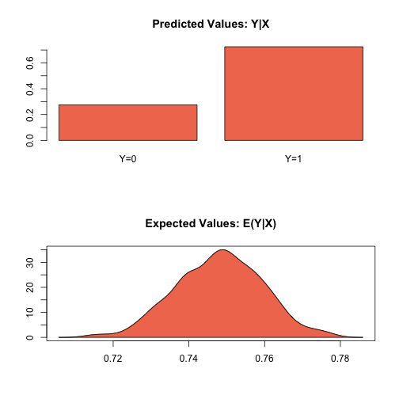
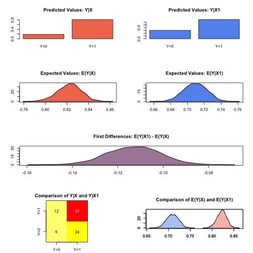

.. _zlogit:

zelig-logit
~~~~~~

Logistic Regression for Dichotomous Dependent Variables

Logistic regression specifies a dichotomous dependent variable as a
function of a set of explanatory variables.

Syntax
+++++

With reference classes:

.. sourcecode:: r
    

    z5 <- zlogit$new()
    z5$zelig(Y ~ X1 + X ~ X, data = mydata)
    z5$setx()
    z5$sim()

With the Zelig 4 compatibility wrappers:

.. sourcecode:: r
    

    z.out <- zelig(Y ~ X1 + X2, model = "logit", data = mydata)
    x.out <- setx(z.out)
    s.out <- sim(z.out, x = x.out, x1 = NULL)

Examples
+++++

Basic Example
!!!!!

Attaching the sample turnout dataset:

.. sourcecode:: r
    

    data(turnout)

Estimating parameter values for the logistic regression:

.. sourcecode:: r
    

    z.out1 <- zelig(vote ~ age + race, model = "logit", data = turnout)

::

    ## How to cite this model in Zelig:
    ##   Kosuke Imai, Gary King, Olivia Lau. 2007.
    ##   logit: Logistic Regression for Dichotomous Dependent Variables
    ##   in Kosuke Imai, Gary King, and Olivia Lau, "Zelig: Everyone's Statistical Software,"
    ##   http://zeligproject.org/

Setting values for the explanatory variables:

.. sourcecode:: r
    

    x.out1 <- setx(z.out1, age = 36, race = "white")

Simulating quantities of interest from the posterior distribution.

.. sourcecode:: r
    

    s.out1 <- sim(z.out1, x = x.out1)

.. sourcecode:: r
    

    summary(s.out1)

::

    ## 
    ##  sim x :
    ##  -----
    ## ev
    ##           mean         sd       50%      2.5%    97.5%
    ## [1,] 0.7481759 0.01163654 0.7483511 0.7246909 0.769207
    ## pv
    ##         0    1
    ## [1,] 0.27 0.73

.. sourcecode:: r
    

    plot(s.out1)

    Zelig-logit-1

Simulating First Differences
!!!!!

Estimating the risk difference (and risk ratio) between low education
(25th percentile) and high education (75th percentile) while all the
other variables held at their default values.

.. sourcecode:: r
    

    z.out2 <- zelig(vote ~ race + educate, model = "logit", data = turnout)

::

    ## How to cite this model in Zelig:
    ##   Kosuke Imai, Gary King, Olivia Lau. 2007.
    ##   logit: Logistic Regression for Dichotomous Dependent Variables
    ##   in Kosuke Imai, Gary King, and Olivia Lau, "Zelig: Everyone's Statistical Software,"
    ##   http://zeligproject.org/

.. sourcecode:: r
    

    x.high <- setx(z.out2, educate = quantile(turnout$educate, prob = 0.75))
    x.low <- setx(z.out2, educate = quantile(turnout$educate, prob = 0.25))
    s.out2 <- sim(z.out2, x = x.high, x1 = x.low)
    summary(s.out2)

::

    ## 
    ##  sim x :
    ##  -----
    ## ev
    ##           mean         sd       50%      2.5%     97.5%
    ## [1,] 0.8224254 0.01054224 0.8226413 0.8005853 0.8425707
    ## pv
    ##          0     1
    ## [1,] 0.191 0.809
    ## 
    ##  sim x1 :
    ##  -----
    ## ev
    ##           mean         sd       50%      2.5%     97.5%
    ## [1,] 0.7089218 0.01320318 0.7093064 0.6829383 0.7340954
    ## pv
    ##          0     1
    ## [1,] 0.292 0.708
    ## fd
    ##            mean        sd        50%       2.5%       97.5%
    ## [1,] -0.1135037 0.0113416 -0.1125439 -0.1356589 -0.09138946

.. sourcecode:: r
    

    plot(s.out2)

    Zelig-logit-2

Model
+++++

Let :math:`Y_i` be the binary dependent variable for observation
:math:`i` which takes the value of either 0 or 1.

-  The *stochastic component* is given by

   .. math::

      \begin{aligned}
      Y_i &\sim& \textrm{Bernoulli}(y_i \mid \pi_i) \\
          &=& \pi_i^{y_i} (1-\pi_i)^{1-y_i}\end{aligned}

   where :math:`\pi_i=\Pr(Y_i=1)`.

-  The *systematic component* is given by:

   .. math:: \pi_i \; = \; \frac{1}{1 + \exp(-x_i \beta)}.

   where :math:`x_i` is the vector of :math:`k` explanatory variables
   for observation :math:`i` and :math:`\beta` is the vector of
   coefficients.

Quantities of Interest
+++++

-  The expected values (qi$ev) for the logit model are simulations of
   the predicted probability of a success:

   .. math::

      E(Y) =
        \pi_i= \frac{1}{1 + \exp(-x_i \beta)},

   given draws of :math:`\beta` from its sampling distribution.

-  The predicted values (qi$pr) are draws from the Binomial distribution
   with mean equal to the simulated expected value :math:`\pi_i`.

-  The first difference (qi$fd) for the logit model is defined as

   .. math:: \textrm{FD} = \Pr(Y = 1 \mid x_1) - \Pr(Y = 1 \mid x).

-  The risk ratio (qi$rr) is defined as

   .. math:: \textrm{RR} = \Pr(Y = 1 \mid x_1) \ / \ \Pr(Y = 1 \mid x).

-  In conditional prediction models, the average expected treatment
   effect (att.ev) for the treatment group is

   .. math::

      \frac{1}{\sum_{i=1}^n t_i}\sum_{i:t_i=1}^n \left\{ Y_i(t_i=1) -
            E[Y_i(t_i=0)] \right\},

   where :math:`t_i` is a binary explanatory variable defining the
   treatment (:math:`t_i=1`) and control (:math:`t_i=0`) groups.
   Variation in the simulations are due to uncertainty in simulating
   :math:`E[Y_i(t_i=0)]`, the counterfactual expected value of
   :math:`Y_i` for observations in the treatment group, under the
   assumption that everything stays the same except that the treatment
   indicator is switched to :math:`t_i=0`.

-  In conditional prediction models, the average predicted treatment
   effect (att.pr) for the treatment group is

   .. math::

      \frac{1}{\sum_{i=1}^n t_i}\sum_{i:t_i=1}^n \left\{ Y_i(t_i=1) -
            \widehat{Y_i(t_i=0)}\right\},

   where :math:`t_i` is a binary explanatory variable defining the
   treatment (:math:`t_i=1`) and control (:math:`t_i=0`) groups.
   Variation in the simulations are due to uncertainty in simulating
   :math:`\widehat{Y_i(t_i=0)}`, the counterfactual predicted value of
   :math:`Y_i` for observations in the treatment group, under the
   assumption that everything stays the same except that the treatment
   indicator is switched to :math:`t_i=0`.

Output Values
+++++

The output of each Zelig command contains useful information which you
may view. For example, if you run
``z.out <- zelig(y ~ x, model = logit, data)``, then you may examine the
available information in ``z.out`` by using ``names(z.out)``, see the
coefficients by using z.out$coefficients, and a default summary of
information through ``summary(z.out)``.

See also
+++++

The logit model is part of the stats package. Advanced users may
wish to refer to ``help(glm)`` and ``help(family)``.
