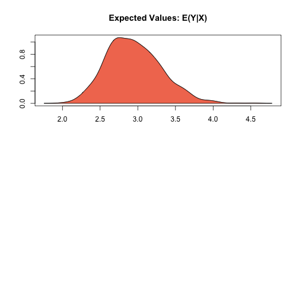

.. _znegbin:

zelig-negbin
~~~~~~

Negative Binomial Regression for Event Count Dependent Variables

Use the negative binomial regression if you have a count of events for
each observation of your dependent variable. The negative binomial model
is frequently used to estimate over-dispersed event count models.

Syntax
+++++

With reference classes:

.. sourcecode:: r
    

    z5 <- znegbin$new()
    z5$zelig(Y ~ X1 + X ~ X, data = mydata)
    z5$setx()
    z5$sim()

With the Zelig 4 compatibility wrappers:

.. sourcecode:: r
    

    z.out <- zelig(Y ~ X1 + X2, model = "negbin", data = mydata)
    x.out <- setx(z.out)
    s.out <- sim(z.out, x = x.out)

Example
+++++

Load sample data:

.. sourcecode:: r
    

    data(sanction)

Estimate the model:

.. sourcecode:: r
    

    z.out <- zelig(num ~ target + coop, model = "negbin", data = sanction)

::

    ## How to cite this model in Zelig:
    ##   Kosuke Imai, Gary King, Olivia Lau. 2008.
    ##   negbinom: Negative Binomial Regression for Event Count Dependent Variables
    ##   in Kosuke Imai, Gary King, and Olivia Lau, "Zelig: Everyone's Statistical Software,"
    ##   http://zeligproject.org/

.. sourcecode:: r
    

    summary(z.out)

::

    ## Model: 
    ## $by
    ## [1] 1
    ## 
    ## 
    ## Call:  MASS::glm.nb(formula = num ~ target + coop, data = ., init.theta = 1.841603403, 
    ##     link = log)
    ## 
    ## Coefficients:
    ## (Intercept)       target         coop  
    ##      -1.564        0.151        1.286  
    ## 
    ## Degrees of Freedom: 77 Total (i.e. Null);  75 Residual
    ## Null Deviance:	    237.1 
    ## Residual Deviance: 56.55 	AIC: 360.2
    ## Next step: Use 'setx' method

Set values for the explanatory variables to their default mean values:

.. sourcecode:: r
    

    x.out <- setx(z.out)

Simulate fitted values:

.. sourcecode:: r
    

    s.out <- sim(z.out, x = x.out)

.. sourcecode:: r
    

    summary(s.out)

::

    ## 
    ##  sim x :
    ##  -----
    ## ev
    ##          mean        sd     50%    2.5%    97.5%
    ## [1,] 2.991251 0.3570885 2.95903 2.37332 3.836963
    ## pv
    ## qi
    ##     0     1     2     3     4     5     6     7     8     9    10    11 
    ## 0.137 0.184 0.166 0.129 0.092 0.076 0.061 0.035 0.034 0.024 0.017 0.018 
    ##    12    13    14    15    16    20    23 
    ## 0.009 0.004 0.005 0.006 0.001 0.001 0.001

.. sourcecode:: r
    

    plot(s.out)

    Zelig-negbin

Model
+++++

Let :math:`Y_i` be the number of independent events that occur during a
fixed time period. This variable can take any non-negative integer
value.

-  The negative binomial distribution is derived by letting the mean of
   the Poisson distribution vary according to a fixed parameter
   :math:`\zeta` given by the Gamma distribution. The *stochastic
   component* is given by

   .. math::

      \begin{aligned}
           Y_i \mid \zeta_i & \sim & \textrm{Poisson}(\zeta_i \mu_i),\\
           \zeta_i & \sim & \frac{1}{\theta}\textrm{Gamma}(\theta).
         \end{aligned}

   The marginal distribution of :math:`Y_i` is then the negative
   binomial with mean :math:`\mu_i` and variance
   :math:`\mu_i + \mu_i^2/\theta`:

   .. math::

      \begin{aligned}
         Y_i & \sim & \textrm{NegBin}(\mu_i, \theta), \\
             & = & \frac{\Gamma (\theta + y_i)}{y! \, \Gamma(\theta)} 
                   \frac{\mu_i^{y_i} \, \theta^{\theta}}{(\mu_i + \theta)^{\theta + y_i}},
         \end{aligned}

   where :math:`\theta` is the systematic parameter of the Gamma
   distribution modeling :math:`\zeta_i`.

-  The *systematic component* is given by

   .. math:: \mu_i = \exp(x_i \beta)

   where :math:`x_i` is the vector of :math:`k` explanatory variables
   and :math:`\beta` is the vector of coefficients.

Quantities of Interest
+++++

-  The expected values (qi$ev) are simulations of the mean of the
   stochastic component. Thus,

   .. math::

      E(Y) = \mu_i = \exp(x_i
        \beta),

   given simulations of :math:`\beta`.

-  The predicted value (qi$pr) drawn from the distribution defined by
   the set of parameters :math:`(\mu_i, \theta)`.

-  The first difference (qi$fd) is

   .. math:: \textrm{FD} \; = \; E(Y | x_1) - E(Y \mid x)

-  In conditional prediction models, the average expected treatment
   effect (att.ev) for the treatment group is

   .. math::

      \frac{1}{\sum_{i=1}^n t_i}\sum_{i:t_i=1}^n \left\{ Y_i(t_i=1) -
            E[Y_i(t_i=0)] \right\},

   where :math:`t_i` is a binary explanatory variable defining the
   treatment (:math:`t_i=1`) and control (:math:`t_i=0`) groups.
   Variation in the simulations are due to uncertainty in simulating
   :math:`E[Y_i(t_i=0)]`, the counterfactual expected value of
   :math:`Y_i` for observations in the treatment group, under the
   assumption that everything stays the same except that the treatment
   indicator is switched to :math:`t_i=0`.

-  In conditional prediction models, the average predicted treatment
   effect (att.pr) for the treatment group is

   .. math::

      \frac{1}{\sum_{i=1}^n t_i}\sum_{i:t_i=1}^n \left\{ Y_i(t_i=1) -
            \widehat{Y_i(t_i=0)} \right\},

   where :math:`t_i` is a binary explanatory variable defining the
   treatment (:math:`t_i=1`) and control (:math:`t_i=0`) groups.
   Variation in the simulations are due to uncertainty in simulating
   :math:`\widehat{Y_i(t_i=0)}`, the counterfactual predicted value of
   :math:`Y_i` for observations in the treatment group, under the
   assumption that everything stays the same except that the treatment
   indicator is switched to :math:`t_i=0`.

Output Values
+++++

The output of each Zelig command contains useful information which you
may view. For example, if you run
``z.out <- zelig(y ~ x, model = negbin, data)``, then you may examine
the available information in ``z.out`` by using ``names(z.out)``, see
the coefficients by using z.out$coefficients, and a default summary of
information through ``summary(z.out)``.

See also
+++++

The negative binomial model is part of the MASS package by William N.
Venable and Brian D. Ripley . Advanced users may wish to refer to
``help(glm.nb)`.
