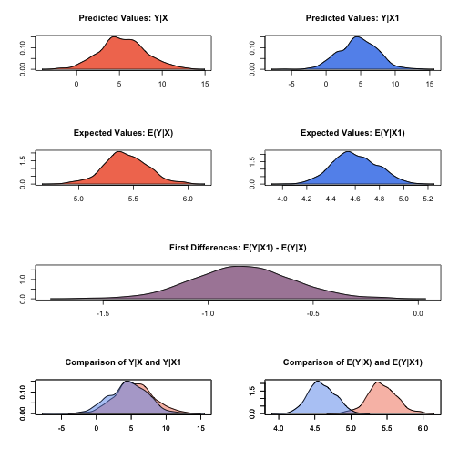

.. _znorm:

zelig-normal
~~~~~~

Normal Regression for Continuous Dependent Variables

The Normal regression model is a close variant of the more standard
least squares regression model (see ). Both models specify a continuous
dependent variable as a linear function of a set of explanatory
variables. The Normal model reports maximum likelihood (rather than
least squares) estimates. The two models differ only in their estimate
for the stochastic parameter :math:`\sigma`.

Syntax
+++++

With reference classes:

.. sourcecode:: r
    

    z5 <- znormal$new()
    z5$zelig(Y ~ X1 + X ~ X, data = mydata)
    z5$setx()
    z5$sim()

With the Zelig 4 compatibility wrappers:

.. sourcecode:: r
    

    z.out <- zelig(Y ~ X1 + X2, model = "normal", data = mydata)
    x.out <- setx(z.out)
    s.out <- sim(z.out, x = x.out)

Examples
+++++

Basic Example with First Differences
!!!!!

Attach sample data:

.. sourcecode:: r
    

    data(macro)

Estimate model:

.. sourcecode:: r
    

    z.out1 <- zelig(unem ~ gdp + capmob + trade, model = "normal", data = macro)

::

    ## How to cite this model in Zelig:
    ##   Kosuke Imai, Gary King, Olivia Lau. 2008.
    ##   normal: Normal Regression for Continuous Dependent Variables
    ##   in Kosuke Imai, Gary King, and Olivia Lau, "Zelig: Everyone's Statistical Software,"
    ##   http://zeligproject.org/

Summarize of regression coefficients:

.. sourcecode:: r
    

    summary(z.out1)

::

    ## Model: 
    ## $by
    ## [1] 1
    ## 
    ## 
    ## Call:  stats::glm(formula = unem ~ gdp + capmob + trade, family = gaussian("identity"), 
    ##     data = .)
    ## 
    ## Coefficients:
    ## (Intercept)          gdp       capmob        trade  
    ##     6.18129     -0.32360      1.42194      0.01985  
    ## 
    ## Degrees of Freedom: 349 Total (i.e. Null);  346 Residual
    ## Null Deviance:	    3665 
    ## Residual Deviance: 2610 	AIC: 1706
    ## Next step: Use 'setx' method

Set explanatory variables to their default (mean/mode) values, with
high (80th percentile) and low (20th percentile) values for trade:

.. sourcecode:: r
    

    x.high <- setx(z.out1, trade = quantile(macro$trade, 0.8))
    x.low <- setx(z.out1, trade = quantile(macro$trade, 0.2))

   
Generate first differences for the effect of high versus low trade on GDP:

.. sourcecode:: r
    

    s.out1 <- sim(z.out1, x = x.high, x1 = x.low)

.. sourcecode:: r
    

    summary(s.out1)

::

    ## 
    ##  sim x :
    ##  -----
    ## ev
    ##        mean        sd     50%     2.5%    97.5%
    ## [1,] 5.4286 0.1892726 5.43233 5.046676 5.772472
    ## pv
    ##          mean       sd      50%      2.5%    97.5%
    ## [1,] 5.514553 2.784038 5.557033 0.2065176 10.85646
    ## 
    ##  sim x1 :
    ##  -----
    ## ev
    ##          mean        sd      50%     2.5%    97.5%
    ## [1,] 4.591913 0.1891217 4.594981 4.225135 4.964913
    ## pv
    ##          mean       sd      50%      2.5%    97.5%
    ## [1,] 4.708323 2.801025 4.692077 -0.590693 10.54292
    ## fd
    ##            mean        sd        50%      2.5%      97.5%
    ## [1,] -0.8366872 0.2364956 -0.8343349 -1.296075 -0.4048062

A visual summary of quantities of interest:

.. sourcecode:: r
    

    plot(s.out1)

    Zelig-normal

Model
+++++

Let :math:`Y_i` be the continuous dependent variable for observation
:math:`i`.

-  The *stochastic component* is described by a univariate normal model
   with a vector of means :math:`\mu_i` and scalar variance
   :math:`\sigma^2`:

   .. math:: Y_i \; \sim \; \textrm{Normal}(\mu_i, \sigma^2).

-  The *systematic component* is

   .. math:: \mu_i \;= \; x_i \beta,

   where :math:`x_i` is the vector of :math:`k` explanatory variables
   and :math:`\beta` is the vector of coefficients.

Quantities of Interest
+++++

-  The expected value (qi$ev) is the mean of simulations from the the
   stochastic component,

   .. math:: E(Y) = \mu_i = x_i \beta,

   given a draw of :math:`\beta` from its posterior.

-  The predicted value (qi$pr) is drawn from the distribution defined by
   the set of parameters :math:`(\mu_i, \sigma)`.

-  The first difference (qi$fd) is:

   .. math:: \textrm{FD}\; = \;E(Y \mid x_1) -  E(Y \mid x)

-  In conditional prediction models, the average expected treatment
   effect (att.ev) for the treatment group is

   .. math::

      \frac{1}{\sum_{i=1}^n t_i}\sum_{i:t_i=1}^n \left\{ Y_i(t_i=1) -
            E[Y_i(t_i=0)] \right\},

   where :math:`t_i` is a binary explanatory variable defining the
   treatment (:math:`t_i=1`) and control (:math:`t_i=0`) groups.
   Variation in the simulations are due to uncertainty in simulating
   :math:`E[Y_i(t_i=0)]`, the counterfactual expected value of
   :math:`Y_i` for observations in the treatment group, under the
   assumption that everything stays the same except that the treatment
   indicator is switched to :math:`t_i=0`.

-  In conditional prediction models, the average predicted treatment
   effect (att.pr) for the treatment group is

   .. math::

      \frac{1}{\sum_{i=1}^n t_i}\sum_{i:t_i=1}^n \left\{ Y_i(t_i=1) -
            \widehat{Y_i(t_i=0)} \right\},

   where :math:`t_i` is a binary explanatory variable defining the
   treatment (:math:`t_i=1`) and control (:math:`t_i=0`) groups.
   Variation in the simulations are due to uncertainty in simulating
   :math:`\widehat{Y_i(t_i=0)}`, the counterfactual predicted value of
   :math:`Y_i` for observations in the treatment group, under the
   assumption that everything stays the same except that the treatment
   indicator is switched to :math:`t_i=0`.

Output Values
+++++

The output of each Zelig command contains useful information which you
may view. For example, if you run
``z.out <- zelig(y ~ x, model = normal, data)``, then you may examine
the available information in ``z.out`` by using ``names(z.out)``, see
the coefficients by using z.out$coefficients, and a default summary of
information through ``summary(z.out)``.

See also
+++++

The normal model is part of the stats package by . Advanced users may
wish to refer to ``help(glm)`` and ``help(family)``.
