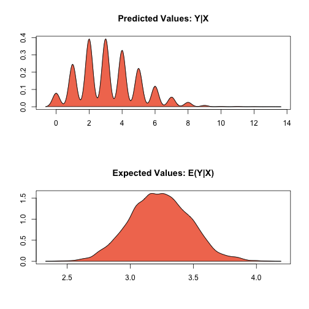

.. _zprobit:

zelig-probit
~~~~~~

Probit Regression for Dichotomous Dependent Variables

Use probit regression to model binary dependent variables specified as a
function of a set of explanatory variables.

Syntax
+++++

With reference classes:

.. sourcecode:: r
    

    z5 <- zprobit$new()
    z5$zelig(Y ~ X1 + X ~ X, data = mydata)
    z5$setx()
    z5$sim()

With the Zelig 4 compatibility wrappers:

.. sourcecode:: r
    

    z.out <- zelig(Y ~ X1 + X2, model = "probit", data = mydata)
    x.out <- setx(z.out)
    s.out <- sim(z.out, x = x.out, x1 = NULL)

Example
+++++

Attach the sample turnout dataset:

.. sourcecode:: r
    

    data(turnout)

Estimate parameter values for the probit regression:

.. sourcecode:: r
    

    z.out <- zelig(vote ~ race + educate, model = "probit", data = turnout)

::

    ## How to cite this model in Zelig:
    ##   Kosuke Imai, Gary King, Olivia Lau. 2007.
    ##   probit: Probit Regression for Dichotomous Dependent Variables
    ##   in Kosuke Imai, Gary King, and Olivia Lau, "Zelig: Everyone's Statistical Software,"
    ##   http://zeligproject.org/

.. sourcecode:: r
    

    summary(z.out)

::

    ## Model: 
    ## $by
    ## [1] 1
    ## 
    ## 
    ## Call:  stats::glm(formula = vote ~ race + educate, family = binomial("probit"), 
    ##     data = .)
    ## 
    ## Coefficients:
    ## (Intercept)    racewhite      educate  
    ##    -0.72595      0.29908      0.09712  
    ## 
    ## Degrees of Freedom: 1999 Total (i.e. Null);  1997 Residual
    ## Null Deviance:	    2267 
    ## Residual Deviance: 2136 	AIC: 2142
    ## Next step: Use 'setx' method

Set values for the explanatory variables to their default values.

.. sourcecode:: r
    

    x.out <- setx(z.out)

Simulate quantities of interest from the posterior distribution.

.. sourcecode:: r
    

    s.out <- sim(z.out, x = x.out)

.. sourcecode:: r
    

    summary(s.out)

.. sourcecode:: r
    

    plot(s.out1)

    Zelig-probit

Model
+++++

Let :math:`Y_i` be the observed binary dependent variable for
observation :math:`i` which takes the value of either 0 or 1.

-  The *stochastic component* is given by

   .. math:: Y_i \; \sim \; \textrm{Bernoulli}(\pi_i),

   where :math:`\pi_i=\Pr(Y_i=1)`.

-  The *systematic component* is

   .. math:: \pi_i \; = \; \Phi (x_i \beta)

   where :math:`\Phi(\mu)` is the cumulative distribution function of
   the Normal distribution with mean 0 and unit variance.

Quantities of Interest
+++++

-  The expected value (qi$ev) is a simulation of predicted probability
   of success

   .. math::

      E(Y) = \pi_i = \Phi(x_i
        \beta),

   given a draw of :math:`\beta` from its sampling distribution.

-  The predicted value (qi$pr) is a draw from a Bernoulli distribution
   with mean :math:`\pi_i`.

-  The first difference (qi$fd) in expected values is defined as

   .. math:: \textrm{FD} = \Pr(Y = 1 \mid x_1) - \Pr(Y = 1 \mid x).

-  The risk ratio (qi$rr) is defined as

   .. math:: \textrm{RR} = \Pr(Y = 1 \mid x_1) / \Pr(Y = 1 \mid x).

-  In conditional prediction models, the average expected treatment
   effect (att.ev) for the treatment group is

   .. math::

      \frac{1}{\sum_{i=1}^n t_i}\sum_{i:t_i=1}^n \left\{ Y_i(t_i=1) -
            E[Y_i(t_i=0)] \right\},

   where :math:`t_i` is a binary explanatory variable defining the
   treatment (:math:`t_i=1`) and control (:math:`t_i=0`) groups.
   Variation in the simulations are due to uncertainty in simulating
   :math:`E[Y_i(t_i=0)]`, the counterfactual expected value of
   :math:`Y_i` for observations in the treatment group, under the
   assumption that everything stays the same except that the treatment
   indicator is switched to :math:`t_i=0`.

-  In conditional prediction models, the average predicted treatment
   effect (att.pr) for the treatment group is

   .. math::

      \frac{1}{\sum_{i=1}^n t_i}\sum_{i:t_i=1}^n \left\{ Y_i(t_i=1) -
            \widehat{Y_i(t_i=0)} \right\},

   where :math:`t_i` is a binary explanatory variable defining the
   treatment (:math:`t_i=1`) and control (:math:`t_i=0`) groups.
   Variation in the simulations are due to uncertainty in simulating
   :math:`\widehat{Y_i(t_i=0)}`, the counterfactual predicted value of
   :math:`Y_i` for observations in the treatment group, under the
   assumption that everything stays the same except that the treatment
   indicator is switched to :math:`t_i=0`.

Output Values
+++++

The output of each Zelig command contains useful information which you
may view. For example, if you run
``z.out <- zelig(y ~ x, model = probit, data)``, then you may examine
the available information in ``z.out`` by using ``names(z.out)``, see
the coefficients by using z.out$coefficients, and a default summary of
information through ``summary(z.out)``.

See also
+++++

The probit model is part of the stats package by . Advanced users may
wish to refer to ``help(glm)`` and ``help(family)``.
