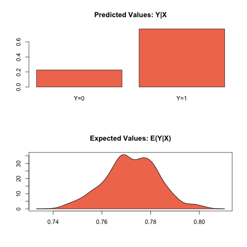
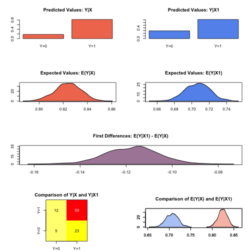

.. _zprobitgee:

zelig-probitgee
~~~~~~

Generalized Estimating Equation for Probit Regression

The GEE probit estimates the same model as the standard probit
regression (appropriate when you have a dichotomous dependent variable
and a set of explanatory variables). Unlike in probit regression, GEE
probit allows for dependence within clusters, such as in longitudinal
data, although its use is not limited to just panel data. The user must
first specify a “working” correlation matrix for the clusters, which
models the dependence of each observation with other observations in the
same cluster. The “working” correlation matrix is a :math:`T \times T`
matrix of correlations, where :math:`T` is the size of the largest
cluster and the elements of the matrix are correlations between
within-cluster observations. The appeal of GEE models is that it gives
consistent estimates of the parameters and consistent estimates of the
standard errors can be obtained using a robust “sandwich” estimator even
if the “working” correlation matrix is incorrectly specified. If the
“working” correlation matrix is correctly specified, GEE models will
give more efficient estimates of the parameters. GEE models measure
population-averaged effects as opposed to cluster-specific effects.

Syntax
+++++

With reference classes:

.. sourcecode:: r
    

    z5 <- zgammagee$new()
    z5$zelig(Y ~ X1 + X2, model = "probit.gee",
             id = "X3", data = mydata)
    z5$setx()
    z5$sim()

With the Zelig 4 compatibility wrappers:

.. sourcecode:: r
    

    z.out <- zelig(Y ~ X1 + X2, model = "probit.gee",
                   id = "X3", data = mydata)
    x.out <- setx(z.out)
    s.out <- sim(z.out, x = x.out)

where ``id`` is a variable which identifies the clusters. The data
should be sorted by ``id`` and should be ordered within each cluster
when appropriate.

Additional Inputs
+++++

Use the following arguments to specify the structure of the “working”
correlations within clusters:

- ``corstr``: character string specifying the correlation structure:
  "independence", "exchangeable", "ar1", "unstructured" and
  "userdefined"

- See ``geeglm`` in package ``geepack`` for other function arguments.

Examples
+++++

Example with Stationary 3 Dependence
!!!!!

Attaching the sample turnout dataset:

.. sourcecode:: r
    

    data(turnout)

Variable identifying clusters

.. sourcecode:: r
    

    turnout$cluster <- rep(c(1:200), 10)
    sorted.turnout <- turnout[order(turnout$cluster), ]

Estimating parameter values:

.. sourcecode:: r
    

    z.out1 <- zelig(vote ~ race + educate, model = "probit.gee",
                    id = "cluster", data = sorted.turnout)

::

    ## How to cite this model in Zelig:
    ##   Patrick Lam. 2011.
    ##   probitgee: General Estimating Equation for Probit Regression
    ##   in Kosuke Imai, Gary King, and Olivia Lau, "Zelig: Everyone's Statistical Software,"
    ##   http://zeligproject.org/

Setting values for the explanatory variables to their default values:

.. sourcecode:: r
    

    x.out1 <- setx(z.out1)

Simulating quantities of interest:

.. sourcecode:: r
    

    s.out1 <- sim(z.out1, x = x.out1)

.. sourcecode:: r
    

    summary(s.out1)

::

    ## 
    ##  sim x :
    ##  -----
    ## ev
    ##           mean         sd       50%      2.5%     97.5%
    ## [1,] 0.7714339 0.01116122 0.7716805 0.7493789 0.7932561
    ## pv
    ##          0     1
    ## [1,] 0.242 0.758

.. sourcecode:: r
    

    plot(s.out1)

    Zelig-probitgee1

Simulating First Differences
!!!!!

Estimating the risk difference (and risk ratio) between low education
(25th percentile) and high education (75th percentile) while all the other variables held at their default values.

.. sourcecode:: r
    

    x.high <- setx(z.out1, educate = quantile(turnout$educate, prob = 0.75))
    x.low <- setx(z.out1, educate = quantile(turnout$educate, prob = 0.25))

.. sourcecode:: r
    

    s.out2 <- sim(z.out1, x = x.high, x1 = x.low)

.. sourcecode:: r
    

    summary(s.out2)

::

    ## 
    ##  sim x :
    ##  -----
    ## ev
    ##          mean         sd       50%      2.5%     97.5%
    ## [1,] 0.824644 0.01021875 0.8249386 0.8038777 0.8437308
    ## pv
    ##          0     1
    ## [1,] 0.176 0.824
    ## 
    ##  sim x1 :
    ##  -----
    ## ev
    ##           mean         sd       50%      2.5%     97.5%
    ## [1,] 0.7069563 0.01455131 0.7069515 0.6797742 0.7359784
    ## pv
    ##          0     1
    ## [1,] 0.295 0.705
    ## fd
    ##            mean         sd        50%       2.5%       97.5%
    ## [1,] -0.1176876 0.01202535 -0.1177123 -0.1416701 -0.09455958

.. sourcecode:: r
    

    plot(s.out2)

    Zelig-probitgee2

Example with Fixed Correlation Structure
!!!!!

User-defined correlation structure

.. sourcecode:: r
    

    corr.mat <- matrix(rep(0.5, 100), nrow = 10, ncol = 10)
    diag(corr.mat) <- 1
    corr.mat <- fixed2Zcor(corr.mat, id=sorted.turnout$cluster, waves=sorted.turnout$race)

Generating empirical estimates:

.. sourcecode:: r
    

    z.out2 <- zelig(vote ~ race + educate, model = "probit.gee",
                    id = "cluster", data = sorted.turnout,
                    corstr = "fixed", zcor = corr.mat)

::

    ## How to cite this model in Zelig:
    ##   Patrick Lam. 2011.
    ##   probitgee: General Estimating Equation for Probit Regression
    ##   in Kosuke Imai, Gary King, and Olivia Lau, "Zelig: Everyone's Statistical Software,"
    ##   http://zeligproject.org/

Viewing the regression output:

.. sourcecode:: r
    

    summary(z.out2)

The Model
+++++

Suppose we have a panel dataset, with :math:`Y_{it}` denoting the binary
dependent variable for unit :math:`i` at time :math:`t`. :math:`Y_{i}`
is a vector or cluster of correlated data where :math:`y_{it}` is
correlated with :math:`y_{it^\prime}` for some or all
:math:`t, t^\prime`. Note that the model assumes correlations within
:math:`i` but independence across :math:`i`.

-  The *stochastic component* is given by the joint and marginal
   distributions

   .. math::

      \begin{aligned}
      Y_{i} &\sim& f(y_{i} \mid \pi_{i})\\
      Y_{it} &\sim& g(y_{it} \mid \pi_{it})\end{aligned}

   where :math:`f` and :math:`g` are unspecified distributions with
   means :math:`\pi_{i}` and :math:`\pi_{it}`. GEE models make no
   distributional assumptions and only require three specifications: a
   mean function, a variance function, and a correlation structure.

-  The *systematic component* is the *mean function*, given by:

   .. math:: \pi_{it} = \Phi(x_{it} \beta)

   where :math:`\Phi(\mu)` is the cumulative distribution function of
   the Normal distribution with mean 0 and unit variance, :math:`x_{it}`
   is the vector of :math:`k` explanatory variables for unit :math:`i`
   at time :math:`t` and :math:`\beta` is the vector of coefficients.

-  The *variance function* is given by:

   .. math:: V_{it} = \pi_{it} (1-\pi_{it})

-  The *correlation structure* is defined by a :math:`T \times T`
   “working” correlation matrix, where :math:`T` is the size of the
   largest cluster. Users must specify the structure of the “working”
   correlation matrix *a priori*. The “working” correlation matrix then
   enters the variance term for each :math:`i`, given by:

   .. math:: V_{i} = \phi \, A_{i}^{\frac{1}{2}} R_{i}(\alpha) A_{i}^{\frac{1}{2}}

   where :math:`A_{i}` is a :math:`T \times T` diagonal matrix with the
   variance function :math:`V_{it} = \pi_{it} (1-\pi_{it})` as the
   :math:`t`\ th diagonal element, :math:`R_{i}(\alpha)` is the
   “working” correlation matrix, and :math:`\phi` is a scale parameter.
   The parameters are then estimated via a quasi-likelihood approach.

-  In GEE models, if the mean is correctly specified, but the variance
   and correlation structure are incorrectly specified, then GEE models
   provide consistent estimates of the parameters and thus the mean
   function as well, while consistent estimates of the standard errors
   can be obtained via a robust “sandwich” estimator. Similarly, if the
   mean and variance are correctly specified but the correlation
   structure is incorrectly specified, the parameters can be estimated
   consistently and the standard errors can be estimated consistently
   with the sandwich estimator. If all three are specified correctly,
   then the estimates of the parameters are more efficient.

-  The robust “sandwich” estimator gives consistent estimates of the
   standard errors when the correlations are specified incorrectly only
   if the number of units :math:`i` is relatively large and the number
   of repeated periods :math:`t` is relatively small. Otherwise, one
   should use the “naïve” model-based standard errors, which assume that
   the specified correlations are close approximations to the true
   underlying correlations. See for more details.

Quantities of Interest
+++++

-  All quantities of interest are for marginal means rather than joint
   means.

-  The method of bootstrapping generally should not be used in GEE
   models. If you must bootstrap, bootstrapping should be done within
   clusters, which is not currently supported in Zelig. For conditional
   prediction models, data should be matched within clusters.

-  The expected values (qi$ev) for the GEE probit model are simulations
   of the predicted probability of a success:

   .. math::

      E(Y) =
        \pi_{c}= \Phi(x_{c} \beta),

   given draws of :math:`\beta` from its sampling distribution, where
   :math:`x_{c}` is a vector of values, one for each independent
   variable, chosen by the user.

-  The first difference (qi$fd) for the GEE probit model is defined as

   .. math:: \textrm{FD} = \Pr(Y = 1 \mid x_1) - \Pr(Y = 1 \mid x).

-  The risk ratio (qi$rr) is defined as

   .. math:: \textrm{RR} = \Pr(Y = 1 \mid x_1) \ / \ \Pr(Y = 1 \mid x).

-  In conditional prediction models, the average expected treatment
   effect (att.ev) for the treatment group is

   .. math::

      \frac{1}{\sum_{i=1}^n \sum_{t=1}^T tr_{it}}\sum_{i:tr_{it}=1}^n \sum_{t:tr_{it}=1}^T \left\{ Y_{it}(tr_{it}=1) -
            E[Y_{it}(tr_{it}=0)] \right\},

   where :math:`tr_{it}` is a binary explanatory variable defining the
   treatment (:math:`tr_{it}=1`) and control (:math:`tr_{it}=0`) groups.
   Variation in the simulations are due to uncertainty in simulating
   :math:`E[Y_{it}(tr_{it}=0)]`, the counterfactual expected value of
   :math:`Y_{it}` for observations in the treatment group, under the
   assumption that everything stays the same except that the treatment
   indicator is switched to :math:`tr_{it}=0`.

Output Values
+++++

The output of each Zelig command contains useful information which you
may view. For examle, if you run
``z.out <- zelig(y ~ x, model = probit.gee, id, data)``, then you may
examine the available information in ``z.out`` by using
``names(z.out)``, see the coefficients by using z.out$coefficients, and
a default summary of information through ``summary(z.out)``. Other
elements available through the $ operator are listed below.

-  From the zelig() output object z.out, you may extract:

   -  coefficients: parameter estimates for the explanatory variables.

   -  residuals: the working residuals in the final iteration of the
      fit.

   -  fitted.values: the vector of fitted values for the systemic
      component, :math:`\pi_{it}`.

   -  linear.predictors: the vector of :math:`x_{it}\beta`

   -  max.id: the size of the largest cluster.

-  From summary(z.out), you may extract:

   -  coefficients: the parameter estimates with their associated
      standard errors, :math:`p`-values, and :math:`z`-statistics.

   -  working.correlation: the “working” correlation matrix

-  From the sim() output object s.out, you may extract quantities of
   interest arranged as matrices indexed by simulation :math:`\times`
   x-observation (for more than one x-observation). Available quantities
   are:

   -  qi$ev: the simulated expected probabilities for the specified
      values of x.

   -  qi$fd: the simulated first difference in the expected
      probabilities for the values specified in x and x1.

   -  qi$rr: the simulated risk ratio for the expected probabilities
      simulated from x and x1.

   -  qi$att.ev: the simulated average expected treatment effect for the
      treated from conditional prediction models.

See also
+++++

The geeglm function is part of the geepack package by Søren Højsgaard,
Ulrich Halekoh and Jun Yan. Advanced users may wish to refer
to ``help(geepack)`` and ``help(family)``.
