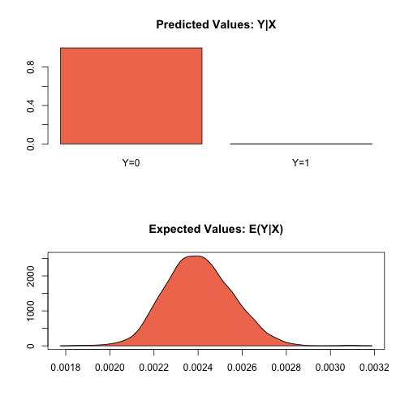
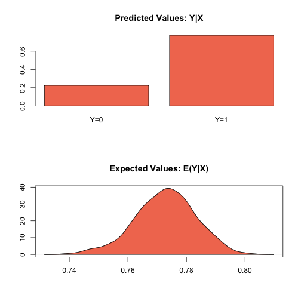

.. _zrelogit:

zelig-relogit
~~~~~~

Rare Events Logistic Regression for Dichotomous Dependent Variables

The relogit procedure estimates the same model as standard logistic
regression (appropriate when you have a dichotomous dependent variable
and a set of explanatory variables; see ), but the estimates are
corrected for the bias that occurs when the sample is small or the
observed events are rare (i.e., if the dependent variable has many more
1s than 0s or the reverse). The relogit procedure also optionally uses
prior correction for case-control sampling designs.

Syntax
+++++

With reference classes:

.. sourcecode:: r
    

    z5 <- zrelogit$new()
    z5$zelig(Y ~ X1 + X2, tau = NULL,
                           case.control = c("prior", "weighting"), 
                           bias.correct = TRUE, robust = FALSE, 
                           data = mydata, ...)
    z5$setx()
    z5$sim()

With the Zelig 4 compatibility wrappers:

.. sourcecode:: r
    

    z.out <- zelig(Y ~ X1 + X2, model = "relogit", tau = NULL,
                           case.control = c("prior", "weighting"), 
                           bias.correct = TRUE, robust = FALSE, 
                           data = mydata, ...)
    x.out <- setx(z.out)
    s.out <- sim(z.out, x = x.out)

Arguments
+++++

The relogit procedure supports four optional arguments in addition to
the standard arguments for zelig(). You may additionally use:

-  tau: a vector containing either one or two values for :math:`\tau`,
   the true population fraction of ones. Use, for example, tau = c(0.05,
   0.1) to specify that the lower bound on tau is 0.05 and the upper
   bound is 0.1. If left unspecified, only finite-sample bias correction
   is performed, not case-control correction.

-  case.control: if tau is specified, choose a method to correct for
   case-control sampling design: “prior” (default) or “weighting”.

-  bias.correct: a logical value of TRUE (default) or FALSE indicating
   whether the intercept should be corrected for finite sample (rare
   events) bias.

Note that if tau = NULL, bias.correct = FALSE, the
relogit procedure performs a standard logistic regression without any
correction.

Example 1: One Tau with Prior Correction and Bias Correction
+++++

Due to memory and space considerations, the data used here are a sample
drawn from the full data set used in King and Zeng, 2001, The proportion
of militarized interstate conflicts to the absence of disputes is
:math:`\tau = 1,042 / 303,772
\approx 0.00343`. To estimate the model,

.. sourcecode:: r
    

    data(mid)

.. sourcecode:: r
    

    z.out1 <- zelig(conflict ~ major + contig + power + maxdem + mindem + years, data = mid, model = "relogit", tau = 1042/303772)

::

    ## How to cite this model in Zelig:
    ##   Kosuke Imai, Gary King, and Olivia Lau. 2014.
    ##   relogit: Rare Events Logistic Regression for Dichotomous Dependent Variables
    ##   in Kosuke Imai, Gary King, and Olivia Lau, "Zelig: Everyone's Statistical Software,"
    ##   http://zeligproject.org/

Summarize the model output:

.. sourcecode:: r
    

    summary(z.out1)

::

    ## Model: 
    ## $by
    ## [1] 1
    ## 
    ## 
    ## Call:  relogit(formula = cbind(conflict, 1 - conflict) ~ major + contig + 
    ##     power + maxdem + mindem + years, data = ., tau = 0.00343020423212146, 
    ##     bias.correct = TRUE, case.control = "prior")
    ## 
    ## Coefficients:
    ## (Intercept)        major       contig        power       maxdem  
    ##    -7.50836      2.43196      4.10797      1.05358      0.04804  
    ##      mindem        years  
    ##    -0.06413     -0.06293  
    ## 
    ## Degrees of Freedom: 3125 Total (i.e. Null);  3119 Residual
    ## Null Deviance:	    3979 
    ## Residual Deviance: 1869 	AIC: 1883
    ## Next step: Use 'setx' method

Set the explanatory variables to their means:

.. sourcecode:: r
    

    x.out1 <- setx(z.out1)

Simulate quantities of interest:

.. sourcecode:: r
    

    s.out1 <- sim(z.out1, x = x.out1)
    summary(s.out1)

::

    ## 
    ##  sim x :
    ##  -----
    ## ev
    ##             mean           sd         50%        2.5%       97.5%
    ## [1,] 0.002402985 0.0001527186 0.002398577 0.002124312 0.002742328
    ## pv
    ##          0     1
    ## [1,] 0.999 0.001

.. sourcecode:: r
    

    plot(s.out1)

    Zelig-relogit

Example 2: One Tau with Weighting, Robust Standard Errors, and Bias Correction
+++++

Suppose that we wish to perform case control correction using weighting
(rather than the default prior correction). To estimate the model:

.. sourcecode:: r
    

    z.out2 <- zelig(conflict ~ major + contig + power + maxdem + mindem + years, data = mid, model = "relogit", tau = 1042/303772, case.control = "weighting", robust = TRUE)

::

    ## Error in glm.control(robust = TRUE): unused argument (robust = TRUE)

Summarize the model output:

.. sourcecode:: r
    

    summary(z.out2)

::

    ## Model: 
    ## $by
    ## [1] 1
    ## 
    ## 
    ## Call:
    ## geepack::geeglm(formula = vote ~ race + educate, family = binomial("probit"), 
    ##     data = ., id = c(1L, 1L, 1L, 1L, 1L, 1L, 1L, 1L, 1L, 1L, 
    ##     2L, 2L, 2L, 2L, 2L, 2L, 2L, 2L, 2L, 2L, 3L, 3L, 3L, 3L, 3L, 
    ##     3L, 3L, 3L, 3L, 3L, 4L, 4L, 4L, 4L, 4L, 4L, 4L, 4L, 4L, 4L, 
    ##     5L, 5L, 5L, 5L, 5L, 5L, 5L, 5L, 5L, 5L, 6L, 6L, 6L, 6L, 6L, 
    ##     6L, 6L, 6L, 6L, 6L, 7L, 7L, 7L, 7L, 7L, 7L, 7L, 7L, 7L, 7L, 
    ##     8L, 8L, 8L, 8L, 8L, 8L, 8L, 8L, 8L, 8L, 9L, 9L, 9L, 9L, 9L, 
    ##     9L, 9L, 9L, 9L, 9L, 10L, 10L, 10L, 10L, 10L, 10L, 10L, 10L, 
    ##     10L, 10L, 11L, 11L, 11L, 11L, 11L, 11L, 11L, 11L, 11L, 11L, 
    ##     12L, 12L, 12L, 12L, 12L, 12L, 12L, 12L, 12L, 12L, 13L, 13L, 
    ##     13L, 13L, 13L, 13L, 13L, 13L, 13L, 13L, 14L, 14L, 14L, 14L, 
    ##     14L, 14L, 14L, 14L, 14L, 14L, 15L, 15L, 15L, 15L, 15L, 15L, 
    ##     15L, 15L, 15L, 15L, 16L, 16L, 16L, 16L, 16L, 16L, 16L, 16L, 
    ##     16L, 16L, 17L, 17L, 17L, 17L, 17L, 17L, 17L, 17L, 17L, 17L, 
    ##     18L, 18L, 18L, 18L, 18L, 18L, 18L, 18L, 18L, 18L, 19L, 19L, 
    ##     19L, 19L, 19L, 19L, 19L, 19L, 19L, 19L, 20L, 20L, 20L, 20L, 
    ##     20L, 20L, 20L, 20L, 20L, 20L, 21L, 21L, 21L, 21L, 21L, 21L, 
    ##     21L, 21L, 21L, 21L, 22L, 22L, 22L, 22L, 22L, 22L, 22L, 22L, 
    ##     22L, 22L, 23L, 23L, 23L, 23L, 23L, 23L, 23L, 23L, 23L, 23L, 
    ##     24L, 24L, 24L, 24L, 24L, 24L, 24L, 24L, 24L, 24L, 25L, 25L, 
    ##     25L, 25L, 25L, 25L, 25L, 25L, 25L, 25L, 26L, 26L, 26L, 26L, 
    ##     26L, 26L, 26L, 26L, 26L, 26L, 27L, 27L, 27L, 27L, 27L, 27L, 
    ##     27L, 27L, 27L, 27L, 28L, 28L, 28L, 28L, 28L, 28L, 28L, 28L, 
    ##     28L, 28L, 29L, 29L, 29L, 29L, 29L, 29L, 29L, 29L, 29L, 29L, 
    ##     30L, 30L, 30L, 30L, 30L, 30L, 30L, 30L, 30L, 30L, 31L, 31L, 
    ##     31L, 31L, 31L, 31L, 31L, 31L, 31L, 31L, 32L, 32L, 32L, 32L, 
    ##     32L, 32L, 32L, 32L, 32L, 32L, 33L, 33L, 33L, 33L, 33L, 33L, 
    ##     33L, 33L, 33L, 33L, 34L, 34L, 34L, 34L, 34L, 34L, 34L, 34L, 
    ##     34L, 34L, 35L, 35L, 35L, 35L, 35L, 35L, 35L, 35L, 35L, 35L, 
    ##     36L, 36L, 36L, 36L, 36L, 36L, 36L, 36L, 36L, 36L, 37L, 37L, 
    ##     37L, 37L, 37L, 37L, 37L, 37L, 37L, 37L, 38L, 38L, 38L, 38L, 
    ##     38L, 38L, 38L, 38L, 38L, 38L, 39L, 39L, 39L, 39L, 39L, 39L, 
    ##     39L, 39L, 39L, 39L, 40L, 40L, 40L, 40L, 40L, 40L, 40L, 40L, 
    ##     40L, 40L, 41L, 41L, 41L, 41L, 41L, 41L, 41L, 41L, 41L, 41L, 
    ##     42L, 42L, 42L, 42L, 42L, 42L, 42L, 42L, 42L, 42L, 43L, 43L, 
    ##     43L, 43L, 43L, 43L, 43L, 43L, 43L, 43L, 44L, 44L, 44L, 44L, 
    ##     44L, 44L, 44L, 44L, 44L, 44L, 45L, 45L, 45L, 45L, 45L, 45L, 
    ##     45L, 45L, 45L, 45L, 46L, 46L, 46L, 46L, 46L, 46L, 46L, 46L, 
    ##     46L, 46L, 47L, 47L, 47L, 47L, 47L, 47L, 47L, 47L, 47L, 47L, 
    ##     48L, 48L, 48L, 48L, 48L, 48L, 48L, 48L, 48L, 48L, 49L, 49L, 
    ##     49L, 49L, 49L, 49L, 49L, 49L, 49L, 49L, 50L, 50L, 50L, 50L, 
    ##     50L, 50L, 50L, 50L, 50L, 50L, 51L, 51L, 51L, 51L, 51L, 51L, 
    ##     51L, 51L, 51L, 51L, 52L, 52L, 52L, 52L, 52L, 52L, 52L, 52L, 
    ##     52L, 52L, 53L, 53L, 53L, 53L, 53L, 53L, 53L, 53L, 53L, 53L, 
    ##     54L, 54L, 54L, 54L, 54L, 54L, 54L, 54L, 54L, 54L, 55L, 55L, 
    ##     55L, 55L, 55L, 55L, 55L, 55L, 55L, 55L, 56L, 56L, 56L, 56L, 
    ##     56L, 56L, 56L, 56L, 56L, 56L, 57L, 57L, 57L, 57L, 57L, 57L, 
    ##     57L, 57L, 57L, 57L, 58L, 58L, 58L, 58L, 58L, 58L, 58L, 58L, 
    ##     58L, 58L, 59L, 59L, 59L, 59L, 59L, 59L, 59L, 59L, 59L, 59L, 
    ##     60L, 60L, 60L, 60L, 60L, 60L, 60L, 60L, 60L, 60L, 61L, 61L, 
    ##     61L, 61L, 61L, 61L, 61L, 61L, 61L, 61L, 62L, 62L, 62L, 62L, 
    ##     62L, 62L, 62L, 62L, 62L, 62L, 63L, 63L, 63L, 63L, 63L, 63L, 
    ##     63L, 63L, 63L, 63L, 64L, 64L, 64L, 64L, 64L, 64L, 64L, 64L, 
    ##     64L, 64L, 65L, 65L, 65L, 65L, 65L, 65L, 65L, 65L, 65L, 65L, 
    ##     66L, 66L, 66L, 66L, 66L, 66L, 66L, 66L, 66L, 66L, 67L, 67L, 
    ##     67L, 67L, 67L, 67L, 67L, 67L, 67L, 67L, 68L, 68L, 68L, 68L, 
    ##     68L, 68L, 68L, 68L, 68L, 68L, 69L, 69L, 69L, 69L, 69L, 69L, 
    ##     69L, 69L, 69L, 69L, 70L, 70L, 70L, 70L, 70L, 70L, 70L, 70L, 
    ##     70L, 70L, 71L, 71L, 71L, 71L, 71L, 71L, 71L, 71L, 71L, 71L, 
    ##     72L, 72L, 72L, 72L, 72L, 72L, 72L, 72L, 72L, 72L, 73L, 73L, 
    ##     73L, 73L, 73L, 73L, 73L, 73L, 73L, 73L, 74L, 74L, 74L, 74L, 
    ##     74L, 74L, 74L, 74L, 74L, 74L, 75L, 75L, 75L, 75L, 75L, 75L, 
    ##     75L, 75L, 75L, 75L, 76L, 76L, 76L, 76L, 76L, 76L, 76L, 76L, 
    ##     76L, 76L, 77L, 77L, 77L, 77L, 77L, 77L, 77L, 77L, 77L, 77L, 
    ##     78L, 78L, 78L, 78L, 78L, 78L, 78L, 78L, 78L, 78L, 79L, 79L, 
    ##     79L, 79L, 79L, 79L, 79L, 79L, 79L, 79L, 80L, 80L, 80L, 80L, 
    ##     80L, 80L, 80L, 80L, 80L, 80L, 81L, 81L, 81L, 81L, 81L, 81L, 
    ##     81L, 81L, 81L, 81L, 82L, 82L, 82L, 82L, 82L, 82L, 82L, 82L, 
    ##     82L, 82L, 83L, 83L, 83L, 83L, 83L, 83L, 83L, 83L, 83L, 83L, 
    ##     84L, 84L, 84L, 84L, 84L, 84L, 84L, 84L, 84L, 84L, 85L, 85L, 
    ##     85L, 85L, 85L, 85L, 85L, 85L, 85L, 85L, 86L, 86L, 86L, 86L, 
    ##     86L, 86L, 86L, 86L, 86L, 86L, 87L, 87L, 87L, 87L, 87L, 87L, 
    ##     87L, 87L, 87L, 87L, 88L, 88L, 88L, 88L, 88L, 88L, 88L, 88L, 
    ##     88L, 88L, 89L, 89L, 89L, 89L, 89L, 89L, 89L, 89L, 89L, 89L, 
    ##     90L, 90L, 90L, 90L, 90L, 90L, 90L, 90L, 90L, 90L, 91L, 91L, 
    ##     91L, 91L, 91L, 91L, 91L, 91L, 91L, 91L, 92L, 92L, 92L, 92L, 
    ##     92L, 92L, 92L, 92L, 92L, 92L, 93L, 93L, 93L, 93L, 93L, 93L, 
    ##     93L, 93L, 93L, 93L, 94L, 94L, 94L, 94L, 94L, 94L, 94L, 94L, 
    ##     94L, 94L, 95L, 95L, 95L, 95L, 95L, 95L, 95L, 95L, 95L, 95L, 
    ##     96L, 96L, 96L, 96L, 96L, 96L, 96L, 96L, 96L, 96L, 97L, 97L, 
    ##     97L, 97L, 97L, 97L, 97L, 97L, 97L, 97L, 98L, 98L, 98L, 98L, 
    ##     98L, 98L, 98L, 98L, 98L, 98L, 99L, 99L, 99L, 99L, 99L, 99L, 
    ##     99L, 99L, 99L, 99L, 100L, 100L, 100L, 100L, 100L, 100L, 100L, 
    ##     100L, 100L, 100L, 101L, 101L, 101L, 101L, 101L, 101L, 101L, 
    ##     101L, 101L, 101L, 102L, 102L, 102L, 102L, 102L, 102L, 102L, 
    ##     102L, 102L, 102L, 103L, 103L, 103L, 103L, 103L, 103L, 103L, 
    ##     103L, 103L, 103L, 104L, 104L, 104L, 104L, 104L, 104L, 104L, 
    ##     104L, 104L, 104L, 105L, 105L, 105L, 105L, 105L, 105L, 105L, 
    ##     105L, 105L, 105L, 106L, 106L, 106L, 106L, 106L, 106L, 106L, 
    ##     106L, 106L, 106L, 107L, 107L, 107L, 107L, 107L, 107L, 107L, 
    ##     107L, 107L, 107L, 108L, 108L, 108L, 108L, 108L, 108L, 108L, 
    ##     108L, 108L, 108L, 109L, 109L, 109L, 109L, 109L, 109L, 109L, 
    ##     109L, 109L, 109L, 110L, 110L, 110L, 110L, 110L, 110L, 110L, 
    ##     110L, 110L, 110L, 111L, 111L, 111L, 111L, 111L, 111L, 111L, 
    ##     111L, 111L, 111L, 112L, 112L, 112L, 112L, 112L, 112L, 112L, 
    ##     112L, 112L, 112L, 113L, 113L, 113L, 113L, 113L, 113L, 113L, 
    ##     113L, 113L, 113L, 114L, 114L, 114L, 114L, 114L, 114L, 114L, 
    ##     114L, 114L, 114L, 115L, 115L, 115L, 115L, 115L, 115L, 115L, 
    ##     115L, 115L, 115L, 116L, 116L, 116L, 116L, 116L, 116L, 116L, 
    ##     116L, 116L, 116L, 117L, 117L, 117L, 117L, 117L, 117L, 117L, 
    ##     117L, 117L, 117L, 118L, 118L, 118L, 118L, 118L, 118L, 118L, 
    ##     118L, 118L, 118L, 119L, 119L, 119L, 119L, 119L, 119L, 119L, 
    ##     119L, 119L, 119L, 120L, 120L, 120L, 120L, 120L, 120L, 120L, 
    ##     120L, 120L, 120L, 121L, 121L, 121L, 121L, 121L, 121L, 121L, 
    ##     121L, 121L, 121L, 122L, 122L, 122L, 122L, 122L, 122L, 122L, 
    ##     122L, 122L, 122L, 123L, 123L, 123L, 123L, 123L, 123L, 123L, 
    ##     123L, 123L, 123L, 124L, 124L, 124L, 124L, 124L, 124L, 124L, 
    ##     124L, 124L, 124L, 125L, 125L, 125L, 125L, 125L, 125L, 125L, 
    ##     125L, 125L, 125L, 126L, 126L, 126L, 126L, 126L, 126L, 126L, 
    ##     126L, 126L, 126L, 127L, 127L, 127L, 127L, 127L, 127L, 127L, 
    ##     127L, 127L, 127L, 128L, 128L, 128L, 128L, 128L, 128L, 128L, 
    ##     128L, 128L, 128L, 129L, 129L, 129L, 129L, 129L, 129L, 129L, 
    ##     129L, 129L, 129L, 130L, 130L, 130L, 130L, 130L, 130L, 130L, 
    ##     130L, 130L, 130L, 131L, 131L, 131L, 131L, 131L, 131L, 131L, 
    ##     131L, 131L, 131L, 132L, 132L, 132L, 132L, 132L, 132L, 132L, 
    ##     132L, 132L, 132L, 133L, 133L, 133L, 133L, 133L, 133L, 133L, 
    ##     133L, 133L, 133L, 134L, 134L, 134L, 134L, 134L, 134L, 134L, 
    ##     134L, 134L, 134L, 135L, 135L, 135L, 135L, 135L, 135L, 135L, 
    ##     135L, 135L, 135L, 136L, 136L, 136L, 136L, 136L, 136L, 136L, 
    ##     136L, 136L, 136L, 137L, 137L, 137L, 137L, 137L, 137L, 137L, 
    ##     137L, 137L, 137L, 138L, 138L, 138L, 138L, 138L, 138L, 138L, 
    ##     138L, 138L, 138L, 139L, 139L, 139L, 139L, 139L, 139L, 139L, 
    ##     139L, 139L, 139L, 140L, 140L, 140L, 140L, 140L, 140L, 140L, 
    ##     140L, 140L, 140L, 141L, 141L, 141L, 141L, 141L, 141L, 141L, 
    ##     141L, 141L, 141L, 142L, 142L, 142L, 142L, 142L, 142L, 142L, 
    ##     142L, 142L, 142L, 143L, 143L, 143L, 143L, 143L, 143L, 143L, 
    ##     143L, 143L, 143L, 144L, 144L, 144L, 144L, 144L, 144L, 144L, 
    ##     144L, 144L, 144L, 145L, 145L, 145L, 145L, 145L, 145L, 145L, 
    ##     145L, 145L, 145L, 146L, 146L, 146L, 146L, 146L, 146L, 146L, 
    ##     146L, 146L, 146L, 147L, 147L, 147L, 147L, 147L, 147L, 147L, 
    ##     147L, 147L, 147L, 148L, 148L, 148L, 148L, 148L, 148L, 148L, 
    ##     148L, 148L, 148L, 149L, 149L, 149L, 149L, 149L, 149L, 149L, 
    ##     149L, 149L, 149L, 150L, 150L, 150L, 150L, 150L, 150L, 150L, 
    ##     150L, 150L, 150L, 151L, 151L, 151L, 151L, 151L, 151L, 151L, 
    ##     151L, 151L, 151L, 152L, 152L, 152L, 152L, 152L, 152L, 152L, 
    ##     152L, 152L, 152L, 153L, 153L, 153L, 153L, 153L, 153L, 153L, 
    ##     153L, 153L, 153L, 154L, 154L, 154L, 154L, 154L, 154L, 154L, 
    ##     154L, 154L, 154L, 155L, 155L, 155L, 155L, 155L, 155L, 155L, 
    ##     155L, 155L, 155L, 156L, 156L, 156L, 156L, 156L, 156L, 156L, 
    ##     156L, 156L, 156L, 157L, 157L, 157L, 157L, 157L, 157L, 157L, 
    ##     157L, 157L, 157L, 158L, 158L, 158L, 158L, 158L, 158L, 158L, 
    ##     158L, 158L, 158L, 159L, 159L, 159L, 159L, 159L, 159L, 159L, 
    ##     159L, 159L, 159L, 160L, 160L, 160L, 160L, 160L, 160L, 160L, 
    ##     160L, 160L, 160L, 161L, 161L, 161L, 161L, 161L, 161L, 161L, 
    ##     161L, 161L, 161L, 162L, 162L, 162L, 162L, 162L, 162L, 162L, 
    ##     162L, 162L, 162L, 163L, 163L, 163L, 163L, 163L, 163L, 163L, 
    ##     163L, 163L, 163L, 164L, 164L, 164L, 164L, 164L, 164L, 164L, 
    ##     164L, 164L, 164L, 165L, 165L, 165L, 165L, 165L, 165L, 165L, 
    ##     165L, 165L, 165L, 166L, 166L, 166L, 166L, 166L, 166L, 166L, 
    ##     166L, 166L, 166L, 167L, 167L, 167L, 167L, 167L, 167L, 167L, 
    ##     167L, 167L, 167L, 168L, 168L, 168L, 168L, 168L, 168L, 168L, 
    ##     168L, 168L, 168L, 169L, 169L, 169L, 169L, 169L, 169L, 169L, 
    ##     169L, 169L, 169L, 170L, 170L, 170L, 170L, 170L, 170L, 170L, 
    ##     170L, 170L, 170L, 171L, 171L, 171L, 171L, 171L, 171L, 171L, 
    ##     171L, 171L, 171L, 172L, 172L, 172L, 172L, 172L, 172L, 172L, 
    ##     172L, 172L, 172L, 173L, 173L, 173L, 173L, 173L, 173L, 173L, 
    ##     173L, 173L, 173L, 174L, 174L, 174L, 174L, 174L, 174L, 174L, 
    ##     174L, 174L, 174L, 175L, 175L, 175L, 175L, 175L, 175L, 175L, 
    ##     175L, 175L, 175L, 176L, 176L, 176L, 176L, 176L, 176L, 176L, 
    ##     176L, 176L, 176L, 177L, 177L, 177L, 177L, 177L, 177L, 177L, 
    ##     177L, 177L, 177L, 178L, 178L, 178L, 178L, 178L, 178L, 178L, 
    ##     178L, 178L, 178L, 179L, 179L, 179L, 179L, 179L, 179L, 179L, 
    ##     179L, 179L, 179L, 180L, 180L, 180L, 180L, 180L, 180L, 180L, 
    ##     180L, 180L, 180L, 181L, 181L, 181L, 181L, 181L, 181L, 181L, 
    ##     181L, 181L, 181L, 182L, 182L, 182L, 182L, 182L, 182L, 182L, 
    ##     182L, 182L, 182L, 183L, 183L, 183L, 183L, 183L, 183L, 183L, 
    ##     183L, 183L, 183L, 184L, 184L, 184L, 184L, 184L, 184L, 184L, 
    ##     184L, 184L, 184L, 185L, 185L, 185L, 185L, 185L, 185L, 185L, 
    ##     185L, 185L, 185L, 186L, 186L, 186L, 186L, 186L, 186L, 186L, 
    ##     186L, 186L, 186L, 187L, 187L, 187L, 187L, 187L, 187L, 187L, 
    ##     187L, 187L, 187L, 188L, 188L, 188L, 188L, 188L, 188L, 188L, 
    ##     188L, 188L, 188L, 189L, 189L, 189L, 189L, 189L, 189L, 189L, 
    ##     189L, 189L, 189L, 190L, 190L, 190L, 190L, 190L, 190L, 190L, 
    ##     190L, 190L, 190L, 191L, 191L, 191L, 191L, 191L, 191L, 191L, 
    ##     191L, 191L, 191L, 192L, 192L, 192L, 192L, 192L, 192L, 192L, 
    ##     192L, 192L, 192L, 193L, 193L, 193L, 193L, 193L, 193L, 193L, 
    ##     193L, 193L, 193L, 194L, 194L, 194L, 194L, 194L, 194L, 194L, 
    ##     194L, 194L, 194L, 195L, 195L, 195L, 195L, 195L, 195L, 195L, 
    ##     195L, 195L, 195L, 196L, 196L, 196L, 196L, 196L, 196L, 196L, 
    ##     196L, 196L, 196L, 197L, 197L, 197L, 197L, 197L, 197L, 197L, 
    ##     197L, 197L, 197L, 198L, 198L, 198L, 198L, 198L, 198L, 198L, 
    ##     198L, 198L, 198L, 199L, 199L, 199L, 199L, 199L, 199L, 199L, 
    ##     199L, 199L, 199L, 200L, 200L, 200L, 200L, 200L, 200L, 200L, 
    ##     200L, 200L, 200L), zcor = c(0.5, 1, 1, 1, 1, 0.5, 1, 0.5, 
    ##     0.5, 0.5, 0.5, 0.5, 0.5, 1, 0.5, 1, 1, 1, 1, 1, 0.5, 1, 0.5, 
    ##     0.5, 1, 1, 0.5, 1, 0.5, 0.5, 1, 0.5, 1, 0.5, 0.5, 0.5, 1, 
    ##     0.5, 0.5, 0.5, 1, 1, 0.5, 0.5, 1, 1, 1, 1, 1, 1, 1, 1, 1, 
    ##     0.5, 1, 1, 1, 1, 1, 1, 1, 0.5, 1, 1, 1, 1, 1, 1, 0.5, 1, 
    ##     1, 1, 1, 1, 0.5, 1, 1, 1, 1, 0.5, 1, 1, 1, 0.5, 1, 1, 0.5, 
    ##     1, 0.5, 0.5, 1, 1, 1, 1, 1, 1, 1, 1, 0.5, 1, 1, 1, 1, 1, 
    ##     1, 1, 0.5, 1, 1, 1, 1, 1, 1, 0.5, 1, 1, 1, 1, 1, 0.5, 1, 
    ##     1, 1, 1, 0.5, 1, 1, 1, 0.5, 1, 1, 0.5, 1, 0.5, 0.5, 1, 1, 
    ##     1, 1, 0.5, 1, 1, 1, 1, 1, 1, 1, 0.5, 1, 1, 1, 1, 1, 1, 0.5, 
    ##     1, 1, 1, 1, 1, 0.5, 1, 1, 1, 1, 0.5, 1, 1, 1, 1, 0.5, 0.5, 
    ##     0.5, 0.5, 1, 1, 1, 1, 1, 1, 1, 1, 1, 1, 1, 1, 1, 1, 1, 1, 
    ##     1, 1, 1, 1, 1, 1, 1, 1, 1, 1, 1, 1, 1, 1, 1, 1, 1, 1, 1, 
    ##     1, 1, 1, 1, 1, 1, 1, 1, 1, 1, 1, 1, 1, 1, 1, 1, 1, 0.5, 1, 
    ##     1, 1, 0.5, 1, 1, 1, 0.5, 1, 1, 1, 0.5, 1, 1, 1, 0.5, 0.5, 
    ##     0.5, 1, 0.5, 0.5, 0.5, 1, 1, 0.5, 1, 1, 1, 1, 0.5, 1, 1, 
    ##     1, 0.5, 1, 1, 1, 0.5, 0.5, 0.5, 1, 1, 1, 1, 1, 0.5, 1, 1, 
    ##     1, 1, 0.5, 0.5, 1, 0.5, 1, 1, 1, 1, 0.5, 0.5, 0.5, 1, 1, 
    ##     1, 1, 0.5, 0.5, 0.5, 0.5, 0.5, 0.5, 1, 1, 1, 1, 1, 0.5, 0.5, 
    ##     1, 1, 0.5, 0.5, 1, 0.5, 0.5, 0.5, 0.5, 1, 1, 0.5, 1, 1, 1, 
    ##     1, 1, 1, 1, 0.5, 1, 1, 1, 1, 1, 1, 1, 0.5, 0.5, 0.5, 0.5, 
    ##     0.5, 0.5, 0.5, 1, 1, 1, 1, 1, 1, 1, 1, 1, 1, 1, 1, 1, 1, 
    ##     1, 1, 1, 1, 1, 1, 1, 0.5, 1, 1, 1, 1, 1, 1, 0.5, 1, 0.5, 
    ##     0.5, 0.5, 0.5, 0.5, 0.5, 1, 0.5, 1, 1, 1, 1, 1, 0.5, 1, 1, 
    ##     1, 1, 1, 0.5, 1, 1, 1, 1, 0.5, 1, 1, 1, 0.5, 1, 1, 0.5, 1, 
    ##     0.5, 1, 0.5, 1, 1, 1, 1, 1, 1, 1, 1, 1, 1, 1, 1, 1, 1, 1, 
    ##     1, 1, 1, 1, 1, 1, 1, 1, 1, 1, 1, 1, 1, 1, 1, 1, 1, 1, 1, 
    ##     1, 1, 1, 1, 1, 1, 1, 1, 1, 1, 1, 0.5, 0.5, 1, 1, 1, 1, 1, 
    ##     1, 1, 1, 0.5, 0.5, 0.5, 0.5, 0.5, 0.5, 0.5, 0.5, 0.5, 0.5, 
    ##     0.5, 0.5, 0.5, 0.5, 1, 1, 1, 1, 1, 1, 1, 1, 1, 1, 1, 1, 1, 
    ##     1, 1, 1, 1, 1, 1, 1, 1, 1, 0.5, 0.5, 1, 1, 1, 0.5, 1, 1, 
    ##     0.5, 0.5, 1, 1, 1, 0.5, 1, 1, 1, 0.5, 0.5, 0.5, 1, 0.5, 0.5, 
    ##     0.5, 0.5, 0.5, 1, 0.5, 0.5, 1, 1, 0.5, 1, 1, 1, 0.5, 1, 1, 
    ##     0.5, 1, 1, 0.5, 0.5, 1, 1, 1, 1, 0.5, 1, 1, 0.5, 1, 1, 1, 
    ##     1, 0.5, 1, 1, 0.5, 1, 1, 1, 0.5, 1, 1, 0.5, 1, 1, 0.5, 1, 
    ##     1, 0.5, 1, 1, 0.5, 0.5, 1, 0.5, 0.5, 1, 0.5, 1, 1, 0.5, 1, 
    ##     1, 0.5, 0.5, 1, 0.5, 1, 1, 1, 1, 1, 1, 1, 1, 0.5, 0.5, 0.5, 
    ##     0.5, 0.5, 0.5, 0.5, 0.5, 1, 1, 1, 1, 1, 1, 1, 1, 1, 1, 1, 
    ##     1, 1, 1, 1, 1, 1, 1, 1, 1, 1, 1, 1, 1, 1, 1, 1, 1, 1, 1, 
    ##     1, 1, 1, 1, 1, 1, 1, 1, 1, 1, 1, 1, 1, 1, 1, 1, 1, 1, 1, 
    ##     1, 1, 1, 1, 1, 1, 1, 1, 1, 1, 1, 1, 1, 1, 1, 1, 1, 1, 1, 
    ##     1, 1, 1, 1, 1, 1, 1, 1, 1, 0.5, 1, 1, 1, 1, 1, 1, 1, 0.5, 
    ##     1, 1, 1, 1, 1, 1, 0.5, 1, 1, 1, 1, 1, 0.5, 1, 1, 1, 1, 0.5, 
    ##     1, 1, 1, 1, 0.5, 0.5, 0.5, 0.5, 1, 1, 1, 1, 1, 1, 1, 1, 1, 
    ##     1, 1, 0.5, 1, 1, 1, 1, 1, 1, 1, 0.5, 1, 1, 1, 1, 1, 1, 0.5, 
    ##     1, 1, 1, 1, 1, 0.5, 1, 1, 1, 1, 0.5, 1, 1, 1, 0.5, 1, 1, 
    ##     1, 0.5, 0.5, 0.5, 1, 1, 1, 0.5, 1, 1, 1, 1, 0.5, 1, 1, 1, 
    ##     0.5, 0.5, 0.5, 0.5, 1, 0.5, 0.5, 0.5, 1, 1, 1, 0.5, 1, 1, 
    ##     1, 1, 1, 0.5, 1, 1, 1, 1, 0.5, 1, 1, 1, 0.5, 1, 1, 1, 0.5, 
    ##     0.5, 0.5, 1, 1, 1, 0.5, 0.5, 0.5, 0.5, 0.5, 0.5, 0.5, 0.5, 
    ##     0.5, 1, 1, 1, 1, 1, 1, 1, 1, 1, 1, 1, 1, 1, 1, 1, 1, 1, 1, 
    ##     1, 1, 1, 1, 1, 1, 1, 1, 1, 1, 1, 1, 1, 1, 1, 1, 1, 1, 1, 
    ##     1, 1, 1, 1, 0.5, 1, 1, 1, 1, 1, 1, 1, 0.5, 1, 1, 1, 1, 1, 
    ##     1, 0.5, 1, 1, 1, 1, 1, 0.5, 1, 1, 1, 1, 0.5, 1, 1, 1, 0.5, 
    ##     1, 1, 1, 0.5, 0.5, 0.5, 1, 1, 1, 1, 1, 1, 1, 1, 1, 1, 1, 
    ##     1, 1, 1, 1, 1, 1, 1, 1, 1, 1, 1, 1, 1, 1, 1, 1, 1, 1, 1, 
    ##     1, 1, 1, 1, 1, 1, 1, 1, 1, 1, 1, 1, 1, 1, 1, 1, 1, 1, 1, 
    ##     1, 1, 1, 1, 1, 1, 1, 1, 1, 1, 1, 1, 1, 1, 1, 1, 1, 1, 1, 
    ##     1, 1, 1, 1, 1, 1, 1, 1, 1, 1, 1, 1, 1, 1, 1, 1, 1, 1, 1, 
    ##     1, 1, 1, 1, 1, 1, 1, 1, 1, 1, 1, 1, 0.5, 1, 1, 1, 1, 1, 1, 
    ##     1, 0.5, 1, 1, 1, 1, 1, 1, 0.5, 1, 1, 1, 1, 1, 0.5, 1, 1, 
    ##     1, 1, 0.5, 1, 1, 1, 0.5, 1, 1, 0.5, 1, 1, 0.5, 0.5, 1, 1, 
    ##     1, 1, 1, 1, 1, 1, 1, 1, 1, 1, 1, 1, 1, 1, 1, 1, 1, 1, 1, 
    ##     1, 1, 1, 1, 1, 1, 1, 1, 1, 1, 1, 1, 1, 1, 1, 1, 1, 1, 1, 
    ##     1, 1, 1, 1, 1, 1, 1, 1, 1, 0.5, 1, 1, 1, 1, 1, 1, 1, 0.5, 
    ##     1, 1, 1, 1, 1, 1, 0.5, 1, 1, 1, 1, 1, 0.5, 1, 1, 1, 1, 1, 
    ##     0.5, 0.5, 0.5, 0.5, 0.5, 1, 1, 1, 1, 1, 1, 1, 1, 1, 1, 1, 
    ##     1, 1, 1, 1, 1, 1, 1, 1, 1, 1, 1, 1, 1, 1, 1, 1, 1, 1, 1, 
    ##     1, 1, 1, 1, 1, 1, 1, 1, 1, 1, 1, 1, 1, 1, 1, 1, 1, 1, 1, 
    ##     1, 1, 1, 1, 1, 1, 1, 1, 0.5, 0.5, 1, 0.5, 1, 1, 1, 1, 0.5, 
    ##     0.5, 1, 0.5, 1, 1, 1, 0.5, 0.5, 1, 0.5, 1, 1, 1, 1, 0.5, 
    ##     1, 0.5, 0.5, 0.5, 0.5, 1, 0.5, 0.5, 0.5, 0.5, 1, 1, 1, 0.5, 
    ##     0.5, 0.5, 1, 1, 1, 1, 1, 1, 1, 1, 1, 1, 1, 1, 1, 1, 1, 1, 
    ##     1, 1, 1, 1, 1, 1, 1, 1, 1, 1, 1, 1, 1, 1, 1, 1, 1, 1, 1, 
    ##     1, 1, 1, 1, 1, 1, 1, 1, 1, 1, 1, 1, 1, 1, 1, 1, 1, 1, 1, 
    ##     1, 1, 1, 1, 1, 1, 1, 1, 1, 1, 1, 1, 1, 1, 1, 1, 1, 1, 1, 
    ##     1, 1, 1, 1, 1, 1, 1, 1, 1, 1, 1, 1, 1, 1, 1, 1, 1, 1, 1, 
    ##     1, 1, 1, 1, 1, 1, 1, 1, 1, 1, 1, 1, 1, 1, 1, 1, 1, 1, 1, 
    ##     1, 1, 1, 1, 1, 1, 1, 1, 1, 1, 1, 1, 1, 1, 1, 1, 1, 1, 1, 
    ##     1, 1, 1, 1, 1, 1, 1, 1, 1, 1, 1, 1, 0.5, 0.5, 1, 1, 1, 1, 
    ##     1, 1, 0.5, 0.5, 1, 1, 1, 1, 1, 0.5, 0.5, 1, 1, 1, 1, 0.5, 
    ##     0.5, 1, 1, 1, 0.5, 0.5, 1, 1, 1, 1, 0.5, 0.5, 0.5, 0.5, 0.5, 
    ##     0.5, 1, 1, 1, 1, 1, 1, 0.5, 1, 1, 1, 1, 1, 1, 1, 0.5, 1, 
    ##     1, 1, 1, 1, 1, 0.5, 1, 1, 1, 1, 1, 0.5, 1, 1, 1, 1, 1, 0.5, 
    ##     0.5, 0.5, 0.5, 0.5, 1, 1, 1, 1, 1, 1, 1, 1, 1, 1, 0.5, 0.5, 
    ##     0.5, 0.5, 0.5, 0.5, 0.5, 0.5, 0.5, 1, 1, 1, 1, 1, 1, 1, 1, 
    ##     1, 1, 1, 1, 1, 1, 1, 1, 1, 1, 1, 1, 1, 1, 1, 1, 1, 1, 1, 
    ##     1, 1, 1, 1, 1, 1, 1, 1, 1, 1, 1, 1, 0.5, 1, 0.5, 0.5, 1, 
    ##     1, 1, 1, 0.5, 1, 0.5, 0.5, 1, 1, 1, 0.5, 1, 0.5, 0.5, 1, 
    ##     1, 0.5, 1, 0.5, 0.5, 1, 1, 0.5, 1, 1, 0.5, 0.5, 0.5, 0.5, 
    ##     1, 1, 1, 0.5, 0.5, 0.5, 0.5, 1, 0.5, 0.5, 0.5, 0.5, 0.5, 
    ##     1, 0.5, 0.5, 0.5, 1, 1, 1, 1, 0.5, 1, 1, 1, 1, 1, 1, 0.5, 
    ##     1, 1, 1, 1, 1, 0.5, 1, 1, 1, 1, 0.5, 1, 1, 1, 0.5, 1, 1, 
    ##     1, 0.5, 0.5, 0.5, 1, 1, 1, 1, 1, 1, 0.5, 1, 1, 0.5, 1, 0.5, 
    ##     1, 1, 0.5, 1, 1, 0.5, 1, 0.5, 1, 0.5, 1, 1, 0.5, 1, 0.5, 
    ##     0.5, 1, 1, 0.5, 1, 0.5, 0.5, 0.5, 1, 0.5, 1, 1, 0.5, 1, 0.5, 
    ##     0.5, 1, 0.5, 0.5, 1, 0.5, 1, 0.5, 1, 1, 1, 1, 1, 1, 1, 0.5, 
    ##     1, 1, 1, 1, 1, 1, 1, 0.5, 0.5, 0.5, 0.5, 0.5, 0.5, 0.5, 1, 
    ##     1, 1, 1, 1, 1, 1, 1, 1, 1, 1, 1, 1, 1, 1, 1, 1, 1, 1, 1, 
    ##     1, 1, 1, 1, 1, 1, 1, 1, 1, 1, 1, 1, 1, 1, 1, 1, 1, 1, 1, 
    ##     1, 1, 1, 1, 1, 1, 1, 1, 1, 1, 1, 1, 1, 1, 1, 1, 1, 1, 1, 
    ##     1, 1, 1, 1, 1, 1, 1, 1, 1, 1, 1, 1, 1, 1, 1, 1, 1, 1, 1, 
    ##     1, 1, 1, 1, 1, 1, 1, 1, 1, 1, 1, 1, 1, 1, 1, 1, 1, 1, 1, 
    ##     1, 1, 1, 1, 1, 1, 1, 1, 1, 1, 1, 1, 1, 1, 1, 1, 1, 0.5, 0.5, 
    ##     1, 1, 1, 0.5, 1, 1, 0.5, 0.5, 1, 1, 1, 0.5, 1, 0.5, 0.5, 
    ##     1, 1, 1, 0.5, 1, 1, 0.5, 0.5, 0.5, 1, 0.5, 0.5, 0.5, 0.5, 
    ##     1, 0.5, 1, 1, 0.5, 1, 1, 0.5, 1, 0.5, 1, 0.5, 1, 0.5, 1, 
    ##     1, 0.5, 1, 1, 1, 1, 0.5, 1, 1, 0.5, 1, 1, 1, 1, 0.5, 0.5, 
    ##     1, 0.5, 0.5, 0.5, 0.5, 1, 0.5, 1, 1, 1, 1, 0.5, 1, 1, 1, 
    ##     1, 0.5, 0.5, 0.5, 0.5, 1, 1, 1, 1, 1, 1, 1, 0.5, 0.5, 0.5, 
    ##     0.5, 0.5, 0.5, 0.5, 0.5, 0.5, 0.5, 0.5, 0.5, 0.5, 0.5, 0.5, 
    ##     0.5, 1, 1, 1, 1, 1, 1, 1, 1, 1, 1, 1, 1, 1, 1, 1, 1, 1, 1, 
    ##     1, 1, 1, 1, 1, 1, 1, 1, 1, 1, 0.5, 1, 1, 0.5, 0.5, 0.5, 1, 
    ##     0.5, 1, 0.5, 0.5, 1, 1, 1, 0.5, 1, 0.5, 1, 0.5, 0.5, 0.5, 
    ##     1, 0.5, 1, 0.5, 0.5, 0.5, 1, 0.5, 1, 1, 1, 0.5, 1, 0.5, 1, 
    ##     0.5, 1, 0.5, 0.5, 1, 0.5, 0.5, 1, 0.5, 1, 0.5, 0.5, 1, 1, 
    ##     1, 1, 1, 0.5, 0.5, 0.5, 1, 1, 1, 1, 1, 0.5, 1, 0.5, 0.5, 
    ##     0.5, 0.5, 0.5, 1, 0.5, 0.5, 0.5, 0.5, 0.5, 1, 1, 1, 1, 1, 
    ##     0.5, 1, 1, 1, 0.5, 1, 1, 0.5, 1, 0.5, 0.5, 1, 1, 1, 1, 0.5, 
    ##     1, 0.5, 1, 1, 1, 1, 1, 0.5, 1, 0.5, 1, 1, 1, 1, 0.5, 1, 0.5, 
    ##     1, 1, 1, 0.5, 1, 0.5, 1, 1, 0.5, 1, 0.5, 1, 1, 0.5, 1, 0.5, 
    ##     0.5, 0.5, 1, 1, 0.5, 0.5, 1, 1, 1, 1, 1, 0.5, 1, 1, 1, 1, 
    ##     1, 1, 1, 0.5, 1, 1, 1, 1, 1, 1, 0.5, 1, 1, 1, 1, 1, 0.5, 
    ##     1, 1, 1, 1, 0.5, 1, 1, 1, 1, 0.5, 0.5, 0.5, 0.5, 1, 1, 1, 
    ##     1, 1, 1, 1, 1, 0.5, 1, 1, 1, 1, 1, 1, 1, 0.5, 1, 1, 1, 1, 
    ##     1, 1, 0.5, 1, 1, 1, 1, 1, 1, 0.5, 0.5, 0.5, 0.5, 0.5, 0.5, 
    ##     1, 1, 1, 1, 1, 1, 1, 1, 1, 1, 1, 1, 1, 1, 1, 1, 1, 1, 1, 
    ##     1, 1, 1, 1, 1, 1, 1, 1, 1, 1, 1, 1, 1, 1, 1, 1, 1, 1, 1, 
    ##     1, 1, 1, 1, 1, 1, 1, 1, 1, 1, 1, 1, 1, 1, 1, 1, 1, 1, 1, 
    ##     1, 1, 1, 1, 1, 0.5, 1, 1, 1, 1, 1, 1, 1, 0.5, 1, 1, 1, 1, 
    ##     1, 1, 0.5, 1, 1, 1, 1, 1, 1, 0.5, 0.5, 0.5, 0.5, 0.5, 0.5, 
    ##     1, 1, 1, 1, 1, 1, 1, 1, 1, 1, 1, 1, 1, 1, 1, 0.5, 1, 1, 0.5, 
    ##     0.5, 1, 0.5, 0.5, 0.5, 0.5, 0.5, 1, 1, 0.5, 1, 1, 1, 1, 0.5, 
    ##     0.5, 1, 0.5, 0.5, 0.5, 0.5, 0.5, 1, 0.5, 0.5, 0.5, 1, 0.5, 
    ##     1, 1, 1, 0.5, 1, 1, 1, 0.5, 0.5, 0.5, 1, 1, 1, 0.5, 0.5, 
    ##     0.5, 1, 0.5, 0.5, 0.5, 0.5, 0.5, 1, 1, 0.5, 1, 1, 1, 1, 1, 
    ##     1, 0.5, 1, 1, 1, 1, 1, 0.5, 1, 1, 1, 1, 1, 0.5, 0.5, 0.5, 
    ##     0.5, 0.5, 1, 1, 1, 1, 1, 1, 1, 1, 1, 1, 1, 0.5, 1, 0.5, 0.5, 
    ##     0.5, 1, 1, 1, 0.5, 1, 0.5, 0.5, 0.5, 1, 1, 1, 0.5, 1, 1, 
    ##     1, 0.5, 0.5, 0.5, 0.5, 0.5, 0.5, 1, 1, 1, 1, 1, 0.5, 0.5, 
    ##     0.5, 1, 0.5, 0.5, 0.5, 0.5, 0.5, 0.5, 1, 1, 1, 1, 1, 0.5, 
    ##     0.5, 1, 1, 0.5, 1, 1, 1, 0.5, 0.5, 1, 1, 0.5, 1, 1, 0.5, 
    ##     0.5, 1, 1, 0.5, 1, 1, 1, 0.5, 0.5, 1, 0.5, 0.5, 0.5, 0.5, 
    ##     1, 0.5, 0.5, 1, 0.5, 1, 1, 0.5, 1, 1, 0.5, 0.5, 1, 1, 1, 
    ##     1, 1, 0.5, 0.5, 0.5, 1, 1, 1, 1, 1, 0.5, 0.5, 0.5, 1, 1, 
    ##     1, 1, 0.5, 0.5, 0.5, 1, 1, 1, 0.5, 0.5, 0.5, 1, 1, 0.5, 0.5, 
    ##     0.5, 1, 1, 1, 1, 0.5, 0.5, 1, 0.5, 0.5, 0.5, 0.5, 1, 1, 1, 
    ##     1, 1, 0.5, 1, 1, 0.5, 1, 1, 1, 1, 0.5, 1, 1, 0.5, 1, 1, 1, 
    ##     0.5, 1, 1, 0.5, 1, 1, 0.5, 1, 1, 0.5, 1, 0.5, 1, 1, 0.5, 
    ##     1, 0.5, 0.5, 1, 0.5, 1, 0.5, 1, 0.5, 1, 0.5, 1, 1, 1, 1, 
    ##     1, 0.5, 1, 1, 1, 1, 1, 1, 1, 0.5, 1, 1, 1, 1, 1, 1, 0.5, 
    ##     1, 1, 1, 1, 1, 0.5, 1, 1, 1, 1, 0.5, 1, 1, 1, 0.5, 1, 1, 
    ##     1, 0.5, 0.5, 0.5, 1, 1, 1, 1, 1, 1, 1, 1, 1, 1, 1, 1, 1, 
    ##     1, 1, 1, 1, 1, 1, 1, 1, 1, 1, 1, 1, 1, 1, 1, 1, 1, 1, 1, 
    ##     1, 1, 1, 1, 1, 1, 1, 1, 1, 1, 1, 1, 1, 1, 1, 1, 1, 1, 1, 
    ##     0.5, 1, 1, 1, 0.5, 1, 1, 1, 0.5, 1, 1, 1, 0.5, 1, 1, 0.5, 
    ##     1, 1, 1, 0.5, 1, 0.5, 1, 1, 1, 0.5, 1, 0.5, 0.5, 0.5, 1, 
    ##     0.5, 1, 1, 0.5, 1, 1, 0.5, 1, 0.5, 1, 0.5, 1, 1, 0.5, 1, 
    ##     1, 0.5, 1, 1, 1, 1, 0.5, 1, 1, 0.5, 1, 1, 1, 0.5, 1, 1, 0.5, 
    ##     1, 1, 1, 0.5, 0.5, 1, 0.5, 0.5, 0.5, 1, 0.5, 1, 1, 1, 0.5, 
    ##     1, 1, 1, 0.5, 0.5, 0.5, 1, 1, 1, 1, 0.5, 1, 1, 1, 1, 1, 1, 
    ##     0.5, 0.5, 1, 1, 1, 1, 1, 1, 0.5, 0.5, 0.5, 0.5, 0.5, 0.5, 
    ##     0.5, 1, 1, 1, 1, 1, 1, 0.5, 1, 1, 1, 1, 0.5, 1, 1, 1, 0.5, 
    ##     1, 1, 0.5, 1, 0.5, 0.5, 0.5, 0.5, 1, 1, 1, 1, 0.5, 0.5, 1, 
    ##     1, 0.5, 0.5, 0.5, 0.5, 1, 1, 0.5, 0.5, 0.5, 0.5, 0.5, 1, 
    ##     1, 0.5, 1, 1, 1, 0.5, 0.5, 1, 1, 1, 0.5, 0.5, 1, 1, 0.5, 
    ##     0.5, 1, 0.5, 0.5, 1, 1, 0.5, 0.5, 1, 1, 1, 1, 1, 0.5, 1, 
    ##     0.5, 1, 1, 1, 1, 1, 0.5, 1, 0.5, 1, 1, 1, 1, 0.5, 1, 0.5, 
    ##     1, 1, 1, 0.5, 1, 0.5, 1, 1, 0.5, 1, 0.5, 1, 0.5, 1, 0.5, 
    ##     1, 0.5, 1, 0.5, 0.5, 1, 0.5, 1, 1, 1, 1, 1, 1, 1, 1, 0.5, 
    ##     1, 1, 1, 1, 1, 1, 1, 0.5, 1, 1, 1, 1, 1, 1, 0.5, 1, 1, 1, 
    ##     1, 1, 0.5, 1, 1, 1, 1, 0.5, 1, 1, 1, 0.5, 1, 1, 0.5, 1, 0.5, 
    ##     0.5, 1, 1, 0.5, 1, 1, 1, 1, 0.5, 1, 1, 0.5, 1, 1, 1, 1, 0.5, 
    ##     1, 0.5, 1, 1, 1, 1, 0.5, 1, 0.5, 0.5, 0.5, 0.5, 1, 0.5, 1, 
    ##     1, 1, 0.5, 1, 1, 1, 0.5, 1, 1, 0.5, 1, 0.5, 1, 0.5, 1, 0.5, 
    ##     1, 1, 1, 1, 1, 1, 0.5, 0.5, 1, 1, 1, 1, 1, 1, 0.5, 0.5, 0.5, 
    ##     0.5, 0.5, 0.5, 0.5, 1, 1, 1, 1, 1, 1, 0.5, 1, 1, 1, 1, 0.5, 
    ##     1, 1, 1, 0.5, 1, 1, 0.5, 1, 0.5, 0.5, 1, 0.5, 0.5, 1, 0.5, 
    ##     0.5, 0.5, 0.5, 0.5, 0.5, 0.5, 1, 0.5, 0.5, 0.5, 0.5, 0.5, 
    ##     1, 0.5, 1, 1, 1, 1, 1, 0.5, 1, 1, 1, 1, 1, 0.5, 0.5, 0.5, 
    ##     0.5, 0.5, 1, 1, 1, 1, 1, 1, 1, 1, 1, 1, 1, 1, 1, 0.5, 1, 
    ##     1, 1, 0.5, 1, 1, 1, 0.5, 1, 1, 1, 0.5, 1, 1, 0.5, 1, 1, 1, 
    ##     0.5, 1, 0.5, 1, 1, 1, 0.5, 1, 0.5, 0.5, 0.5, 1, 0.5, 1, 1, 
    ##     0.5, 1, 1, 0.5, 1, 0.5, 1, 0.5, 1, 1, 1, 1, 1, 1, 1, 1, 1, 
    ##     1, 1, 1, 1, 1, 1, 1, 1, 1, 1, 1, 1, 1, 1, 1, 1, 1, 1, 1, 
    ##     1, 1, 1, 1, 1, 1, 1, 1, 1, 1, 1, 1, 1, 1, 1, 1, 1, 1, 0.5, 
    ##     0.5, 1, 1, 1, 1, 1, 1, 0.5, 0.5, 1, 1, 1, 1, 1, 1, 1, 0.5, 
    ##     0.5, 0.5, 0.5, 0.5, 0.5, 0.5, 0.5, 0.5, 0.5, 0.5, 0.5, 1, 
    ##     1, 1, 1, 1, 1, 1, 1, 1, 1, 1, 1, 1, 1, 1, 1, 1, 1, 1, 1, 
    ##     1, 1, 1, 1, 1, 1, 1, 1, 1, 1, 1, 1, 1, 1, 1, 1, 1, 1, 1, 
    ##     1, 1, 1, 1, 1, 1, 1, 1, 1, 1, 1, 1, 1, 1, 1, 1, 1, 1, 1, 
    ##     1, 1, 1, 1, 1, 1, 1, 0.5, 0.5, 1, 1, 1, 1, 1, 1, 0.5, 0.5, 
    ##     1, 1, 1, 1, 1, 0.5, 0.5, 1, 1, 1, 1, 0.5, 0.5, 1, 1, 1, 0.5, 
    ##     0.5, 1, 1, 0.5, 0.5, 1, 1, 1, 0.5, 0.5, 0.5, 0.5, 1, 1, 0.5, 
    ##     1, 1, 1, 1, 1, 1, 1, 0.5, 1, 1, 1, 1, 1, 1, 1, 0.5, 0.5, 
    ##     0.5, 0.5, 0.5, 0.5, 0.5, 1, 1, 1, 1, 1, 1, 1, 1, 1, 1, 1, 
    ##     1, 1, 1, 1, 1, 1, 1, 1, 1, 1, 1, 0.5, 1, 1, 1, 1, 1, 1, 1, 
    ##     0.5, 1, 1, 1, 1, 1, 1, 1, 0.5, 0.5, 0.5, 0.5, 0.5, 0.5, 0.5, 
    ##     1, 1, 1, 1, 1, 1, 1, 1, 1, 1, 1, 1, 1, 1, 1, 1, 1, 1, 1, 
    ##     1, 1, 0.5, 0.5, 0.5, 0.5, 0.5, 0.5, 0.5, 0.5, 0.5, 1, 1, 
    ##     1, 1, 1, 1, 1, 1, 1, 1, 1, 1, 1, 1, 1, 1, 1, 1, 1, 1, 1, 
    ##     1, 1, 1, 1, 1, 1, 1, 1, 1, 1, 1, 1, 1, 1, 1, 1, 1, 1, 1, 
    ##     1, 0.5, 1, 1, 1, 1, 1, 1, 1, 0.5, 1, 1, 1, 1, 1, 1, 0.5, 
    ##     1, 1, 1, 1, 1, 0.5, 1, 1, 1, 1, 0.5, 1, 1, 1, 0.5, 1, 1, 
    ##     1, 0.5, 0.5, 0.5, 1, 1, 1, 1, 0.5, 1, 1, 1, 1, 1, 1, 1, 0.5, 
    ##     1, 1, 1, 1, 1, 1, 1, 0.5, 0.5, 0.5, 0.5, 0.5, 0.5, 0.5, 1, 
    ##     1, 1, 1, 1, 1, 1, 1, 1, 1, 1, 1, 1, 1, 1, 1, 1, 1, 1, 1, 
    ##     1, 1, 1, 0.5, 0.5, 1, 1, 1, 1, 1, 1, 0.5, 0.5, 1, 1, 1, 1, 
    ##     1, 0.5, 0.5, 1, 1, 1, 1, 1, 1, 0.5, 0.5, 0.5, 0.5, 0.5, 0.5, 
    ##     0.5, 0.5, 0.5, 0.5, 1, 1, 1, 1, 1, 1, 1, 1, 1, 1, 0.5, 0.5, 
    ##     1, 0.5, 0.5, 0.5, 0.5, 0.5, 0.5, 1, 0.5, 1, 1, 1, 1, 1, 1, 
    ##     0.5, 1, 1, 1, 1, 1, 1, 0.5, 0.5, 0.5, 0.5, 0.5, 0.5, 1, 1, 
    ##     1, 1, 1, 1, 1, 1, 1, 1, 1, 1, 1, 1, 1, 1, 1, 1, 1, 1, 1, 
    ##     1, 1, 0.5, 1, 1, 1, 1, 1, 1, 1, 0.5, 1, 1, 1, 1, 1, 1, 0.5, 
    ##     1, 1, 1, 1, 1, 0.5, 1, 1, 1, 1, 0.5, 1, 1, 1, 0.5, 1, 1, 
    ##     0.5, 1, 0.5, 0.5, 1, 1, 1, 1, 1, 1, 1, 0.5, 1, 1, 1, 1, 1, 
    ##     1, 1, 0.5, 1, 1, 1, 1, 1, 1, 0.5, 1, 1, 1, 1, 1, 0.5, 1, 
    ##     1, 1, 1, 0.5, 1, 1, 1, 0.5, 1, 1, 0.5, 1, 0.5, 1, 0.5, 1, 
    ##     1, 1, 0.5, 1, 0.5, 1, 0.5, 1, 1, 1, 0.5, 1, 0.5, 1, 0.5, 
    ##     1, 1, 0.5, 1, 0.5, 1, 0.5, 1, 0.5, 1, 0.5, 1, 0.5, 1, 0.5, 
    ##     1, 0.5, 1, 0.5, 0.5, 1, 0.5, 1, 0.5, 1, 0.5, 0.5, 1, 0.5, 
    ##     1, 1, 1, 1, 1, 0.5, 0.5, 1, 0.5, 1, 1, 1, 1, 0.5, 0.5, 1, 
    ##     0.5, 1, 1, 1, 0.5, 0.5, 1, 0.5, 1, 1, 0.5, 0.5, 1, 0.5, 1, 
    ##     0.5, 0.5, 1, 0.5, 0.5, 0.5, 1, 0.5, 1, 0.5, 1, 0.5, 1, 0.5, 
    ##     1, 1, 1, 1, 0.5, 1, 1, 1, 1, 1, 1, 1, 0.5, 1, 1, 1, 1, 1, 
    ##     1, 0.5, 1, 1, 1, 1, 1, 0.5, 1, 1, 1, 1, 0.5, 1, 1, 1, 1, 
    ##     0.5, 0.5, 0.5, 0.5, 1, 1, 1, 1, 1, 1, 0.5, 0.5, 0.5, 0.5, 
    ##     0.5, 0.5, 0.5, 1, 0.5, 1, 1, 1, 1, 1, 1, 0.5, 1, 1, 1, 1, 
    ##     1, 1, 0.5, 1, 1, 1, 1, 1, 0.5, 1, 1, 1, 1, 0.5, 1, 1, 1, 
    ##     0.5, 1, 1, 0.5, 1, 0.5, 1, 0.5, 1, 1, 1, 1, 1, 1, 1, 1, 1, 
    ##     1, 1, 1, 1, 1, 1, 1, 1, 1, 1, 1, 1, 1, 1, 1, 1, 1, 1, 1, 
    ##     1, 1, 1, 1, 1, 1, 1, 1, 1, 1, 1, 1, 1, 1, 1, 1, 1, 1, 1, 
    ##     1, 1, 1, 1, 1, 1, 0.5, 1, 1, 1, 1, 1, 1, 1, 0.5, 1, 1, 1, 
    ##     1, 1, 1, 0.5, 1, 1, 1, 1, 1, 0.5, 1, 1, 1, 1, 0.5, 1, 1, 
    ##     1, 0.5, 1, 1, 0.5, 1, 0.5, 0.5, 1, 0.5, 0.5, 1, 1, 0.5, 0.5, 
    ##     0.5, 0.5, 0.5, 0.5, 1, 1, 0.5, 0.5, 0.5, 0.5, 1, 0.5, 0.5, 
    ##     1, 1, 1, 1, 0.5, 0.5, 1, 1, 1, 1, 1, 0.5, 0.5, 0.5, 0.5, 
    ##     0.5, 0.5, 0.5, 0.5, 1, 1, 1, 1, 1, 1, 1, 1, 1, 1, 1, 0.5, 
    ##     1, 1, 0.5, 1, 1, 1, 1, 0.5, 1, 1, 0.5, 1, 1, 1, 0.5, 1, 1, 
    ##     0.5, 1, 1, 0.5, 1, 1, 0.5, 1, 0.5, 1, 1, 0.5, 0.5, 1, 1, 
    ##     0.5, 0.5, 0.5, 1, 1, 0.5, 0.5, 0.5, 1, 0.5, 1, 1, 1, 1, 1, 
    ##     1, 0.5, 1, 0.5, 0.5, 0.5, 0.5, 0.5, 0.5, 0.5, 1, 1, 1, 1, 
    ##     1, 1, 0.5, 0.5, 0.5, 0.5, 0.5, 0.5, 1, 1, 1, 1, 1, 1, 1, 
    ##     1, 1, 1, 1, 1, 1, 1, 1, 1, 1, 1, 1, 1, 1, 1, 1, 1, 1, 1, 
    ##     1, 1, 1, 1, 1, 1, 1, 1, 1, 1, 1, 1, 1, 1, 1, 1, 1, 1, 1, 
    ##     1, 1, 1, 1, 1, 1, 1, 1, 1, 1, 1, 1, 1, 1, 1, 0.5, 0.5, 0.5, 
    ##     0.5, 1, 0.5, 0.5, 0.5, 0.5, 1, 1, 1, 0.5, 1, 1, 1, 1, 1, 
    ##     1, 0.5, 1, 1, 1, 1, 1, 0.5, 1, 1, 1, 1, 0.5, 1, 1, 1, 1, 
    ##     0.5, 0.5, 0.5, 0.5, 1, 1, 1, 1, 1, 1, 1, 1, 1, 1, 1, 0.5, 
    ##     1, 1, 1, 1, 1, 1, 1, 0.5, 1, 1, 1, 1, 1, 1, 0.5, 1, 1, 1, 
    ##     1, 1, 0.5, 1, 1, 1, 1, 0.5, 1, 1, 1, 0.5, 1, 1, 1, 0.5, 0.5, 
    ##     0.5, 1, 1, 1, 1, 1, 0.5, 1, 1, 1, 1, 0.5, 1, 1, 0.5, 1, 1, 
    ##     1, 1, 0.5, 1, 0.5, 1, 1, 1, 1, 0.5, 1, 0.5, 0.5, 0.5, 0.5, 
    ##     1, 0.5, 1, 1, 1, 0.5, 1, 1, 1, 0.5, 1, 1, 0.5, 1, 0.5, 1, 
    ##     0.5, 1, 1, 1, 1, 1, 1, 1, 1, 1, 1, 1, 1, 1, 1, 1, 1, 1, 1, 
    ##     1, 1, 1, 1, 1, 1, 1, 1, 1, 1, 1, 1, 1, 1, 1, 1, 1, 1, 1, 
    ##     1, 1, 1, 1, 1, 1, 1, 1, 1, 1, 1, 1, 1, 1, 1, 0.5, 1, 1, 1, 
    ##     1, 1, 1, 1, 0.5, 1, 1, 1, 1, 1, 1, 0.5, 1, 1, 1, 1, 1, 0.5, 
    ##     1, 1, 1, 1, 0.5, 1, 1, 1, 0.5, 1, 1, 0.5, 1, 0.5, 1, 0.5, 
    ##     1, 1, 1, 1, 1, 1, 1, 1, 1, 1, 1, 1, 1, 1, 1, 1, 1, 1, 1, 
    ##     1, 1, 1, 1, 1, 1, 1, 1, 1, 1, 1, 1, 1, 1, 1, 1, 1, 1, 1, 
    ##     1, 1, 1, 1, 1, 1, 1, 0.5, 0.5, 1, 1, 1, 1, 1, 1, 1, 1, 0.5, 
    ##     0.5, 0.5, 0.5, 0.5, 0.5, 0.5, 0.5, 0.5, 0.5, 0.5, 0.5, 0.5, 
    ##     0.5, 1, 1, 1, 1, 1, 1, 1, 1, 1, 1, 1, 1, 1, 1, 1, 1, 1, 1, 
    ##     1, 1, 1, 1, 1, 1, 1, 1, 1, 1, 1, 1, 1, 1, 1, 1, 1, 1, 1, 
    ##     1, 1, 1, 1, 1, 1, 1, 1, 1, 1, 1, 1, 1, 1, 1, 1, 1, 1, 1, 
    ##     1, 1, 1, 1, 1, 1, 1, 1, 1, 1, 1, 0.5, 1, 1, 1, 0.5, 1, 1, 
    ##     1, 0.5, 1, 1, 1, 0.5, 1, 1, 1, 0.5, 0.5, 0.5, 1, 0.5, 0.5, 
    ##     0.5, 1, 1, 0.5, 1, 1, 1, 1, 0.5, 1, 1, 1, 0.5, 1, 1, 1, 0.5, 
    ##     0.5, 0.5, 1, 1, 1, 1, 1, 1, 1, 1, 1, 1, 1, 1, 1, 1, 1, 1, 
    ##     1, 1, 1, 1, 1, 1, 1, 1, 1, 1, 1, 1, 1, 1, 1, 1, 1, 1, 1, 
    ##     1, 1, 1, 1, 1, 1, 1, 1, 1, 1, 1, 1, 1, 1, 1, 1, 1, 1, 0.5, 
    ##     1, 1, 1, 1, 1, 1, 1, 0.5, 1, 1, 1, 1, 1, 1, 0.5, 1, 1, 1, 
    ##     1, 1, 0.5, 1, 1, 1, 1, 0.5, 1, 1, 1, 0.5, 1, 1, 1, 0.5, 0.5, 
    ##     0.5, 1, 1, 1, 0.5, 0.5, 0.5, 0.5, 0.5, 0.5, 0.5, 0.5, 0.5, 
    ##     1, 1, 1, 1, 1, 1, 1, 1, 1, 1, 1, 1, 1, 1, 1, 1, 1, 1, 1, 
    ##     1, 1, 1, 1, 1, 1, 1, 1, 1, 1, 1, 1, 1, 1, 1, 1, 1, 1, 1, 
    ##     1, 0.5, 1, 0.5, 1, 0.5, 1, 1, 1, 0.5, 1, 0.5, 1, 0.5, 1, 
    ##     1, 0.5, 1, 0.5, 1, 0.5, 1, 0.5, 1, 0.5, 1, 0.5, 1, 0.5, 1, 
    ##     0.5, 1, 0.5, 0.5, 1, 0.5, 1, 0.5, 1, 0.5, 0.5, 1, 0.5, 1, 
    ##     0.5, 1, 1, 1, 1, 0.5, 1, 1, 0.5, 1, 1, 1, 1, 0.5, 1, 1, 0.5, 
    ##     0.5, 0.5, 0.5, 1, 0.5, 0.5, 1, 1, 1, 0.5, 1, 1, 1, 1, 0.5, 
    ##     1, 1, 1, 0.5, 1, 1, 0.5, 1, 1, 0.5, 0.5, 1, 0.5, 0.5, 0.5, 
    ##     0.5, 1, 1, 0.5, 0.5, 0.5, 1, 1, 1, 0.5, 0.5, 1, 1, 1, 1, 
    ##     1, 0.5, 0.5, 1, 1, 1, 1, 0.5, 0.5, 1, 1, 1, 0.5, 0.5, 1, 
    ##     1, 1, 1, 0.5, 0.5, 0.5, 0.5, 0.5, 0.5, 1, 1, 1, 0.5, 0.5, 
    ##     0.5, 0.5, 0.5, 1, 0.5, 0.5, 0.5, 1, 1, 1, 1, 0.5, 1, 1, 1, 
    ##     1, 1, 1, 0.5, 1, 1, 1, 1, 1, 0.5, 1, 1, 1, 1, 0.5, 1, 1, 
    ##     1, 0.5, 1, 1, 1, 0.5, 0.5, 0.5, 1, 1, 1, 1, 1, 0.5, 0.5, 
    ##     1, 1, 1, 0.5, 1, 1, 0.5, 0.5, 1, 1, 1, 0.5, 1, 0.5, 0.5, 
    ##     1, 1, 1, 0.5, 1, 1, 0.5, 0.5, 0.5, 1, 0.5, 0.5, 0.5, 0.5, 
    ##     1, 0.5, 1, 1, 0.5, 1, 1, 0.5, 1, 0.5, 1, 0.5, 1, 1, 0.5, 
    ##     1, 1, 1, 1, 1, 1, 1, 0.5, 1, 1, 1, 1, 1, 1, 0.5, 1, 1, 1, 
    ##     1, 1, 1, 0.5, 0.5, 0.5, 0.5, 0.5, 0.5, 1, 1, 1, 1, 1, 1, 
    ##     1, 1, 1, 1, 1, 1, 1, 1, 1, 1, 1, 1, 1, 0.5, 1, 1, 1, 1, 1, 
    ##     1, 1, 0.5, 1, 1, 1, 1, 1, 1, 0.5, 1, 1, 1, 1, 1, 0.5, 1, 
    ##     1, 1, 1, 0.5, 1, 1, 1, 1, 0.5, 0.5, 0.5, 0.5, 1, 1, 1, 1, 
    ##     1, 1, 1, 0.5, 1, 1, 1, 1, 1, 1, 1, 0.5, 1, 1, 1, 1, 1, 1, 
    ##     1, 0.5, 0.5, 0.5, 0.5, 0.5, 0.5, 0.5, 1, 1, 1, 1, 1, 1, 1, 
    ##     1, 1, 1, 1, 1, 1, 1, 1, 1, 1, 1, 1, 1, 1, 1, 1, 0.5, 1, 1, 
    ##     1, 1, 0.5, 1, 1, 0.5, 1, 1, 1, 1, 0.5, 1, 0.5, 1, 1, 1, 1, 
    ##     0.5, 1, 0.5, 0.5, 0.5, 0.5, 1, 0.5, 1, 1, 1, 0.5, 1, 1, 1, 
    ##     0.5, 1, 1, 0.5, 1, 0.5, 1, 0.5, 1, 1, 1, 1, 1, 1, 1, 1, 1, 
    ##     1, 1, 1, 1, 1, 1, 1, 1, 1, 1, 1, 1, 1, 1, 1, 1, 1, 1, 1, 
    ##     1, 1, 1, 1, 1, 1, 1, 1, 1, 1, 1, 1, 1, 1, 1, 1, 1, 1, 1, 
    ##     1, 1, 1, 1, 1, 1, 1, 1, 1, 1, 1, 1, 1, 1, 1, 1, 1, 1, 1, 
    ##     1, 1, 1, 1, 1, 1, 1, 1, 1, 1, 1, 1, 1, 1, 1, 1, 1, 1, 1, 
    ##     1, 1, 1, 1, 1, 1, 1, 1, 1, 1, 0.5, 1, 1, 0.5, 1, 1, 1, 1, 
    ##     0.5, 1, 1, 0.5, 1, 1, 1, 0.5, 1, 1, 0.5, 1, 1, 0.5, 1, 1, 
    ##     0.5, 1, 0.5, 1, 1, 0.5, 0.5, 1, 1, 0.5, 0.5, 0.5, 1, 1, 0.5, 
    ##     0.5, 1, 1, 1, 1, 1, 1, 1, 1, 0.5, 1, 1, 1, 1, 1, 1, 1, 0.5, 
    ##     1, 1, 1, 1, 1, 1, 0.5, 1, 1, 1, 1, 1, 0.5, 1, 1, 1, 1, 0.5, 
    ##     1, 1, 1, 0.5, 1, 1, 0.5, 1, 0.5, 0.5, 1, 1, 1, 1, 1, 1, 0.5, 
    ##     1, 1, 1, 1, 1, 1, 1, 0.5, 1, 1, 1, 1, 1, 1, 0.5, 1, 1, 1, 
    ##     1, 1, 0.5, 1, 1, 1, 1, 0.5, 1, 1, 1, 0.5, 1, 1, 0.5, 1, 1, 
    ##     0.5, 0.5, 1, 1, 1, 1, 0.5, 1, 1, 1, 1, 1, 1, 1, 0.5, 1, 1, 
    ##     1, 1, 1, 1, 0.5, 1, 1, 1, 1, 1, 0.5, 1, 1, 1, 1, 1, 0.5, 
    ##     0.5, 0.5, 0.5, 0.5, 1, 1, 1, 1, 1, 1, 1, 1, 1, 1, 1, 1, 1, 
    ##     1, 1, 1, 1, 1, 1, 1, 1, 1, 1, 1, 1, 1, 1, 1, 1, 1, 1, 1, 
    ##     1, 1, 1, 1, 1, 1, 1, 1, 1, 1, 1, 1, 1, 1, 1, 1, 1, 1, 1, 
    ##     1, 1, 1, 1, 1, 1, 1, 1, 1, 1, 1, 1, 1, 1, 1, 1, 1, 1, 1, 
    ##     1, 1, 1, 1, 1, 1, 1, 1, 1, 1, 1, 1, 1, 1, 1, 1, 1, 1, 1, 
    ##     1, 1, 1, 1, 1, 1, 1, 1, 1, 1, 1, 1, 1, 1, 0.5, 1, 1, 1, 1, 
    ##     1, 1, 1, 0.5, 1, 1, 1, 1, 1, 1, 0.5, 1, 1, 1, 1, 1, 0.5, 
    ##     1, 1, 1, 1, 1, 0.5, 0.5, 0.5, 0.5, 0.5, 1, 1, 1, 1, 1, 1, 
    ##     1, 1, 1, 1, 1, 1, 1, 1, 0.5, 1, 1, 0.5, 1, 1, 1, 1, 0.5, 
    ##     1, 1, 0.5, 1, 1, 1, 0.5, 1, 1, 0.5, 1, 1, 0.5, 1, 1, 0.5, 
    ##     1, 0.5, 1, 1, 0.5, 1, 0.5, 0.5, 1, 0.5, 1, 0.5, 1, 0.5, 1, 
    ##     0.5, 1, 1, 1, 1, 0.5, 1, 1, 1, 0.5, 1, 1, 1, 0.5, 1, 1, 1, 
    ##     0.5, 1, 1, 0.5, 1, 1, 1, 0.5, 1, 0.5, 1, 1, 1, 0.5, 0.5, 
    ##     1, 1, 1, 0.5, 0.5, 0.5, 0.5, 1, 1, 1, 0.5, 1, 0.5, 0.5, 1, 
    ##     1, 1, 1, 1, 1, 1, 1, 1, 1, 1, 1, 1, 1, 1, 1, 1, 1, 1, 1, 
    ##     1, 1, 1, 1, 1, 1, 1, 1, 1, 1, 1, 1, 1, 1, 1, 1, 1, 1, 1, 
    ##     1, 1, 1, 1, 1, 1, 1, 1, 0.5, 1, 0.5, 1, 1, 1, 1, 1, 0.5, 
    ##     1, 0.5, 1, 1, 1, 1, 0.5, 1, 0.5, 1, 1, 1, 1, 0.5, 1, 0.5, 
    ##     0.5, 0.5, 0.5, 0.5, 1, 1, 1, 1, 0.5, 0.5, 0.5, 0.5, 1, 1, 
    ##     1, 1, 1, 1, 1, 1, 1, 1, 1, 1, 1, 1, 1, 1, 1, 1, 1, 1, 1, 
    ##     1, 1, 1, 1, 1, 1, 1, 1, 1, 1, 1, 1, 1, 1, 1, 1, 1, 1, 1, 
    ##     1, 1, 1, 1, 1, 1, 1, 1, 1, 1, 1, 1, 1, 1, 1, 1, 1, 1, 1, 
    ##     1, 1, 1, 1, 1, 1, 1, 1, 1, 1, 1, 1, 1, 1, 1, 1, 1, 1, 1, 
    ##     1, 1, 1, 1, 1, 1, 1, 1, 1, 1, 1, 1, 1, 1, 1, 1, 1, 1, 0.5, 
    ##     1, 1, 1, 1, 1, 1, 1, 1, 0.5, 0.5, 0.5, 0.5, 0.5, 0.5, 0.5, 
    ##     0.5, 1, 1, 1, 1, 1, 1, 1, 1, 1, 1, 1, 1, 1, 1, 1, 1, 1, 1, 
    ##     1, 1, 1, 1, 1, 1, 1, 1, 1, 1, 0.5, 0.5, 1, 0.5, 1, 1, 1, 
    ##     1, 1, 1, 0.5, 1, 0.5, 0.5, 0.5, 0.5, 0.5, 0.5, 1, 0.5, 0.5, 
    ##     0.5, 0.5, 0.5, 0.5, 1, 1, 1, 1, 1, 0.5, 0.5, 0.5, 0.5, 0.5, 
    ##     1, 1, 1, 1, 1, 1, 1, 1, 1, 1, 0.5, 1, 1, 1, 1, 1, 1, 1, 1, 
    ##     0.5, 0.5, 0.5, 0.5, 0.5, 0.5, 0.5, 0.5, 1, 1, 1, 1, 1, 1, 
    ##     1, 1, 1, 1, 1, 1, 1, 1, 1, 1, 1, 1, 1, 1, 1, 1, 1, 1, 1, 
    ##     1, 1, 1, 1, 0.5, 0.5, 1, 1, 1, 1, 1, 1, 0.5, 0.5, 1, 1, 1, 
    ##     1, 1, 1, 1, 0.5, 0.5, 0.5, 0.5, 0.5, 0.5, 0.5, 0.5, 0.5, 
    ##     0.5, 0.5, 0.5, 1, 1, 1, 1, 1, 1, 1, 1, 1, 1, 1, 1, 1, 1, 
    ##     1, 1, 1, 1, 1, 1, 1, 0.5, 1, 1, 1, 1, 1, 1, 1, 0.5, 1, 1, 
    ##     1, 1, 1, 1, 0.5, 1, 1, 1, 1, 1, 0.5, 1, 1, 1, 1, 0.5, 1, 
    ##     1, 1, 0.5, 1, 1, 0.5, 1, 1, 0.5, 0.5, 1, 0.5, 0.5, 0.5, 0.5, 
    ##     0.5, 0.5, 0.5, 0.5, 1, 1, 1, 1, 1, 1, 1, 1, 0.5, 1, 1, 1, 
    ##     1, 1, 1, 0.5, 1, 1, 1, 1, 1, 0.5, 1, 1, 1, 1, 0.5, 1, 1, 
    ##     1, 0.5, 1, 1, 0.5, 1, 0.5, 0.5, 1, 1, 1, 1, 1, 1, 1, 1, 1, 
    ##     1, 1, 1, 1, 1, 1, 1, 1, 1, 1, 1, 1, 1, 1, 1, 1, 1, 1, 1, 
    ##     1, 1, 1, 1, 1, 1, 1, 1, 1, 1, 1, 1, 1, 1, 1, 1, 1, 0.5, 1, 
    ##     1, 1, 1, 0.5, 1, 1, 0.5, 0.5, 0.5, 0.5, 0.5, 1, 0.5, 0.5, 
    ##     1, 1, 1, 1, 0.5, 1, 1, 0.5, 1, 1, 0.5, 1, 1, 0.5, 1, 0.5, 
    ##     1, 1, 0.5, 0.5, 1, 1, 0.5, 0.5, 0.5, 1, 1, 0.5, 0.5, 1, 1, 
    ##     0.5, 0.5, 0.5, 1, 1, 1, 1, 1, 0.5, 0.5, 0.5, 1, 1, 1, 1, 
    ##     0.5, 0.5, 0.5, 1, 1, 1, 1, 1, 1, 0.5, 0.5, 0.5, 0.5, 1, 0.5, 
    ##     0.5, 0.5, 0.5, 0.5, 0.5, 0.5, 0.5, 1, 1, 1, 1, 1, 1, 1, 1, 
    ##     1, 1, 1, 1, 1, 1, 1, 1, 1, 1, 1, 1, 1, 1, 1, 1, 1, 1, 1, 
    ##     1, 1, 1, 1, 1, 1, 1, 1, 1, 1, 1, 1, 1, 1, 1, 1, 1, 1, 1, 
    ##     1, 1, 1, 1, 1, 1, 1, 1, 1, 0.5, 1, 1, 1, 1, 1, 1, 1, 0.5, 
    ##     1, 1, 1, 1, 1, 1, 0.5, 1, 1, 1, 1, 1, 0.5, 1, 1, 1, 1, 0.5, 
    ##     1, 1, 1, 1, 0.5, 0.5, 0.5, 0.5, 1, 1, 1, 1, 1, 1, 1, 1, 0.5, 
    ##     1, 0.5, 1, 1, 1, 0.5, 1, 0.5, 1, 0.5, 1, 1, 1, 0.5, 0.5, 
    ##     1, 0.5, 1, 1, 1, 0.5, 0.5, 1, 0.5, 0.5, 0.5, 1, 0.5, 1, 1, 
    ##     1, 0.5, 0.5, 0.5, 0.5, 1, 1, 1, 0.5, 1, 0.5, 0.5, 1, 1, 1, 
    ##     0.5, 1, 1, 1, 1, 1, 1, 1, 0.5, 1, 1, 1, 1, 1, 1, 0.5, 1, 
    ##     1, 1, 1, 1, 0.5, 1, 1, 1, 1, 1, 0.5, 0.5, 0.5, 0.5, 0.5, 
    ##     1, 1, 1, 1, 1, 1, 1, 1, 1, 1, 1, 1, 1, 0.5, 1, 0.5, 1, 0.5, 
    ##     1, 1, 1, 0.5, 1, 0.5, 1, 0.5, 1, 1, 0.5, 1, 0.5, 1, 0.5, 
    ##     1, 0.5, 1, 0.5, 1, 0.5, 1, 0.5, 1, 0.5, 1, 0.5, 0.5, 1, 0.5, 
    ##     1, 0.5, 1, 0.5, 0.5, 1, 0.5, 1, 0.5, 1, 1, 1, 1, 1, 1, 1, 
    ##     0.5, 1, 1, 1, 1, 1, 1, 1, 0.5, 0.5, 0.5, 0.5, 0.5, 0.5, 0.5, 
    ##     1, 1, 1, 1, 1, 1, 1, 1, 1, 1, 1, 1, 1, 1, 1, 1, 1, 1, 1, 
    ##     1, 1, 0.5, 1, 1, 1, 1, 1, 0.5, 1, 1, 0.5, 0.5, 0.5, 0.5, 
    ##     0.5, 1, 0.5, 0.5, 1, 1, 1, 1, 0.5, 1, 1, 1, 1, 1, 0.5, 1, 
    ##     1, 1, 1, 0.5, 1, 1, 1, 0.5, 1, 1, 0.5, 1, 1, 0.5, 0.5, 1, 
    ##     1, 1, 0.5, 1, 1, 1, 1, 1, 1, 1, 0.5, 1, 1, 1, 1, 1, 1, 0.5, 
    ##     1, 1, 1, 1, 1, 1, 0.5, 0.5, 0.5, 0.5, 0.5, 0.5, 1, 1, 1, 
    ##     1, 1, 1, 1, 1, 1, 1, 1, 1, 1, 1, 1, 0.5, 1, 1, 1, 1, 1, 1, 
    ##     1, 1, 0.5, 0.5, 0.5, 0.5, 0.5, 0.5, 0.5, 0.5, 1, 1, 1, 1, 
    ##     1, 1, 1, 1, 1, 1, 1, 1, 1, 1, 1, 1, 1, 1, 1, 1, 1, 1, 1, 
    ##     1, 1, 1, 1, 1, 1, 0.5, 1, 1, 1, 1, 1, 1, 1, 0.5, 1, 1, 1, 
    ##     1, 1, 1, 1, 0.5, 0.5, 0.5, 0.5, 0.5, 0.5, 0.5, 1, 1, 1, 1, 
    ##     1, 1, 1, 1, 1, 1, 1, 1, 1, 1, 1, 1, 1, 1, 1, 1, 1, 0.5, 0.5, 
    ##     0.5, 0.5, 1, 0.5, 0.5, 0.5, 0.5, 1, 1, 1, 0.5, 1, 1, 1, 1, 
    ##     1, 1, 0.5, 1, 1, 1, 1, 1, 0.5, 1, 1, 1, 1, 0.5, 1, 1, 1, 
    ##     1, 0.5, 0.5, 0.5, 0.5, 1, 1, 1, 1, 1, 1, 0.5, 0.5, 0.5, 1, 
    ##     1, 1, 1, 1, 1, 1, 1, 0.5, 0.5, 0.5, 0.5, 0.5, 0.5, 1, 0.5, 
    ##     0.5, 0.5, 0.5, 0.5, 0.5, 0.5, 0.5, 0.5, 0.5, 0.5, 0.5, 1, 
    ##     1, 1, 1, 1, 1, 1, 1, 1, 1, 1, 1, 1, 1, 1, 1, 1, 1, 1, 1, 
    ##     1, 1, 1, 1, 1, 1, 1, 1, 1, 1, 1, 1, 1, 1, 1, 1, 1, 1, 1, 
    ##     1, 1, 1, 1, 1, 1, 1, 1, 1, 1, 1, 1, 1, 1, 1, 1, 1, 1, 1, 
    ##     1, 1, 0.5, 0.5, 1, 1, 1, 1, 0.5, 1, 1, 1, 0.5, 0.5, 0.5, 
    ##     0.5, 1, 0.5, 0.5, 0.5, 0.5, 0.5, 0.5, 1, 0.5, 0.5, 1, 1, 
    ##     1, 0.5, 1, 1, 1, 1, 0.5, 1, 1, 1, 0.5, 1, 1, 0.5, 1, 1, 0.5, 
    ##     0.5, 1, 1, 1, 1, 1, 1, 0.5, 1, 1, 1, 1, 1, 1, 1, 0.5, 1, 
    ##     1, 1, 1, 1, 1, 0.5, 1, 1, 1, 1, 1, 0.5, 1, 1, 1, 1, 0.5, 
    ##     1, 1, 1, 0.5, 1, 1, 1, 0.5, 0.5, 0.5, 1, 1, 1, 0.5, 0.5, 
    ##     0.5, 0.5, 0.5, 0.5, 0.5, 0.5, 0.5, 1, 1, 1, 1, 1, 1, 1, 1, 
    ##     1, 1, 1, 1, 1, 1, 1, 1, 1, 1, 1, 1, 1, 1, 1, 1, 1, 1, 1, 
    ##     1, 1, 1, 1, 1, 1, 1, 1, 1, 1, 1, 1, 1, 1, 1, 0.5, 1, 1, 1, 
    ##     1, 1, 1, 1, 0.5, 1, 1, 1, 1, 1, 1, 0.5, 1, 1, 1, 1, 1, 0.5, 
    ##     1, 1, 1, 1, 0.5, 1, 1, 1, 0.5, 1, 1, 0.5, 1, 1, 0.5, 0.5, 
    ##     1, 0.5, 1, 1, 1, 1, 0.5, 1, 1, 0.5, 0.5, 0.5, 0.5, 0.5, 1, 
    ##     0.5, 0.5, 1, 1, 1, 1, 0.5, 1, 1, 0.5, 1, 1, 0.5, 1, 1, 0.5, 
    ##     1, 0.5, 1, 1, 0.5, 0.5, 1, 1, 0.5, 0.5, 0.5, 1, 1, 0.5, 0.5, 
    ##     0.5, 1, 1, 0.5, 1, 1, 1, 1, 1, 0.5, 0.5, 1, 0.5, 0.5, 0.5, 
    ##     0.5, 0.5, 1, 0.5, 1, 1, 1, 1, 1, 0.5, 1, 1, 1, 1, 1, 0.5, 
    ##     0.5, 0.5, 0.5, 0.5, 1, 1, 1, 1, 1, 1, 1, 1, 1, 1, 0.5, 0.5, 
    ##     1, 0.5, 0.5, 0.5, 1, 0.5, 0.5, 1, 0.5, 1, 1, 1, 0.5, 1, 1, 
    ##     0.5, 1, 1, 1, 0.5, 1, 1, 0.5, 0.5, 0.5, 1, 0.5, 0.5, 1, 1, 
    ##     0.5, 1, 1, 1, 0.5, 1, 1, 0.5, 1, 1, 0.5, 0.5, 1, 1, 1, 1, 
    ##     1, 1, 1, 1, 0.5, 1, 1, 1, 1, 1, 1, 1, 0.5, 1, 1, 1, 1, 1, 
    ##     1, 0.5, 1, 1, 1, 1, 1, 0.5, 1, 1, 1, 1, 0.5, 1, 1, 1, 0.5, 
    ##     1, 1, 0.5, 1, 0.5, 1, 0.5, 1, 1, 1, 1, 1, 1, 1, 1, 1, 1, 
    ##     1, 1, 1, 1, 1, 1, 1, 1, 1, 1, 1, 1, 1, 1, 1, 1, 1, 1, 1, 
    ##     1, 1, 1, 1, 1, 1, 1, 1, 1, 1, 1, 1, 1, 1, 1, 1, 1, 0.5, 1, 
    ##     1, 1, 1, 1, 1, 1, 0.5, 1, 1, 1, 1, 1, 1, 1, 0.5, 0.5, 0.5, 
    ##     0.5, 0.5, 0.5, 0.5, 1, 1, 1, 1, 1, 1, 1, 1, 1, 1, 1, 1, 1, 
    ##     1, 1, 1, 1, 1, 1, 1, 1, 1, 1, 0.5, 1, 1, 1, 0.5, 1, 1, 1, 
    ##     0.5, 1, 1, 1, 0.5, 1, 1, 0.5, 1, 1, 1, 0.5, 1, 1, 0.5, 0.5, 
    ##     0.5, 1, 0.5, 0.5, 1, 1, 0.5, 1, 1, 1, 0.5, 1, 1, 0.5, 1, 
    ##     1, 0.5, 0.5, 1, 1, 1, 1, 1, 1, 1, 1, 1, 1, 1, 1, 1, 1, 1, 
    ##     1, 1, 1, 1, 1, 1, 1, 1, 1, 1, 1, 1, 1, 1, 1, 1, 1, 1, 1, 
    ##     1, 1, 1, 1, 1, 1, 1, 1, 1, 1, 1, 1, 0.5, 1, 0.5, 0.5, 0.5, 
    ##     0.5, 0.5, 0.5, 0.5, 0.5, 1, 1, 1, 1, 1, 1, 1, 0.5, 0.5, 0.5, 
    ##     0.5, 0.5, 0.5, 0.5, 1, 1, 1, 1, 1, 1, 1, 1, 1, 1, 1, 1, 1, 
    ##     1, 1, 1, 1, 1, 1, 1, 1, 1, 1, 1, 1, 1, 1, 1, 1, 1, 1, 1, 
    ##     1, 1, 1, 1, 1, 1, 1, 1, 1, 1, 1, 1, 1, 1, 1, 1, 1, 1, 1, 
    ##     1, 1, 1, 1, 1, 1, 1, 1, 1, 1, 1, 1, 1, 1, 1, 1, 1, 1, 1, 
    ##     1, 1, 1, 0.5, 1, 1, 1, 1, 1, 1, 1, 0.5, 1, 1, 1, 1, 1, 1, 
    ##     0.5, 1, 1, 1, 1, 1, 0.5, 1, 1, 1, 1, 0.5, 1, 1, 1, 0.5, 1, 
    ##     1, 0.5, 1, 0.5, 1, 0.5, 1, 1, 1, 1, 1, 1, 1, 1, 1, 1, 1, 
    ##     1, 1, 1, 1, 1, 1, 1, 1, 1, 1, 1, 1, 1, 1, 1, 1, 1, 1, 1, 
    ##     1, 1, 1, 1, 1, 1, 1, 1, 1, 1, 1, 1, 1, 1, 1, 1, 1, 1, 1, 
    ##     1, 1, 0.5, 1, 1, 1, 1, 1, 1, 1, 0.5, 1, 1, 1, 1, 1, 1, 0.5, 
    ##     1, 1, 1, 1, 1, 0.5, 1, 1, 1, 1, 0.5, 1, 1, 1, 0.5, 1, 1, 
    ##     0.5, 1, 1, 0.5, 0.5, 1, 1, 1, 1, 1, 1, 1, 1, 0.5, 1, 1, 1, 
    ##     1, 1, 1, 1, 0.5, 1, 1, 1, 1, 1, 1, 0.5, 1, 1, 1, 1, 1, 0.5, 
    ##     1, 1, 1, 1, 0.5, 1, 1, 1, 0.5, 1, 1, 0.5, 1, 0.5, 1, 0.5, 
    ##     1, 1, 1, 1, 0.5, 1, 0.5, 0.5, 1, 1, 1, 1, 0.5, 1, 0.5, 0.5, 
    ##     1, 1, 1, 0.5, 1, 0.5, 0.5, 1, 1, 0.5, 1, 0.5, 0.5, 1, 0.5, 
    ##     1, 0.5, 0.5, 1, 0.5, 1, 1, 0.5, 0.5, 0.5, 1, 1, 0.5, 0.5, 
    ##     1, 1, 1, 1, 1, 1, 0.5, 1, 1, 1, 1, 1, 1, 1, 0.5, 1, 1, 1, 
    ##     1, 1, 1, 0.5, 1, 1, 1, 1, 1, 0.5, 1, 1, 1, 1, 0.5, 1, 1, 
    ##     1, 0.5, 1, 1, 0.5, 1, 1, 0.5, 0.5, 1, 1, 1, 1, 1, 1, 1, 1, 
    ##     1, 1, 1, 1, 1, 1, 1, 1, 1, 1, 1, 1, 1, 1, 1, 1, 1, 1, 1, 
    ##     1, 1, 1, 1, 1, 1, 1, 1, 1, 1, 1, 1, 1, 1, 1, 1, 1, 1, 1, 
    ##     1, 1, 1, 1, 1, 1, 1, 1, 1, 1, 1, 1, 1, 1, 1, 1, 1, 1, 1, 
    ##     1, 1, 1, 1, 1, 1, 1, 1, 1, 1, 1, 1, 1, 1, 1, 1, 1, 1, 1, 
    ##     1, 1, 1, 1, 1, 1, 1, 0.5, 1, 0.5, 0.5, 1, 1, 1, 1, 1, 0.5, 
    ##     1, 1, 0.5, 0.5, 0.5, 0.5, 0.5, 0.5, 0.5, 1, 1, 1, 1, 1, 1, 
    ##     0.5, 0.5, 0.5, 0.5, 0.5, 0.5, 0.5, 0.5, 0.5, 0.5, 1, 1, 1, 
    ##     1, 1, 1, 1, 1, 1, 1, 1, 1, 1, 1, 1, 1, 1, 1, 1, 1, 1, 1, 
    ##     1, 1, 1, 1, 1, 1, 1, 1, 1, 1, 1, 1, 1, 1, 1, 1, 1, 1, 1, 
    ##     1, 1, 1, 1, 1, 1, 1, 1, 1, 1, 1, 1, 1, 1, 1, 1, 1, 1, 1, 
    ##     1, 1, 1, 0.5, 1, 1, 1, 1, 1, 1, 1, 0.5, 1, 1, 1, 1, 1, 1, 
    ##     0.5, 1, 1, 1, 1, 1, 0.5, 1, 1, 1, 1, 0.5, 1, 1, 1, 0.5, 1, 
    ##     1, 0.5, 1, 0.5, 0.5, 1, 1, 1, 1, 1, 1, 1, 1, 1, 1, 1, 1, 
    ##     1, 1, 1, 1, 1, 1, 1, 1, 1, 1, 1, 1, 1, 1, 1, 1, 1, 1, 1, 
    ##     1, 1, 1, 1, 1, 1, 1, 1, 1, 1, 1, 1, 1, 1, 0.5, 0.5, 0.5, 
    ##     1, 0.5, 0.5, 0.5, 0.5, 0.5, 1, 1, 0.5, 1, 1, 1, 1, 1, 1, 
    ##     0.5, 1, 1, 1, 1, 1, 0.5, 1, 1, 1, 1, 1, 0.5, 0.5, 0.5, 0.5, 
    ##     0.5, 1, 1, 1, 1, 1, 1, 1, 1, 1, 1, 1, 1, 1, 1, 1, 0.5, 1, 
    ##     0.5, 0.5, 1, 1, 1, 1, 0.5, 1, 0.5, 0.5, 1, 1, 1, 0.5, 1, 
    ##     0.5, 0.5, 1, 1, 0.5, 1, 0.5, 0.5, 1, 0.5, 1, 0.5, 0.5, 0.5, 
    ##     1, 0.5, 0.5, 0.5, 1, 1, 0.5, 0.5, 1, 1, 1, 1, 1, 1, 1, 1, 
    ##     1, 1, 1, 1, 1, 1, 1, 1, 1, 1, 1, 1, 1, 1, 1, 1, 1, 1, 1, 
    ##     1, 1, 1, 1, 1, 1, 1, 1, 1, 1, 1, 1, 1, 1, 1, 1, 1, 1, 1, 
    ##     1, 1, 1, 1, 1, 1, 1, 1, 1, 1, 1, 1, 1, 1, 1, 1, 1, 1, 1, 
    ##     1, 1, 1, 1, 1, 1, 1, 1, 1, 1, 1, 1, 1, 1, 1, 1, 1, 1, 1, 
    ##     1, 1, 1, 1, 1, 1, 1, 1, 1, 1, 1, 1, 1, 0.5, 0.5, 1, 1, 1, 
    ##     1, 1, 1, 0.5, 0.5, 1, 1, 1, 1, 1, 0.5, 0.5, 1, 1, 1, 1, 0.5, 
    ##     0.5, 1, 1, 1, 0.5, 0.5, 1, 1, 0.5, 0.5, 1, 0.5, 0.5, 1, 1, 
    ##     0.5, 0.5, 1, 1, 1, 1, 1, 1, 0.5, 1, 1, 1, 1, 1, 1, 1, 0.5, 
    ##     1, 1, 1, 1, 1, 1, 0.5, 1, 1, 1, 1, 1, 0.5, 1, 1, 1, 1, 0.5, 
    ##     1, 1, 1, 0.5, 1, 1, 0.5, 1, 1, 0.5, 0.5, 1, 1, 1, 1, 1, 1, 
    ##     1, 1, 1, 1, 1, 1, 1, 1, 1, 1, 1, 1, 1, 1, 1, 1, 1, 1, 1, 
    ##     1, 1, 1, 1, 1, 1, 1, 1, 1, 1, 1, 1, 1, 1, 1, 1, 1, 1, 1, 
    ##     1, 1, 0.5, 0.5, 1, 0.5, 1, 0.5, 1, 1, 0.5, 1, 0.5, 1, 0.5, 
    ##     1, 0.5, 0.5, 1, 0.5, 1, 0.5, 1, 0.5, 0.5, 1, 0.5, 1, 0.5, 
    ##     1, 1, 0.5, 0.5, 1, 0.5, 0.5, 1, 0.5, 1, 1, 0.5, 0.5, 0.5, 
    ##     1, 1, 0.5, 0.5, 1, 1, 0.5, 1, 1, 1, 1, 1, 1, 1, 0.5, 1, 1, 
    ##     1, 1, 1, 1, 0.5, 1, 1, 1, 1, 1, 1, 0.5, 0.5, 0.5, 0.5, 0.5, 
    ##     0.5, 1, 1, 1, 1, 1, 1, 1, 1, 1, 1, 1, 1, 1, 1, 1, 1, 1, 1, 
    ##     1, 1, 1, 1, 1, 1, 1, 1, 1, 1, 1, 1, 1, 1, 1, 1, 1, 1, 1, 
    ##     1, 1, 1, 1, 1, 1, 1, 1, 1, 1, 1, 1, 1, 1, 1, 1, 1, 1, 1, 
    ##     1, 1, 1, 1, 0.5, 1, 1, 0.5, 0.5, 1, 0.5, 1, 1, 0.5, 0.5, 
    ##     1, 1, 0.5, 1, 0.5, 0.5, 1, 0.5, 0.5, 1, 0.5, 1, 1, 0.5, 0.5, 
    ##     1, 0.5, 1, 1, 1, 0.5, 1, 0.5, 0.5, 0.5, 1, 0.5, 0.5, 0.5, 
    ##     1, 1, 0.5, 0.5, 1, 1, 1, 1, 1, 1, 1, 1, 0.5, 1, 1, 1, 1, 
    ##     1, 1, 1, 0.5, 1, 1, 1, 1, 1, 1, 0.5, 1, 1, 1, 1, 1, 0.5, 
    ##     1, 1, 1, 1, 0.5, 1, 1, 1, 0.5, 1, 1, 0.5, 1, 0.5, 1, 0.5, 
    ##     0.5, 1, 1, 1, 1, 0.5, 1, 1, 1, 0.5, 0.5, 0.5, 0.5, 1, 0.5, 
    ##     0.5, 0.5, 1, 1, 1, 0.5, 1, 1, 1, 1, 1, 0.5, 1, 1, 1, 1, 0.5, 
    ##     1, 1, 1, 0.5, 1, 1, 1, 0.5, 0.5, 0.5, 1, 1, 1, 0.5, 1, 1, 
    ##     1, 1, 0.5, 1, 1, 0.5, 0.5, 0.5, 0.5, 0.5, 1, 0.5, 0.5, 1, 
    ##     1, 1, 1, 0.5, 1, 1, 0.5, 1, 1, 0.5, 1, 1, 0.5, 1, 0.5, 1, 
    ##     1, 0.5, 0.5, 1, 1, 0.5, 0.5, 0.5, 1, 1, 0.5, 0.5, 1, 0.5, 
    ##     1, 0.5, 1, 0.5, 1, 1, 1, 0.5, 1, 0.5, 1, 0.5, 1, 1, 1, 0.5, 
    ##     1, 0.5, 1, 0.5, 0.5, 0.5, 0.5, 1, 0.5, 1, 1, 1, 0.5, 1, 0.5, 
    ##     0.5, 0.5, 0.5, 1, 1, 1, 0.5, 0.5, 0.5, 1, 1, 1, 1, 1, 1, 
    ##     1, 1, 1, 1, 1, 1, 1, 1, 1, 1, 1, 1, 1, 1, 1, 1, 1, 1, 1, 
    ##     1, 1, 1, 1, 1, 1, 1, 1, 1, 1, 1, 1, 1, 1, 1, 1, 1, 1, 1, 
    ##     1, 1, 1, 1, 0.5, 1, 0.5, 0.5, 0.5, 1, 1, 1, 1, 0.5, 1, 1, 
    ##     1, 0.5, 0.5, 0.5, 0.5, 0.5, 0.5, 0.5, 1, 1, 1, 1, 1, 1, 0.5, 
    ##     0.5, 0.5, 0.5, 1, 0.5, 0.5, 0.5, 0.5, 0.5, 0.5, 0.5, 0.5, 
    ##     1, 1, 1, 1, 1, 1, 1, 0.5, 1, 1, 0.5, 1, 1, 1, 1, 0.5, 1, 
    ##     1, 0.5, 1, 1, 1, 1, 0.5, 0.5, 1, 0.5, 0.5, 0.5, 0.5, 1, 0.5, 
    ##     1, 1, 1, 1, 0.5, 1, 1, 1, 1, 0.5, 0.5, 0.5, 0.5, 1, 1, 1, 
    ##     1, 1, 1, 1, 0.5, 1, 1, 1, 1, 1, 1, 1, 0.5, 1, 1, 1, 1, 1, 
    ##     1, 1, 0.5, 0.5, 0.5, 0.5, 0.5, 0.5, 0.5, 1, 1, 1, 1, 1, 1, 
    ##     1, 1, 1, 1, 1, 1, 1, 1, 1, 1, 1, 1, 1, 1, 1, 1, 1, 1, 0.5, 
    ##     1, 1, 1, 1, 1, 1, 1, 0.5, 1, 1, 1, 1, 1, 1, 0.5, 1, 1, 1, 
    ##     1, 1, 0.5, 1, 1, 1, 1, 1, 0.5, 0.5, 0.5, 0.5, 0.5, 1, 1, 
    ##     1, 1, 1, 1, 1, 1, 1, 1, 1, 0.5, 0.5, 1, 1, 1, 0.5, 1, 1, 
    ##     0.5, 0.5, 1, 1, 1, 0.5, 1, 1, 1, 0.5, 0.5, 0.5, 1, 0.5, 0.5, 
    ##     0.5, 0.5, 0.5, 1, 0.5, 0.5, 1, 1, 0.5, 1, 1, 1, 0.5, 1, 1, 
    ##     0.5, 1, 1, 0.5, 0.5, 1, 1, 1, 1, 0.5, 1, 1, 1, 0.5, 1, 1, 
    ##     1, 0.5, 1, 1, 1, 0.5, 1, 1, 0.5, 1, 1, 1, 0.5, 1, 0.5, 1, 
    ##     1, 1, 0.5, 1, 0.5, 0.5, 0.5, 1, 0.5, 1, 1, 0.5, 1, 1, 0.5, 
    ##     1, 0.5, 1, 0.5, 1, 1, 1, 0.5, 1, 1, 1, 0.5, 1, 1, 1, 0.5, 
    ##     1, 1, 1, 0.5, 1, 1, 0.5, 1, 1, 1, 0.5, 1, 0.5, 1, 1, 1, 0.5, 
    ##     1, 0.5, 0.5, 0.5, 1, 0.5, 1, 1, 0.5, 1, 1, 0.5, 1, 0.5, 1, 
    ##     0.5, 1, 1, 1, 1, 1, 1, 1, 1, 1, 1, 1, 1, 1, 1, 1, 1, 1, 1, 
    ##     1, 1, 1, 1, 1, 1, 1, 1, 1, 1, 1, 1, 1, 1, 1, 1, 1, 1, 1, 
    ##     1, 1, 1, 1, 1, 1, 1, 1, 1, 1, 0.5, 1, 1, 1, 1, 1, 1, 1, 0.5, 
    ##     1, 1, 1, 1, 1, 1, 0.5, 1, 1, 1, 1, 1, 1, 0.5, 0.5, 0.5, 0.5, 
    ##     0.5, 0.5, 1, 1, 1, 1, 1, 1, 1, 1, 1, 1, 1, 1, 1, 1, 1, 1, 
    ##     1, 1, 1, 1, 1, 1, 1, 1, 1, 1, 1, 1, 1, 1, 1, 1, 1, 1, 1, 
    ##     1, 1, 1, 1, 1, 1, 1, 1, 1, 1, 1, 1, 1, 1, 1, 1, 1, 1, 1, 
    ##     1, 1, 1, 1, 1, 1), corstr = "fixed")
    ## 
    ## Coefficients:
    ## (Intercept)   racewhite     educate 
    ##   -24.55278   -19.89639  -296.26380 
    ## 
    ## Degrees of Freedom: 2000 Total (i.e. Null);  1997 Residual
    ## 
    ## Scale Link:                   identity
    ## Estimated Scale Parameters:  [1] 3.359685e+15
    ## 
    ## Correlation:  Structure = fixed    Link = identity 
    ## Estimated Correlation Parameters:
    ## alpha:1 
    ##       1 
    ## 
    ## Number of clusters:   200   Maximum cluster size: 10 
    ## 
    ## Next step: Use 'setx' method

Set the explanatory variables to their means:

.. sourcecode:: r
    

    x.out2 <- setx(z.out2)

Simulate quantities of interest:

.. sourcecode:: r
    

    s.out2 <- sim(z.out2, x = x.out2)
    summary(s.out2)

::

    ## 
    ##  sim x :
    ##  -----
    ## ev
    ##              mean sd          50%         2.5%        97.5%
    ## [1,] 2.220446e-16  0 2.220446e-16 2.220446e-16 2.220446e-16
    ## pv
    ##      [,1]
    ## [1,]    1

Example 3: Two Taus with Bias Correction and Prior Correction
+++++

Suppose that we did not know that :math:`\tau \approx 0.00343`, but only
that it was somewhere between :math:`(0.002, 0.005)`. To estimate a
model with a range of feasible estimates for :math:`\tau` (using the
default prior correction method for case control correction):

.. sourcecode:: r
    

    z.out2 <- zelig(conflict ~ major + contig + power + maxdem + mindem + years, data = mid, model = "relogit", tau = c(0.002, 0.005))

::

    ## How to cite this model in Zelig:
    ##   Kosuke Imai, Gary King, and Olivia Lau. 2014.
    ##   relogit: Rare Events Logistic Regression for Dichotomous Dependent Variables
    ##   in Kosuke Imai, Gary King, and Olivia Lau, "Zelig: Everyone's Statistical Software,"
    ##   http://zeligproject.org/

Summarize the model output:

.. sourcecode:: r
    

    z.out2

::

    ## Model: 
    ## $by
    ## [1] 1
    ## 
    ## $lower.estimate
    ## 
    ## Call:  (function (formula, data = sys.parent(), tau = NULL, bias.correct = TRUE, 
    ##     case.control = "prior", ...) 
    ## {
    ##     mf <- match.call()
    ##     mf$tau <- mf$bias.correct <- mf$case.control <- NULL
    ##     if (!is.null(tau)) {
    ##         tau <- unique(tau)
    ##         if (length(case.control) > 1) 
    ##             stop("You can only choose one option for case control correction.")
    ##         ck1 <- grep("p", case.control)
    ##         ck2 <- grep("w", case.control)
    ##         if (length(ck1) == 0 & length(ck2) == 0) 
    ##             stop("choose either case.control = \"prior\" ", "or case.control = \"weighting\"")
    ##         if (length(ck2) == 0) 
    ##             weighting <- FALSE
    ##         else weighting <- TRUE
    ##     }
    ##     else weighting <- FALSE
    ##     if (length(tau) > 2) 
    ##         stop("tau must be a vector of length less than or equal to 2")
    ##     else if (length(tau) == 2) {
    ##         mf[[1]] <- relogit
    ##         res <- list()
    ##         mf$tau <- min(tau)
    ##         res$lower.estimate <- eval(as.call(mf), parent.frame())
    ##         mf$tau <- max(tau)
    ##         res$upper.estimate <- eval(as.call(mf), parent.frame())
    ##         res$formula <- formula
    ##         class(res) <- c("Relogit2", "Relogit")
    ##         return(res)
    ##     }
    ##     else {
    ##         mf[[1]] <- glm
    ##         mf$family <- binomial(link = "logit")
    ##         y2 <- model.response(model.frame(mf$formula, data))
    ##         if (is.matrix(y2)) 
    ##             y <- y2[, 1]
    ##         else y <- y2
    ##         ybar <- mean(y)
    ##         if (weighting) {
    ##             w1 <- tau/ybar
    ##             w0 <- (1 - tau)/(1 - ybar)
    ##             wi <- w1 * y + w0 * (1 - y)
    ##             mf$weights <- wi
    ##         }
    ##         res <- eval(as.call(mf), parent.frame())
    ##         res$call <- match.call(expand.dots = TRUE)
    ##         res$tau <- tau
    ##         X <- model.matrix(res)
    ##         if (bias.correct) {
    ##             pihat <- fitted(res)
    ##             if (is.null(tau)) 
    ##                 wi <- rep(1, length(y))
    ##             else if (weighting) 
    ##                 res$weighting <- TRUE
    ##             else {
    ##                 w1 <- tau/ybar
    ##                 w0 <- (1 - tau)/(1 - ybar)
    ##                 wi <- w1 * y + w0 * (1 - y)
    ##                 res$weighting <- FALSE
    ##             }
    ##             W <- pihat * (1 - pihat) * wi
    ##             Qdiag <- lm.influence(lm(y ~ X - 1, weights = W))$hat/W
    ##             if (is.null(tau)) 
    ##                 xi <- 0.5 * Qdiag * (2 * pihat - 1)
    ##             else xi <- 0.5 * Qdiag * ((1 + w0) * pihat - w0)
    ##             res$coefficients <- res$coefficients - lm(xi ~ X - 
    ##                 1, weights = W)$coefficients
    ##             res$bias.correct <- TRUE
    ##         }
    ##         else res$bias.correct <- FALSE
    ##         if (!is.null(tau) & !weighting) {
    ##             if (tau <= 0 || tau >= 1) 
    ##                 stop("\ntau needs to be between 0 and 1.\n")
    ##             res$coefficients["(Intercept)"] <- res$coefficients["(Intercept)"] - 
    ##                 log(((1 - tau)/tau) * (ybar/(1 - ybar)))
    ##             res$prior.correct <- TRUE
    ##             res$weighting <- FALSE
    ##         }
    ##         else res$prior.correct <- FALSE
    ##         if (is.null(res$weighting)) 
    ##             res$weighting <- FALSE
    ##         res$linear.predictors <- t(res$coefficients) %*% t(X)
    ##         res$fitted.values <- 1/(1 + exp(-res$linear.predictors))
    ##         res$zelig <- "Relogit"
    ##         class(res) <- c("Relogit", "glm")
    ##         return(res)
    ##     }
    ## })(formula = cbind(conflict, 1 - conflict) ~ major + contig + 
    ##     power + maxdem + mindem + years, data = ., tau = 0.002)
    ## 
    ## Coefficients:
    ## (Intercept)        major       contig        power       maxdem  
    ##    -8.04923      2.43196      4.10791      1.05357      0.04804  
    ##      mindem        years  
    ##    -0.06412     -0.06293  
    ## 
    ## Degrees of Freedom: 3125 Total (i.e. Null);  3119 Residual
    ## Null Deviance:	    3979 
    ## Residual Deviance: 1869 	AIC: 1883
    ## 
    ## $upper.estimate
    ## 
    ## Call:  (function (formula, data = sys.parent(), tau = NULL, bias.correct = TRUE, 
    ##     case.control = "prior", ...) 
    ## {
    ##     mf <- match.call()
    ##     mf$tau <- mf$bias.correct <- mf$case.control <- NULL
    ##     if (!is.null(tau)) {
    ##         tau <- unique(tau)
    ##         if (length(case.control) > 1) 
    ##             stop("You can only choose one option for case control correction.")
    ##         ck1 <- grep("p", case.control)
    ##         ck2 <- grep("w", case.control)
    ##         if (length(ck1) == 0 & length(ck2) == 0) 
    ##             stop("choose either case.control = \"prior\" ", "or case.control = \"weighting\"")
    ##         if (length(ck2) == 0) 
    ##             weighting <- FALSE
    ##         else weighting <- TRUE
    ##     }
    ##     else weighting <- FALSE
    ##     if (length(tau) > 2) 
    ##         stop("tau must be a vector of length less than or equal to 2")
    ##     else if (length(tau) == 2) {
    ##         mf[[1]] <- relogit
    ##         res <- list()
    ##         mf$tau <- min(tau)
    ##         res$lower.estimate <- eval(as.call(mf), parent.frame())
    ##         mf$tau <- max(tau)
    ##         res$upper.estimate <- eval(as.call(mf), parent.frame())
    ##         res$formula <- formula
    ##         class(res) <- c("Relogit2", "Relogit")
    ##         return(res)
    ##     }
    ##     else {
    ##         mf[[1]] <- glm
    ##         mf$family <- binomial(link = "logit")
    ##         y2 <- model.response(model.frame(mf$formula, data))
    ##         if (is.matrix(y2)) 
    ##             y <- y2[, 1]
    ##         else y <- y2
    ##         ybar <- mean(y)
    ##         if (weighting) {
    ##             w1 <- tau/ybar
    ##             w0 <- (1 - tau)/(1 - ybar)
    ##             wi <- w1 * y + w0 * (1 - y)
    ##             mf$weights <- wi
    ##         }
    ##         res <- eval(as.call(mf), parent.frame())
    ##         res$call <- match.call(expand.dots = TRUE)
    ##         res$tau <- tau
    ##         X <- model.matrix(res)
    ##         if (bias.correct) {
    ##             pihat <- fitted(res)
    ##             if (is.null(tau)) 
    ##                 wi <- rep(1, length(y))
    ##             else if (weighting) 
    ##                 res$weighting <- TRUE
    ##             else {
    ##                 w1 <- tau/ybar
    ##                 w0 <- (1 - tau)/(1 - ybar)
    ##                 wi <- w1 * y + w0 * (1 - y)
    ##                 res$weighting <- FALSE
    ##             }
    ##             W <- pihat * (1 - pihat) * wi
    ##             Qdiag <- lm.influence(lm(y ~ X - 1, weights = W))$hat/W
    ##             if (is.null(tau)) 
    ##                 xi <- 0.5 * Qdiag * (2 * pihat - 1)
    ##             else xi <- 0.5 * Qdiag * ((1 + w0) * pihat - w0)
    ##             res$coefficients <- res$coefficients - lm(xi ~ X - 
    ##                 1, weights = W)$coefficients
    ##             res$bias.correct <- TRUE
    ##         }
    ##         else res$bias.correct <- FALSE
    ##         if (!is.null(tau) & !weighting) {
    ##             if (tau <= 0 || tau >= 1) 
    ##                 stop("\ntau needs to be between 0 and 1.\n")
    ##             res$coefficients["(Intercept)"] <- res$coefficients["(Intercept)"] - 
    ##                 log(((1 - tau)/tau) * (ybar/(1 - ybar)))
    ##             res$prior.correct <- TRUE
    ##             res$weighting <- FALSE
    ##         }
    ##         else res$prior.correct <- FALSE
    ##         if (is.null(res$weighting)) 
    ##             res$weighting <- FALSE
    ##         res$linear.predictors <- t(res$coefficients) %*% t(X)
    ##         res$fitted.values <- 1/(1 + exp(-res$linear.predictors))
    ##         res$zelig <- "Relogit"
    ##         class(res) <- c("Relogit", "glm")
    ##         return(res)
    ##     }
    ## })(formula = cbind(conflict, 1 - conflict) ~ major + contig + 
    ##     power + maxdem + mindem + years, data = ., tau = 0.005)
    ## 
    ## Coefficients:
    ## (Intercept)        major       contig        power       maxdem  
    ##    -7.13001      2.43197      4.10805      1.05358      0.04804  
    ##      mindem        years  
    ##    -0.06413     -0.06294  
    ## 
    ## Degrees of Freedom: 3125 Total (i.e. Null);  3119 Residual
    ## Null Deviance:	    3979 
    ## Residual Deviance: 1869 	AIC: 1883
    ## 
    ## $formula
    ## cbind(conflict, 1 - conflict) ~ major + contig + power + maxdem + 
    ##     mindem + years
    ## <environment: 0x7f90d38125f0>
    ## 
    ## attr(,"class")
    ## [1] "Relogit2" "Relogit" 
    ## Next step: Use 'setx' method

Set the explanatory variables to their means:

.. sourcecode:: r
    

    x.out2 <- setx(z.out2)

Simulate quantities of interest:

.. sourcecode:: r
    

    s.out <- sim(z.out2, x = x.out2)

::

    ## Error in UseMethod("vcov"): no applicable method for 'vcov' applied to an object of class "c('Relogit2', 'Relogit')"

.. sourcecode:: r
    

    summary(s.out2)

::

    ## 
    ##  sim x :
    ##  -----
    ## ev
    ##              mean sd          50%         2.5%        97.5%
    ## [1,] 2.220446e-16  0 2.220446e-16 2.220446e-16 2.220446e-16
    ## pv
    ##      [,1]
    ## [1,]    1

.. sourcecode:: r
    

    plot(s.out2)

    

The cost of giving a range of values for :math:`\tau` is that point
estimates are not available for quantities of interest. Instead,
quantities are presented as confidence intervals with significance less
than or equal to a specified level (e.g., at least 95% of the
simulations are contained in the nominal 95% confidence interval).

Model
+++++

-  Like the standard logistic regression, the *stochastic component* for
   the rare events logistic regression is:

   .. math:: Y_i \; \sim \; \textrm{Bernoulli}(\pi_i),

   where :math:`Y_i` is the binary dependent variable, and takes a value
   of either 0 or 1.

-  The *systematic component* is:

   .. math:: \pi_i \; = \; \frac{1}{1 + \exp(-x_i \beta)}.

-  If the sample is generated via a case-control (or choice-based)
   design, such as when drawing all events (or “cases”) and a sample
   from the non-events (or “controls”) and going backwards to collect
   the explanatory variables, you must correct for selecting on the
   dependent variable. While the slope coefficients are approximately
   unbiased, the constant term may be significantly biased. Zelig has
   two methods for case control correction:

   #. The “prior correction” method adjusts the intercept term. Let
      :math:`\tau` be the true population fraction of events,
      :math:`\bar{y}` the fraction of events in the sample, and
      :math:`\hat{\beta_0}` the uncorrected intercept term. The
      corrected intercept :math:`\beta_0` is:

      .. math::

         \beta =  \hat{\beta_0} - \ln \left[ \bigg( \frac{1 - \tau}{\tau}
           \bigg) \bigg( \frac{\bar{y}}{1 - \bar{y}} \bigg) \right].

   #. The “weighting” method performs a weighted logistic regression to
      correct for a case-control sampling design. Let the 1 subscript
      denote observations for which the dependent variable is observed
      as a 1, and the 0 subscript denote observations for which the
      dependent variable is observed as a 0. Then the vector of weights
      :math:`w_i`

      .. math::

         \begin{aligned}
         w_1 &=& \frac{\tau}{\bar{y}} \\
         w_0 &=& \frac{(1 - \tau)}{(1 - \bar{y})} \\
         w_i &=& w_1 Y_i + w_0 (1 - Y_i)\end{aligned}

   If :math:`\tau` is unknown, you may alternatively specify an upper
   and lower bound for the possible range of :math:`\tau`. In this case,
   the relogit procedure uses “robust Bayesian” methods to generate a
   confidence interval (rather than a point estimate) for each quantity
   of interest. The nominal coverage of the confidence interval is at
   least as great as the actual coverage.

-  By default, estimates of the the coefficients :math:`\beta` are
   bias-corrected to account for finite sample or rare events bias. In
   addition, quantities of interest, such as predicted probabilities,
   are also corrected of rare-events bias. If :math:`\widehat{\beta}`
   are the uncorrected logit coefficients and
   bias(\ :math:`\widehat{\beta}`) is the bias term, the corrected
   coefficients :math:`\tilde{\beta}` are

   .. math:: \widehat{\beta} - \textrm{bias}(\widehat{\beta}) = \tilde{\beta}

   The bias term is

   .. math:: \textrm{bias}(\widehat{\beta}) = (X'WX)^{-1} X'W \xi

   where

   .. math::

      \begin{aligned}
      \xi_i &=& 0.5 Q_{ii} \Big( (1 + w-1)\widehat{\pi}_i - w_1 \Big) \\
      Q &=& X(X'WX)^{-1} X' \\
      W = \textrm{diag}\{\widehat{\pi}_i (1 - \widehat{\pi}_i) w_i\}\end{aligned}

   where :math:`w_i` and :math:`w_1` are given in the “weighting”
   section above.

Quantities of Interest
+++++

-  For either one or no :math:`\tau`:

   -  The expected values (qi$ev) for the rare events logit are
      simulations of the predicted probability

      .. math::

         E(Y) = \pi_i =
             \frac{1}{1 + \exp(-x_i \beta)},

      given draws of :math:`\beta` from its posterior.

   -  The predicted value (qi$pr) is a draw from a binomial distribution
      with mean equal to the simulated :math:`\pi_i`.

   -  The first difference (qi$fd) is defined as

      .. math:: \textrm{FD} = \Pr(Y = 1 \mid x_1, \tau) - \Pr(Y = 1 \mid x, \tau).

   -  The risk ratio (qi$rr) is defined as

      .. math:: \textrm{RR} = \Pr(Y = 1 \mid x_1, \tau) \ / \ \Pr(Y = 1 \mid x, \tau).

-  For a range of :math:`\tau` defined by :math:`[\tau_1, \tau_2]`, each
   of the quantities of interest are :math:`n \times 2` matrices, which
   report the lower and upper bounds, respectively, for a confidence
   interval with nominal coverage at least as great as the actual
   coverage. At worst, these bounds are conservative estimates for the
   likely range for each quantity of interest. Please refer to for the
   specific method of calculating bounded quantities of interest.

-  In conditional prediction models, the average expected treatment
   effect (att.ev) for the treatment group is

   .. math::

      \frac{1}{\sum_{i=1}^n t_i}\sum_{i:t_i=1}^n \left\{ Y_i(t_i=1) -
            E[Y_i(t_i=0)] \right\},

   where :math:`t_i` is a binary explanatory variable defining the
   treatment (:math:`t_i=1`) and control (:math:`t_i=0`) groups.
   Variation in the simulations are due to uncertainty in simulating
   :math:`E[Y_i(t_i=0)]`, the counterfactual expected value of
   :math:`Y_i` for observations in the treatment group, under the
   assumption that everything stays the same except that the treatment
   indicator is switched to :math:`t_i=0`.

-  In conditional prediction models, the average predicted treatment
   effect (att.pr) for the treatment group is

   .. math::

      \frac{1}{\sum_{i=1}^n t_i}\sum_{i:t_i=1}^n \left\{ Y_i(t_i=1) -
            \widehat{Y_i(t_i=0)} \right\},

   where :math:`t_i` is a binary explanatory variable defining the
   treatment (:math:`t_i=1`) and control (:math:`t_i=0`) groups.
   Variation in the simulations are due to uncertainty in simulating
   :math:`\widehat{Y_i(t_i=0)}`, the counterfactual predicted value of
   :math:`Y_i` for observations in the treatment group, under the
   assumption that everything stays the same except that the treatment
   indicator is switched to :math:`t_i=0`.

Output Values
+++++

The output of each Zelig command contains useful information which you
may view. For example, if you run
``z.out <- zelig(y ~ x, model = relogit, data)``, then you may examine
the available information in ``z.out`` by using ``names(z.out)``, see
the coefficients by using z.out$coefficients, and a default summary of
information through ``summary(z.out)``.

Differences with Stata Version
+++++

The Stata version of ReLogit and the R implementation differ slightly in
their coefficient estimates due to differences in the matrix inversion
routines implemented in R and Stata. Zelig uses orthogonal-triangular
decomposition (through lm.influence()) to compute the bias term, which
is more numerically stable than standard matrix calculations.

See also
+++++

