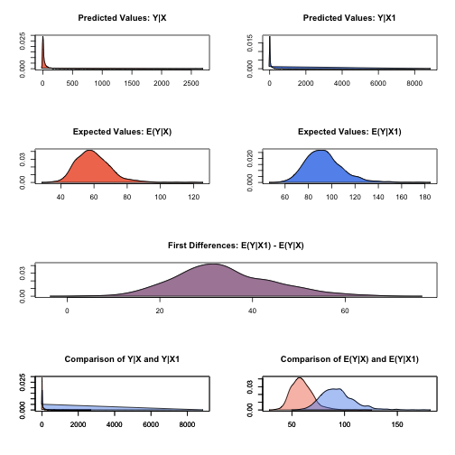

.. _zweibull:

zelig-weibull
~~~~~~

Weibull Regression for Duration Dependent Variables

Choose the Weibull regression model if the values in your dependent
variable are duration observations. The Weibull model relaxes the
exponential model’s assumption of constant hazard, and allows the
hazard rate to increase or decrease monotonically with respect to
elapsed time.

Syntax
+++++

With reference classes:

.. sourcecode:: r
    

    z5 <- zweibull$new()
    z5$zelig(Surv(Y, C) ~ X, data = mydata)
    z5$setx()
    z5$sim()

With the Zelig 4 compatibility wrappers:

.. sourcecode:: r
    

    z.out <- zelig(Surv(Y, C) ~ X, model = "weibull", data = mydata)
    x.out <- setx(z.out)
    s.out <- sim(z.out, x = x.out)

Weibull models require that the dependent variable be in the form
Surv(Y, C), where Y and C are vectors of length :math:`n`. For each
observation :math:`i` in 1, …, :math:`n`, the value :math:`y_i` is the
duration (lifetime, for example), and the associated :math:`c_i` is a
binary variable such that :math:`c_i = 1` if the duration is not
censored (*e.g.*, the subject dies during the study) or :math:`c_i = 0`
if the duration is censored (*e.g.*, the subject is still alive at the
end of the study). If :math:`c_i` is omitted, all Y are assumed to be
completed; that is, time defaults to 1 for all observations.

Input Values
+++++

In addition to the standard inputs, zelig() takes the following
additional options for weibull regression:

-  robust: defaults to FALSE. If TRUE, zelig() computes robust standard
   errors based on sandwich estimators (see and ) based on the options
   in cluster.

-  cluster: if robust = TRUE, you may select a variable to define groups
   of correlated observations. Let x3 be a variable that consists of
   either discrete numeric values, character strings, or factors that
   define strata. Then

.. sourcecode:: r
    

    z.out <- zelig(y ~ x1 + x2, robust = TRUE, cluster = "x3", 
                   model = "exp", data = mydata)

means that the observations can be correlated within the strata defined by the variable x3, and that robust standard errors should be calculated according to those clusters. If `robust = TRUE` but cluster is not specified, zelig() assumes that each observation falls into its own cluster.

Example
+++++

Attach the sample data:

.. sourcecode:: r
    

    data(coalition)

Estimate the model:

.. sourcecode:: r
    

    z.out <- zelig(Surv(duration, ciep12) ~ fract + numst2,
                   model = "weibull", data = coalition)

::

    ## How to cite this model in Zelig:
    ##   Olivia Lau, Kosuke Imai, Gary King. 2007.
    ##   weibull: Weibull Regression for Duration Dependent Variables
    ##   in Kosuke Imai, Gary King, and Olivia Lau, "Zelig: Everyone's Statistical Software,"
    ##   http://zeligproject.org/

View the regression output:

.. sourcecode:: r
    

    summary(z.out)

::

    ## Model: 
    ## $by
    ## [1] 1
    ## 
    ## Call:
    ## survival::survreg(formula = Surv(duration, ciep12) ~ fract + 
    ##     numst2, data = ., dist = "weibull", model = FALSE)
    ## 
    ## Coefficients:
    ##  (Intercept)        fract       numst2 
    ##  5.498500132 -0.003838969  0.452319329 
    ## 
    ## Scale= 0.9566212 
    ## 
    ## Loglik(model)= -1077   Loglik(intercept only)= -1100.6
    ## 	Chisq= 47.18 on 2 degrees of freedom, p= 5.7e-11 
    ## n= 314 
    ## Next step: Use 'setx' method

Set the baseline values (with the ruling coalition in the minority) and
the alternative values (with the ruling coalition in the majority) for
X:

.. sourcecode:: r
    

    x.low <- setx(z.out, numst2 = 0)
    x.high <- setx(z.out, numst2 = 1)

Simulate expected values and first differences:

.. sourcecode:: r
    

    s.out <- sim(z.out, x = x.low, x1 = x.high)

.. sourcecode:: r
    

    summary(s.out)

::

    ## 
    ##  sim x :
    ##  -----
    ## ev
    ##       mean       sd      50%     2.5%    97.5%
    ## 1 59.47878 10.11007 58.61662 43.17787 82.16518
    ## pv
    ##          mean       sd      50%        2.5%    97.5%
    ## [1,] 68.98974 222.3549 7.536251 0.001316673 638.5919
    ## 
    ##  sim x1 :
    ##  -----
    ## ev
    ##       mean       sd     50%     2.5%    97.5%
    ## 1 93.35468 15.79635 91.6965 67.48231 129.0987
    ## pv
    ##         mean       sd      50%        2.5%    97.5%
    ## [1,] 102.015 405.0193 8.897719 0.002779282 707.9159
    ## fd
    ##      mean       sd      50%     2.5%    97.5%
    ## 1 33.8759 10.55142 32.82968 15.46736 57.52953

.. sourcecode:: r
    

    plot(s.out)

    Zelig-weibull

Model
+++++

Let :math:`Y_i^*` be the survival time for observation :math:`i`. This
variable might be censored for some observations at a fixed time
:math:`y_c` such that the fully observed dependent variable,
:math:`Y_i`, is defined as

.. math::

   Y_i = \left\{ \begin{array}{ll}
         Y_i^* & \textrm{if }Y_i^* \leq y_c \\
         y_c & \textrm{if }Y_i^* > y_c 
       \end{array} \right.

-  The *stochastic component* is described by the distribution of the
   partially observed variable :math:`Y^*`. We assume :math:`Y_i^*`
   follows the Weibull distribution whose density function is given by

   .. math::

      f(y_i^*\mid \lambda_i, \alpha) = \frac{\alpha}{\lambda_i^\alpha}
          y_i^{* \alpha-1} \exp \left\{ -\left( \frac{y_i^*}{\lambda_i}
      \right)^{\alpha} \right\}

   for :math:`y_i^* \ge 0`, the scale parameter :math:`\lambda_i > 0`,
   and the shape parameter :math:`\alpha > 0`. The mean of this
   distribution is :math:`\lambda_i
     \Gamma(1 + 1 / \alpha)`. When :math:`\alpha = 1`, the distribution
   reduces to the exponential distribution (see Section [exp]). (Note
   that the output from zelig() parameterizes
   scale\ :math:` = 1 / \alpha`.)

   In addition, survival models like the Weibull have three additional
   properties. The hazard function :math:`h(t)` measures the probability
   of not surviving past time :math:`t` given survival up to :math:`t`.
   In general, the hazard function is equal to :math:`f(t)/S(t)` where
   the survival function :math:`S(t) = 1 - \int_{0}^t f(s) ds`
   represents the fraction still surviving at time :math:`t`. The
   cumulative hazard function :math:`H(t)` describes the probability of
   dying before time :math:`t`. In general,
   :math:`H(t)= \int_{0}^{t} h(s) ds = -\log S(t)`. In the case of the
   Weibull model,

   .. math::

      \begin{aligned}
      h(t) &=& \frac{\alpha}{\lambda_i^{\alpha}} t^{\alpha - 1}  \\
      S(t) &=&  \exp \left\{ -\left( \frac{t}{\lambda_i} \right)^{\alpha} \right\} \\
      H(t) &=& \left( \frac{t}{\lambda_i} \right)^{\alpha}\end{aligned}

   For the Weibull model, the hazard function :math:`h(t)` can increase
   or decrease monotonically over time.

-  The *systematic component* :math:`\lambda_i` is modeled as

   .. math:: \lambda_i = \exp(x_i \beta),

   where :math:`x_i` is the vector of explanatory variables, and
   :math:`\beta` is the vector of coefficients.

Quantities of Interest
+++++

-  The expected values (qi$ev) for the Weibull model are simulations of
   the expected duration:

   .. math:: E(Y) = \lambda_i \, \Gamma (1 + \alpha^{-1}),

   given draws of :math:`\beta` and :math:`\alpha` from their sampling
   distributions.

-  The predicted value (qi$pr) is drawn from a distribution defined by
   :math:`(\lambda_i, \alpha)`.

-  The first difference (qi$fd) in expected value is

   .. math:: \textrm{FD} = E(Y \mid x_1) - E(Y \mid x).

-  In conditional prediction models, the average expected treatment
   effect (att.ev) for the treatment group is

   .. math::

      \frac{1}{\sum_{i=1}^n t_i}\sum_{i:t_i=1}^n \left\{ Y_i(t_i=1) -
            E[Y_i(t_i=0)] \right\},

   where :math:`t_i` is a binary explanatory variable defining the
   treatment (:math:`t_i=1`) and control (:math:`t_i=0`) groups. When
   :math:`Y_i(t_i=1)` is censored rather than observed, we replace it
   with a simulation from the model given available knowledge of the
   censoring process. Variation in the simulations are due to
   uncertainty in simulating :math:`E[Y_i(t_i=0)]`, the counterfactual
   expected value of :math:`Y_i` for observations in the treatment
   group, under the assumption that everything stays the same except
   that the treatment indicator is switched to :math:`t_i=0`.

-  In conditional prediction models, the average predicted treatment
   effect (att.pr) for the treatment group is

   .. math::

      \frac{1}{\sum_{i=1}^n t_i}\sum_{i:t_i=1}^n \left\{ Y_i(t_i=1) -
            \widehat{Y_i(t_i=0)} \right\},

   where :math:`t_i` is a binary explanatory variable defining the
   treatment (:math:`t_i=1`) and control (:math:`t_i=0`) groups. When
   :math:`Y_i(t_i=1)` is censored rather than observed, we replace it
   with a simulation from the model given available knowledge of the
   censoring process. Variation in the simulations are due to
   uncertainty in simulating :math:`\widehat{Y_i(t_i=0)}`, the
   counterfactual predicted value of :math:`Y_i` for observations in the
   treatment group, under the assumption that everything stays the same
   except that the treatment indicator is switched to :math:`t_i=0`.

Output Values
+++++

The output of each Zelig command contains useful information which you
may view. For example, if you run
``z.out <- zelig(y ~ x, model = weibull, data)``, then you may examine
the available information in ``z.out`` by using ``names(z.out)``, see
the coefficients by using z.out$coefficients, and a default summary of
information through ``summary(z.out)``. Other elements available through
the $ operator are listed below.

-  From the zelig() output object z.out, you may extract:

   -  coefficients: parameter estimates for the explanatory variables.

   -  icoef: parameter estimates for the intercept and “scale” parameter
      :math:`1 / \alpha`.

   -  var: the variance-covariance matrix.

   -  loglik: a vector containing the log-likelihood for the model and
      intercept only (respectively).

   -  linear.predictors: a vector of the :math:`x_{i}\beta`.

   -  df.residual: the residual degrees of freedom.

   -  df.null: the residual degrees of freedom for the null model.

   -  zelig.data: the input data frame if save.data = TRUE.

-  Most of this may be conveniently summarized using summary(z.out).
   From summary(z.out), you may additionally extract:

   -  table: the parameter estimates with their associated standard
      errors, :math:`p`-values, and :math:`t`-statistics.

-  From the sim() output object s.out, you may extract quantities of
   interest arranged as matrices indexed by simulation :math:`\times`
   x-observation (for more than one x-observation). Available quantities
   are:

   -  qi$ev: the simulated expected values for the specified values of
      x.

   -  qi$pr: the simulated predicted values drawn from a distribution
      defined by :math:`(\lambda_i, \alpha)`.

   -  qi$fd: the simulated first differences between the simulated
      expected values for x and x1.

   -  qi$att.ev: the simulated average expected treatment effect for the
      treated from conditional prediction models.

   -  qi$att.pr: the simulated average predicted treatment effect for
      the treated from conditional prediction models.

See also
+++++

The Weibull model is part of the survival library by Terry Therneau,
ported to R by Thomas Lumley. Advanced users may wish to refer to
``help(survfit)`` in the survival library.
