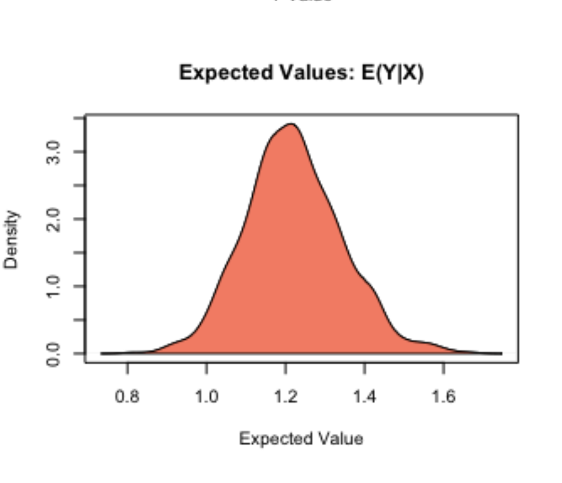
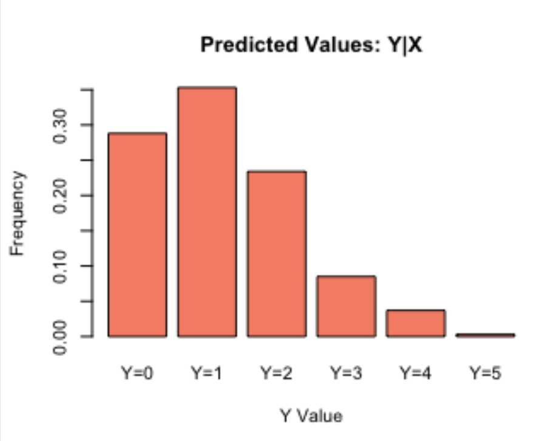
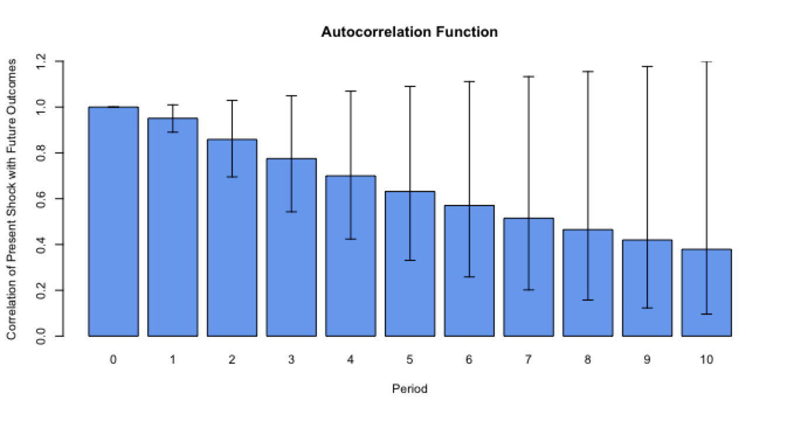

---

```{r setup, include=FALSE}
knitr::opts_knit$set(
    stop_on_error = 2L
)
knitr::opts_chunk$set(
    fig.height = 11,
    fig.width = 7
)

options(cite = FALSE)
```

## General Overview

Graphing in Zelig works in concert with the simulation and counterfactual analysis functionality included in Zelig. Zelig provides a number graphs to represent the results of the simulations. However, as simulation is not univerally part of the standard statistical workflow, interpretation of some the graphs produced by Zelig is not always straightforward.  

## Types of Graphs

#### Value Distribution

The majority of graphs produced by the Zelig `plot` function are estimates of the probability distributions of simulated model statistics. The probabilty distributions are estimated by the `density` function in the `R` `stats` package. This implements a kernel density estimator. Due to this, the Zelig graphs aren't true probability distributions, but they are reasonable approximations of them.



An example of a Zelig generated distribution plot from a Poisson model.

#### Histograms

Zelig's histograms represent the relative frequencies of outputs based on user input counterfactuals and the simulated model parameters. The are output when a model's dependent variable has discrete, rather than continuous, output.



An example of a Zelig generated histogram from a Poisson model.

#### Discrete Value Comparisons

When comparing the results of counterfactuals for discrete valued models, Zelig outputs Contingency Tables of the following type. They visually represent a heatmap of the model output for the two generated counterfactuals.


Contingency Table generated from a Logistic Regression Model


Contingency Table generated from a Poisson Regression Model

#### Time Series

Time Series models in Zelig produce a different series of graphics then the other forms of models. The




## Graphing Syntax

### Customizing Zelig Graphs


